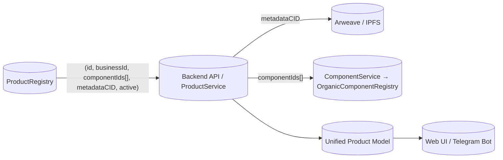

# Product Data Interface Guide

## 1. Purpose

Документ служит мостом между web/бот интерфейсами и backend/contract логикой. Цель — описать, как выглядят данные продукта, откуда они берутся и как с ними работать без необходимости погружаться в `contracts/` и `scripts/`.

## 2. High-level flow

```
CSV + media + organic_descriptions
    ↓ (catalog pipeline)
active_catalog.json + cid mappings
    ↓ (prepare_products_for_registry.py)
product_registry_upload_data.json (CID → product metadata)
    ↓ (deploy actions 4/41/43/444/555/888)
ProductRegistry (blockchain) ↔ Arweave metadata ↔ OrganicComponentRegistry
    ↓ (ProductService / Catalog API)
Web / Telegram bot consume structured product models
```

## 3. Core entities

### 3.1 Organic Component (`component_id`)
- Источник: `data/components/<component_id>/`
- Поля: `biounit_id`, `scientific_title`, `forms[]`, `features`, `simple_fields`, `complex_fields` (многоязычные описания).
- Shared между всеми продавцами; изменения в компоненте автоматически влияют на все продукты, ссылающиеся на `component_id`.

### 3.2 Product metadata vs. on-chain ProductRegistry
- Форматы:
  - `FORMAT_SINGLE`: корневой `component_id`, продукт = один компонент.
  - `FORMAT_MULTI`: массив `organic_components[{component_id, proportion}]`.
- Обязательные поля:
  - `business_id` / `product_id`
  - `title`, `forms`, `categories`, `species`
  - `prices[]` (`quantity`, `unit`, `price`, `currency`)
  - `media` / `description` ссылки (CID из pipeline)
- Доп. поля: `features`, `benefits`, `warnings`, `recipes`, etc.
- **Важно:** metadata содержит только ссылки на компоненты (`component_id`). При загрузке каталога эти значения трансформируются в `componentIds[]`, которые хранятся в смарт-контракте.

### 3.3 On-chain Product (`ProductRegistry`)
```solidity
struct Product {
    uint256 id;            // blockchain_id
    address seller;
    string businessId;     // = metadata.business_id
    string[] componentIds; // сформированы из metadata.component_id / organic_components[].component_id
    string metadataCID;    // CID на Arweave/Pinata (без вложенных компонентов)
    bool active;
}
```

> `componentIds[]` — единственный источник истины для состава продукта. UI/боты всегда должны доверять этому списку, а не полю `organic_components` в метаданных.

### 3.3 Catalog artifacts
- `active_catalog.json`: объединенный список продуктов (SINGLE/MULTI) после конвертации CSV.
- `catalog_images.json`: mapping `image_file → CID`.
- `organic_cid_mapping.json`: mapping `organic_unit_id → CID`.
- `product_registry_upload_data.json`: финальные данные для записи в ProductRegistry (CID метаданных + business_id).

## 4. Interfaces for Web/Bot

### 4.1 Data retrieval
- API (или локальный сервис) должен предоставлять Unified Product Model:
  - `id` (business_id)
  - `blockchain_id` (если зарегистрирован)
  - `components[]` (обогащенные данными из OrganicComponentRegistry; основа — `componentIds[]` из ProductRegistry)
  - `forms`, `prices`, `mediaCID`, `descriptionCID`
  - `seller` metadata (если нужно)
- Источники:
  - `active_catalog.json` для статического каталога.
  - Realtime — Arweave CID из ProductRegistry (`ProductRegistry.getProduct(id)` → CID → загрузка JSON).
  - `organic_cid_mapping.json` и `catalog_images.json` для отображения описаний/изображений.

### 4.2 Preparing UI
- Сохраняем словари:
  - `forms` (powder, tincture, dried...)
  - `categories`, `species`, `features` — берутся из компонент + продукта.
- Мультикомпонентные продукты отображаются как список ингредиентов с пропорциями; данные тянутся по каждому `component_id`.
- Shared поля (например, dosage instructions) приходят из OrganicComponentRegistry, поэтому UI не должен хранить дублирующий текст.

## 5. Data flow for UI/Bot



- Шаг 1: Backend получает tuple продукта из ProductRegistry (`componentIds[]`, `metadataCID` и т.д.).
- Шаг 2: Загружает метаданные по `metadataCID` (только бизнес-данные).
- Шаг 3: Для каждого componentId вызывает `ComponentService.get_component_full(componentId)` (кэш → контракт → Arweave).
- Шаг 4: ProductAssembler собирает Unified Product Model, который уже готов для UI/бота.

## 6. Pipelines & references

- **Pipeline 41/42/43/444** — см. `catalog_pipeline.md` + `product-catalog-population.md`:
  1. Загрузка media/organic descriptions → CID словари.
  2. Конвертация CSV → JSON → `active_catalog.json`.
  3. Подготовка `product_registry_upload_data.json`.
  4. Запись в ProductRegistry (Action 4/41/43).
- **Serialization flow** — см. `product-serialization-flow.md`: как ProductService склеивает данные из блокчейна и Arweave.
- **Тестирование** — см. `product-registry-TDD.md`, `action43.e2e.test.js`.

## 7. Quick FAQ для UI/бота

- *Откуда брать описание компонента?* — `OrganicComponentRegistry` через `component_id` (см. `product-formats-explained`).
- *Где взять изображения?* — `catalog_images.json` (CID → URL). Сборщик UI должен формировать URL (например, `https://ipfs.io/ipfs/<cid>`).
- *Как получить список продуктов для продавца?* — `active_catalog.json` или API, который агрегирует данные из ProductRegistry + Arweave.
- *Что такое shared поля?* — данные, которые тянутся из компонента (effects, dosage, warnings). Они общие для всех продуктов, ссылающихся на компонент, и обновляются централизованно.

## 8. References

- `product-structure.md` — идентификаторы и API.
- `product-formats-explained.md` — разбор SINGLE/MULTI.
- `product-catalog-population.md` + `catalog_pipeline.md` — команды и артефакты pipeline.
- `product-serialization-flow.md` — runtime конвейер.
- `action43.e2e.test.js` — пример полного on-chain апдейта.

