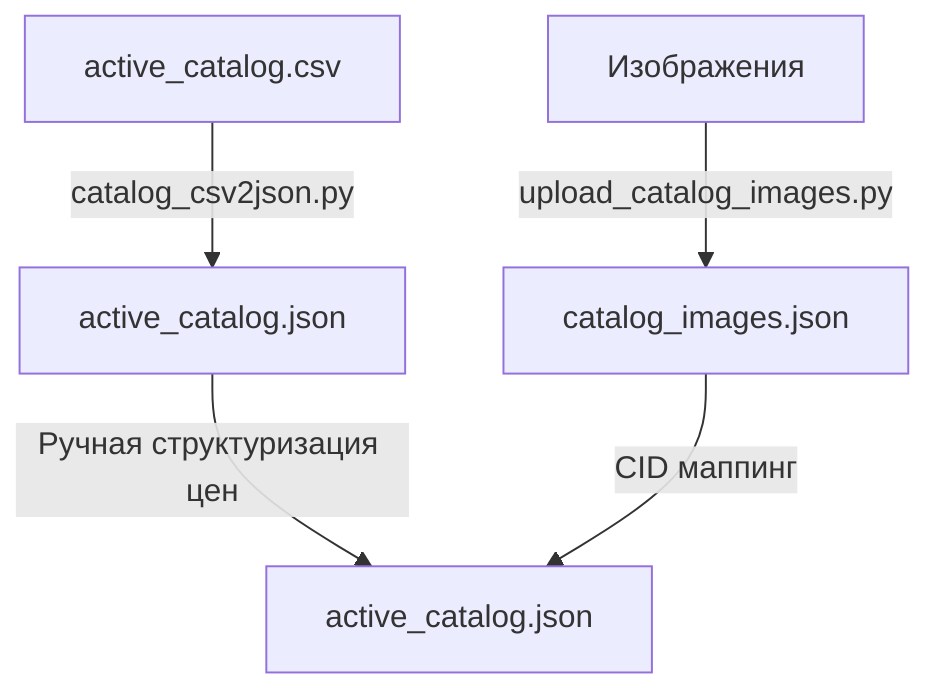
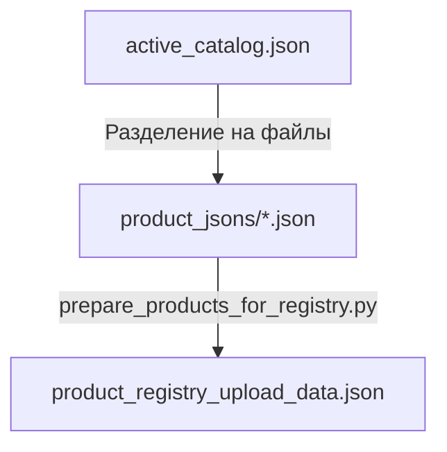
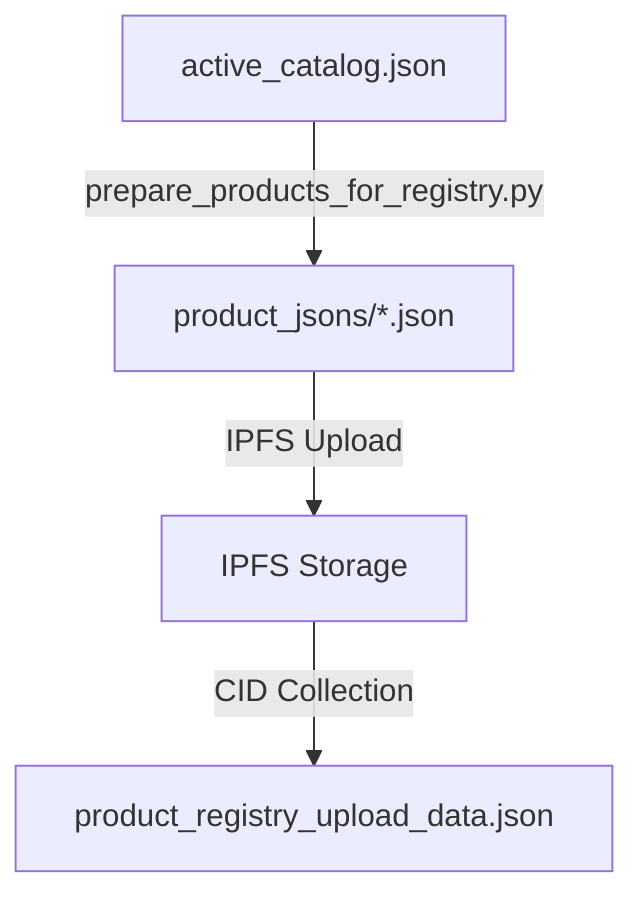

🚀 **Быстрый старт: Как заполнить каталог**

1. **Подготовка изображений**
```bash
➡️ Положить картинки в `bot/catalog/`
# Загрузить все изображения в IPFS
python3 bot/utility/upload_catalog_images.py
```
✅ Получим CID'ы в `catalog_images.json`

2. **Подготовка описаний биоединиц**
```bash
# Загрузить описания в IPFS
➡️ Подготовить organic_descriptions.json с описанием биоединиц (потом это будут связи с общим реестром)
python3 bot/utility/upload_organic_descriptions.py
```
✅ Получим маппинг в `organic_cid_mapping.json`

3. **Создание каталога**
```bash
➡️ Заполнить `***_catalog.csv`, использовать buiunit_id и image_file позволяющие точно идентифицировать значения в маппингах описаний и изображений. Указать этот файл в Python скрипте который будет выполняться.
# Конвертация CSV в JSON
python3 bot/utility/catalog_csv2json.py
```
- ✅ Получим /catalog/active_catalog.json

4. **Подготовка к загрузке в смарт-контракт**
```bash
# Подготовка JSON файлов для IPFS и создание маппинга для контракта
python3 bot/utility/prepare_products_for_registry.py
```
- ✅ Проверить структуру `active_catalog.json`
- ✅ Убедиться в уникальности всех product_id
- ✅ Проверить корректность CID'ов изображений и описаний
- ✅ Проверить структуру цен и поддерживаемые валюты
- ✅ Получим:
  - Отдельные JSON файлы в `bot/catalog/product_jsons/`
  - Маппинг для контракта в `product_registry_upload_data.json`

5. **Загрузка в смарт-контракт**
```bash
# Подготовка и загрузка каталога в блокчейн
DEPLOY_ACTION=4 npx hardhat run scripts/deploy_full.js
# Активация всех продуктов каталога
DEPLOY_ACTION=41 npx hardhat run scripts/deploy_full.js
```


💡 **Важные файлы**
- `bot/catalog/active_catalog.csv` - исходные данные
- `bot/catalog/active_catalog.json` - структурированный каталог
- `bot/catalog/organic_cid_mapping.json` - CID'ы описаний
- `bot/catalog/catalog_images.json` - CID'ы изображений
- `bot/catalog/product_registry_upload_data.json` - данные для контракта

# 1. Загрузка изображений

Сначала я загружаю в `bot/catalog` директорию все обложки для будущих продуктов в виде файлов с понятными удобными названиями которые сами себя легко идентифицируют и похожи на их будущие id внутри json файлов. Наша задача — загрузить их на IPFS сервер, который выбирается в зависимости от поля `STORAGE_TYPE` в `.env` файле.

## 1.1 Архитектура загрузки

### Фабрика IPFS хранилищ
У нас есть фабрика (`IPFSFactory`) для выбора реализации хранилища:
- Pinata IPFS (`STORAGE_TYPE=pinata`)
- Arweave (`STORAGE_TYPE=arweave`)

### Сервис Pinata
Основной сервис загрузки `SecurePinataUploader` обеспечивает:
- Безопасную загрузку файлов с валидацией
- Поддержку только изображений (JPEG, PNG, GIF)
- Ограничение размера файлов (50MB)
- Кэширование загруженных файлов
- Rate limiting для API запросов
- Метрики производительности

### Структура хранения
- Изображения хранятся в директории `bot/catalog`
- Логи загрузки сохраняются в:
  - `bot/catalog/images_upload_log.json` (расширенный лог)
  - `bot/catalog/images_upload_log.csv` (базовый лог)
  - `bot/catalog/upload_catalog.log` (процесс загрузки)
- Метрики сохраняются в директории `metrics`

## 1.2 Процесс загрузки

Для загрузки изображений используется скрипт `bot/utility/upload_catalog_images.py`:

1. Сканирует директорию `bot/catalog`
2. Фильтрует только файлы изображений (JPEG, PNG, GIF)
3. Для каждого изображения:
   - Проверяет размер и тип файла
   - Вычисляет SHA-256 хеш
   - Загружает в IPFS через выбранный сервис
   - Сохраняет CID в лог
4. Формирует итоговую статистику:
   - Количество успешных загрузок
   - Общий размер данных
   - Время выполнения
   - Среднюю скорость

Дальше мы запускаем `bot/utility/upload_catalog_images.py`

# 2. Загрузка описаний биологических единицы

Так как у нас платформа ориентирована на народную медицину и на ней продают природные растительные продукты, то у каждого должна быть своя биологическая единица. Одна или несколько (алмимические многокомпонентные формулы). Формы выпуска для одной и той же биологической единицы могут различаться. Например, мухоморные шляпки или порошок или спиртовая вытяжка. Для избежания некачественного дублирования информации о самом растении или грибе мы выносим это в отдельный словарь биоединиц, который загружается скриптом upload_organic_descriptions.py, который берет json из файла organic_descriptions.json и итерирует по структуре информации каждого описания биологической единицы, фиксируя с ним уникальную связь через его поле id, которое мы задаем вручную при формировании каталога. Это не будет сложной работой для настоящих шаманов, так как они очень любят растения, с которыми работают и с удовольствием про них рассказывают. Надо только потом в Телеграм боте сделать прием информации с голоса и с ИИ обработкой для структуризации и улучшения лингвистики.
На выходе мы получаем заполненный файл с маппингом между этими идентификаторами из входного json и полученными для каждого cid из хранилища — organic_cid_mapping. Причем это может быть и Pinata и Arweave. Наша фабрика делает процесс storage-kind agnostic и впоследствии, для тех кто не переживает за то что их "спалят", можно будет расширить возможности Supabase или другими инновационными способами работы с данными.

## Архитектура

Система состоит из трех ключевых компонентов:
1. Источник данных (`organic_descriptions.json`)
2. Загрузчик (`upload_organic_descriptions.py`)
3. Реестр идентификаторов (`organic_cid_mapping.json`)

## Формат данных

### Входные данные (organic_descriptions.json)
```json
{
  "organic_items": {
    "[unit_id]": {
      "id": "string",
      "title": "string",
      "scientific_name": "string",
      "generic_description": "string",
      "effects": "string",
      "shamanic": "string",
      "warnings": "string",
      "dosage_instructions": [
        {
          "type": "string",
          "title": "string",
          "description": "string"
        }
      ]
    }
  }
}
```

### Выходные данные (organic_cid_mapping.json)
```json
{
  "[unit_id]": {
    "cid": "string",
    "file_name": "string"
  }
}
```

## Процесс загрузки

1. **Инициализация**
   - Создание IPFS-клиента через фабрику
   - Загрузка исходного JSON
   - Настройка логирования

2. **Обработка единиц**
   - Для каждой биологической единицы:
     - Генерация уникального имени файла на основе id
     - Форматирование JSON с отступами
     - Загрузка в IPFS
     - Сохранение CID в маппинг

3. **Сохранение маппинга**
   - Запись соответствий unit_id → CID
   - Сохранение имен файлов для отслеживания

## Использование

```bash
# Базовый запуск
python3 bot/utility/upload_organic_descriptions.py

# С подробным логированием
python3 bot/utility/upload_organic_descriptions.py -v

# С минимальным логированием
python3 bot/utility/upload_organic_descriptions.py -s

# С указанием уровня логов
python3 bot/utility/upload_organic_descriptions.py --log-cli-level DEBUG
```

# 3. Создание базового каталога

## 3.1 Подготовка данных

### CSV с базовой информацией
Начальные данные о продуктах хранятся в `bot/catalog/Iveta_catalog.csv`. Этот файл содержит базовую информацию:
- Business ID продукта (уникальный строковый идентификатор)
- Название
- Цена
- Описание
- Связь с биологической единицей (organic_unit_id)
- Форма выпуска
- Вес/объем
- Другие характеристики

### Конвертация в JSON
Скрипт `catalog_csv2json.py` преобразует CSV в расширенный JSON-формат:
1. Загружает CID'ы изображений через `load_image_cids()`
2. Преобразует данные в структурированный JSON
3. Добавляет UX-метаданные и форматирование
4. Связывает продукты с их биологическими единицами

На выходе создает файл active-catalog.json

## 3.2 Подготовка для смарт-контракта

Скрипт `prepare_products_for_registry.py` выполняет следующие шаги:

1. **Берет файл active_catalog.json и итерирует по его продуктам.
!!! Важно! Чтобы там были заполнены поля id и чтобы они были уникальны в рамках этого каталога.

2. **Создание отдельных JSON-файлов**:
```json
{
  "business_id": "amanita_powder",
  "title": "Мухомор красный молотый",
  "price": "2000",
  "description": "Порошок из шляпок мухомора...",
  "organic_unit_id": "amanita_muscaria",
  "organic_description_cid": "QmdoqBWBZoupjQWFfBxMJD5N9dJSFTyjVEV1AVL8oNEVSG",
  "image_cid": "QmRqMjpkLihEsCSJJS4B3WjwW5ZhGm33PHfVw6MxQuo1ru",
  "form": "powder",
  "weight": "50g"
}
```

2. **Загрузка в IPFS**:
- Каждый JSON-файл загружается в IPFS
- Получаем CID для каждого продукта
- Логируем процесс загрузки

3. **Формирование данных для контракта**:
Создается `product_registry_upload_data.json`:
```json
[
  {
    "id": "amanita_powder",
    "ipfsCID": "QmRqMjpkLihEsCSJJS4B3WjwW5ZhGm33PHfVw6MxQuo1ru",
    "active": true
  }
  // ... другие продукты
]
```
Это исходная структура данных для хранения в контракте. Поле `id` здесь соответствует `business_id` из метаданных.

## 3.3 Интеграция с биологическими единицами

### Связь продукта с описанием
Каждый продукт связывается с описанием биоединицы через два поля:
1. `organic_unit_id` - идентификатор биологической единицы
2. `organic_description_cid` - CID описания из `organic_cid_mapping.json`

TODO Я пока проставляла ссылки на CID описаний вручную. Нужно будет дописать автоматизацию загрузки через маппинг organic_cid_mapping.json
Аналогично для картинок

### Пример интеграции
```json
{
  "business_id": "amanita_powder",
  "organic_biounit_id": "amanita_muscaria",
  "organic_description_cid": "QmdoqBWBZoupjQWFfBxMJD5N9dJSFTyjVEV1AVL8oNEVSG",
  "form": "powder",
  "weight": "50g",
  "price": "2000",
  // ... другие поля продукта
}
```

Это позволяет:
- Избежать дублирования описаний
- Иметь разные формы выпуска одной биоединицы
- Централизованно обновлять описания
- Поддерживать многоязычность

## 3.4 Загрузка в смарт-контракт

Финальный этап выполняется через `deploy_full.js` с параметром `action=4`:

1. **Подготовка**:
- Проверка подключения к сети
- Загрузка аккаунта продавца
- Подключение к контракту ProductRegistry

2. **Загрузка продуктов**:
- Чтение `product_registry_upload_data.json`
- Последовательная загрузка каждого продукта
- Обновление версии каталога
- Логирование процесса

3. **Верификация**:
- Проверка загруженных продуктов через `getProductsBySellerFull()`
- Сверка CID'ов и статусов
- Проверка версии каталога

### Команда запуска
```bash
DEPLOY_ACTION=4 npx hardhat run scripts/deploy_full.js
```

## 3.5 Обновление каталога

Каталог поддерживает версионирование через `catalogVersion` в смарт-контракте:
- Версия увеличивается при любом изменении
- Каждый продавец имеет свою версию каталога
- Фронтенд может отслеживать изменения через `getMyCatalogVersion()`
- События `CatalogUpdated` эмитятся при изменениях

## Интеграция описаний с каталогом продуктов

Полученные CID используются в основном каталоге продуктов (`active_catalog.json`) для связывания товаров с их биологическими описаниями:

```json
{
  "products": [
        {
        "business_id": "amanita1",
        "title": "Amanita muscaria — sliced caps and gills (1st grade)",
        "description_cid": "QmbCeGjVDtazNrFD8DFXhGFisMVqitHwxePR96KxPB15H5",
        ...
        ]
    }
  ]
}
```

## Безопасность и масштабирование

- Поддержка различных IPFS-провайдеров (Pinata, Arweave)
- Абстракция хранилища через фабрику
- Возможность расширения для других типов хранилищ
- Rate limiting для API-вызовов
- Валидация размеров и форматов файлов

## Рекомендации по развитию

1. Добавить валидацию JSON-схемы
2. Реализовать механизм возобновления загрузки
3. Внедрить систему версионирования описаний
4. Добавить компрессию данных
5. Реализовать кэширование CID

## 3.6 Структура цен и поддерживаемые валюты

### Модель данных цен
В системе реализована гибкая структура цен с поддержкой различных валют:

```python
SUPPORTED_CURRENCIES = {
    'EUR': '€',  # Евро
    'USD': '$',  # Доллар США
    'GBP': '£',  # Фунт стерлингов
    'JPY': '¥',  # Йена
    'RUB': '₽',  # Рубль
    'CNY': '¥',  # Юань
    'USDT': '₮', # Tether
    'ETH': 'Ξ',  # Ethereum
    'BTC': '₿',  # Bitcoin
}
```

### Процесс обработки цен

1. **Начальный CSV → JSON конвертация**:
   - Скрипт `catalog_csv2json.py` изначально сохраняет цены как текстовое поле
   - Это сделано для упрощения первичного импорта данных

2. **Ручное структурирование**:
   - После конвертации цены преобразуются в структурированный формат
   - Используется Cursor IDE с ИИ для автоматизации процесса
   - При фокусировке на ценах ИИ предлагает автозамену в нужную структуру

3. **Финальная структура цен**:
```json
"prices": [
    {
        "weight": "100",
        "weight_unit": "g",
        "price": "30",
        "currency": "EUR"
    }
]
```

## 3.7 Цепочка загрузки продуктов

### 1. Подготовка данных


### 2. Создание отдельных JSON файлов


Пример для продукта "Blue Lotus":

1. **Исходный файл** (`active_catalog.json`):
```json
{
  "id": "blue_lotus_flowers",
  "title": "Blue Lotus",
  "description_cid": "QmRPHaVsnbP14byQynNd5K3bQ4uRSHXUtt9voDBXaMD4uB",
  "categories": ["plant", "mental health", "focus"],
  "cover_image": "QmT5RC6Q6MRRF3YoDcXmKamKntXT6oSvxk3G2aLDkPc17T",
  "form": "flower",
  "species": "Nymphaea caerulea (Blue Lotus)",
  "prices": [{
    "weight": "100",
    "weight_unit": "g",
    "price": "30",
    "currency": "EUR"
  }]
}
```

2. **Отдельный JSON** (`product_jsons/blue_lotus_flowers.json`):
   - Идентичен исходному файлу
   - Сохраняется в отдельном файле для загрузки в IPFS

3. **Маппинг для смарт-контракта** (`product_registry_upload_data.json`):
```json
{
  "id": "blue_lotus_flowers",
  "ipfsCID": "Qmf4iQKJms9nZvYTLrDRfZn7L59BPAZzUyFJQYkunSnnum",
  "active": true
}
```

### 3. Загрузка в смарт-контракт

1. **Подготовка данных**:
   - Проверка всех CID в IPFS
   - Валидация структуры данных
   - Проверка поддерживаемых валют

2. **Процесс загрузки**:
   - Чтение `product_registry_upload_data.json`
   - Последовательная загрузка каждого продукта
   - Обновление версии каталога

3. **Верификация**:
   - Проверка загруженных CID
   - Валидация цен и валют
   - Проверка связей с описаниями

### 4. Мониторинг и обновление

1. **Отслеживание версий**:
   - Каждое изменение увеличивает `catalogVersion`
   - Фронтенд следит за изменениями через `getMyCatalogVersion()`

2. **Обновление цен**:
   - Поддержка множественных валют
   - Автоматическая конвертация
   - Кэширование курсов

3. **Логирование**:
   - Запись всех изменений
   - Отслеживание статусов загрузки
   - Мониторинг доступности IPFS

## 4.1 Процесс подготовки данных для смарт-контракта

### Архитектура процесса



### Этапы обработки

1. **Разделение на отдельные JSON файлы**
   - Каждый продукт из `active_catalog.json` сохраняется в отдельный файл
   - Файлы создаются в директории `bot/catalog/product_jsons/`
   - Имя файла формируется на основе `product_id`

2. **Загрузка в IPFS**
   - Каждый JSON файл загружается в IPFS через выбранный провайдер
   - Используется фабрика `IPFSFactory` для абстракции провайдера
   - Поддерживаются Pinata и Arweave

3. **Формирование данных для контракта**
   - Создается `product_registry_upload_data.json`
   - Каждая запись содержит:
     ```json
     {
       "id": "product_id",
       "ipfsCID": "полученный_cid",
       "active": true
     }
     ```

### Структура данных

1. **Входные данные** (`active_catalog.json`):
```json
{
  "id": "blue_lotus_flowers",
  "title": "Blue Lotus",
  "description_cid": "QmRPHaVsnbP14byQynNd5K3bQ4uRSHXUtt9voDBXaMD4uB",
  "categories": ["plant", "mental health", "focus"],
  "cover_image": "QmT5RC6Q6MRRF3YoDcXmKamKntXT6oSvxk3G2aLDkPc17T",
  "form": "flower",
  "species": "Nymphaea caerulea (Blue Lotus)",
  "prices": [{
    "weight": "100",
    "weight_unit": "g",
    "price": "30",
    "currency": "EUR"
  }]
}
```

2. **Промежуточные файлы** (`bot/catalog/product_jsons/{product_id}.json`):
   - Идентичны структуре из active_catalog.json
   - Сохраняются для отладки и верификации
   - Используются как источник для загрузки в IPFS

3. **Выходные данные** (`product_registry_upload_data.json`):
```json
[
  {
    "id": "blue_lotus_flowers",
    "ipfsCID": "Qmf4iQKJms9nZvYTLrDRfZn7L59BPAZzUyFJQYkunSnnum",
    "active": true
  }
]
```

# 5. Сервисный уровень и структуры данных

## 5.1 Модель данных

### Уровни абстракции данных

1. **Смарт-контракт (On-chain)**
```solidity
struct Product {
    uint256 id;          // Уникальный идентификатор
    address seller;      // Адрес продавца
    string ipfsCID;      // CID метаданных в IPFS
    bool active;         // Статус активности
}
```

2. **IPFS Метаданные (Off-chain)**
```json
{
    "id": "string",
    "title": "string",
    "description_cid": "string",
    "categories": ["string"],
    "cover_image": "string",
    "form": "string",
    "species": "string",
    "prices": [
        {
            "weight": "decimal",
            "weight_unit": "string",
            "volume": "decimal",
            "volume_unit": "string",
            "price": "decimal",
            "currency": "string"
        }
    ]
}
```

3. **Сервисная модель (Python)**
```python
class Product:
    id: Union[int, str]
    status: int
    cid: str
    title: str
    description: Description
    cover_image_url: str
    categories: List[str]
    forms: List[str]
    species: str
    prices: List[PriceInfo]
```

### Особенности структуры цен

1. **Поддерживаемые единицы измерения**
   - Вес: g, kg, oz, lb
   - Объем: ml, l, fl_oz
   - Валюты: RUB, USDT, ESTO — Ходовые P2P валюты новой экономической системы, ориентируемся сразу на них.

2. **Валидация**
   - Проверка допустимых единиц измерения
   - Конвертация между единицами
   - Округление по правилам валют

3. **Кэширование курсов валют**
   - Периодическое обновление
   - Fallback значения
   - Логирование изменений

## 5.2 Сервисный слой

### ProductRegistryService

1. **Кэширование**
   - Каталог продуктов (TTL: 5 минут)
   - Описания биоединиц (TTL: 1 час)
   - Изображения (TTL: 24 часа)

2. **Валидация**
   - Проверка целостности данных
   - Валидация связей между продуктами и описаниями
   - Проверка доступности IPFS ресурсов

3. **Оптимизация**
   - Batch загрузка продуктов
   - Предварительная загрузка описаний
   - Ленивая загрузка изображений

# 5. Аудит MVP и рекомендации

## 5.1 Критические улучшения для MVP

1. **Безопасность**
   - [ ] Добавить валидацию входных данных в `upload_organic_descriptions.py`
   - [ ] Реализовать проверку хэшей файлов перед загрузкой
   - [ ] Внедрить механизм backup для CID маппингов

2. **Надежность**
   - [ ] Добавить механизм восстановления при сбоях загрузки
   - [ ] Реализовать очередь для больших загрузок
   - [ ] Внедрить мониторинг состояния IPFS узлов

3. **Производительность**
   - [ ] Оптимизировать размер JSON файлов
   - [ ] Реализовать параллельную загрузку файлов
   - [ ] Улучшить механизм кэширования

## 5.2 Долгосрочные улучшения

1. **Архитектурные**
   - Внедрение событийной модели для обновлений
   - Поддержка горизонтального масштабирования
   - Реализация микросервисной архитектуры

2. **Функциональные**
   - Многоязычность описаний
   - Версионирование метаданных
   - Расширенная аналитика использования

3. **UX/UI**
   - Интерфейс администратора для управления каталогом
   - Предпросмотр изменений перед публикацией
   - Инструменты для массового обновления

## 5.3 Известные ограничения

1. **Технические**
   - Ограничение размера файлов (50MB)
   - Задержки при обновлении кэша
   - Зависимость от доступности IPFS узлов

2. **Бизнес-логика**
   - Отсутствие поддержки сложных скидок
   - Ограниченное количество форм выпуска
   - Фиксированный набор валют

3. **Масштабируемость**
   - Ограничения batch-операций
   - Отсутствие шардинга данных
   - Централизованное хранение метаданных

## 5.4 Метрики и мониторинг

1. **Ключевые метрики**
   - Время загрузки файлов
   - Доступность IPFS ресурсов
   - Актуальность кэша
   - Использование ресурсов

2. **Алерты**
   - Недоступность IPFS узлов
   - Ошибки загрузки
   - Проблемы с валидацией
   - Аномалии в использовании

3. **Отчетность**
   - Ежедневные отчеты о состоянии каталога
   - Статистика использования
   - Анализ трендов

## 5.5 План действий для MVP

1. **Немедленные действия**
   - Внедрить базовую валидацию данных
   - Добавить логирование критических операций
   - Реализовать простой механизм backup

2. **Краткосрочные задачи (1-2 недели)**
   - Оптимизировать размер JSON файлов
   - Улучшить механизм кэширования
   - Добавить базовый мониторинг

3. **Среднесрочные задачи (2-4 недели)**
   - Реализовать восстановление при сбоях
   - Внедрить параллельную загрузку
   - Добавить базовую аналитику

# 6. Заключение

Текущая реализация каталога продуктов представляет собой надежное MVP-решение, способное обеспечить базовую функциональность платформы. Основные компоненты системы (загрузка изображений, описания биоединиц, создание каталога) работают корректно и интегрированы между собой.

Для обеспечения стабильной работы в производственной среде необходимо сфокусироваться на реализации критических улучшений из раздела 5.1. Это позволит минимизировать риски и обеспечить надежную работу системы на начальном этапе.

Дальнейшее развитие системы должно следовать плану из разделов 5.2-5.5, с приоритетом на безопасность и надежность операций.

# 7. Roadmap: Критически необходимые улучшения

## 7.1 Критические проблемы безопасности и надежности

### 1. Валидация входных данных в утилитах загрузки
**Проблема**: В `upload_catalog_images.py` и `upload_organic_descriptions.py` отсутствует валидация JSON-схем и проверка целостности данных перед загрузкой в IPFS.

**Обоснование**: Текущая реализация принимает любые данные без проверки структуры, что может привести к загрузке некорректных метаданных в блокчейн. Это критично для децентрализованной системы, где данные нельзя изменить после публикации.

**Решение**: 
- Добавить JSON-схемы валидации для всех типов данных
- Внедрить проверку хешей файлов перед загрузкой
- Добавить валидацию CID'ов после загрузки

### 2. Механизм восстановления при сбоях загрузки
**Проблема**: При сбое загрузки в IPFS или блокчейн система не может восстановить состояние и определить, какие файлы уже загружены.

**Обоснование**: В `product_registry_upload_data.json` видны ошибки транзакций (`'SignedTransaction' object has no attribute 'rawTransaction'`), но нет механизма их обработки. Это приводит к потере данных и необходимости повторной загрузки всего каталога.

**Решение**:
- Добавить состояние транзакций в маппинг
- Реализовать механизм возобновления загрузки
- Создать систему отката изменений

### 3. Проверка доступности IPFS ресурсов
**Проблема**: Система не проверяет доступность загруженных CID'ов после публикации, что может привести к "мертвым" ссылкам в каталоге.

**Обоснование**: В `active_catalog.json` используются CID'ы, но нет гарантии их доступности. Это критично для пользовательского опыта и доверия к платформе.

**Решение**:
- Добавить мониторинг доступности CID'ов
- Реализовать автоматическое перезагружение недоступных ресурсов
- Создать систему уведомлений о проблемах

## 7.2 Проблемы производительности и масштабируемости

### 4. Оптимизация размера JSON файлов
**Проблема**: В `organic_descriptions.json` содержатся большие текстовые описания, которые увеличивают размер IPFS-файлов и время загрузки.

**Обоснование**: Текущие описания содержат избыточную информацию (например, повторяющиеся научные названия). Это влияет на стоимость хранения и скорость загрузки каталога.

**Решение**:
- Сжать текстовые данные
- Вынести общие данные в отдельные файлы
- Реализовать версионирование описаний

### 5. Параллельная загрузка файлов
**Проблема**: В `upload_catalog_images.py` файлы загружаются последовательно, что значительно замедляет процесс при большом количестве изображений.

**Обоснование**: Текущая реализация не использует возможности современных IPFS-провайдеров для параллельной загрузки, что критично для каталогов с сотнями продуктов.

**Решение**:
- Реализовать асинхронную загрузку с ограничением concurrency
- Добавить очередь для больших файлов
- Оптимизировать batch-операции

### 6. Улучшение механизма кэширования
**Проблема**: В `ProductRegistryService` кэш обновляется полностью при любом изменении, что неэффективно для больших каталогов.

**Обоснование**: Текущая реализация не поддерживает инкрементальные обновления, что приводит к избыточной нагрузке на IPFS и блокчейн.

**Решение**:
- Реализовать инкрементальное обновление кэша
- Добавить TTL для разных типов данных
- Внедрить стратегии invalidation

## 7.3 Проблемы архитектуры и интеграции

### 7. Автоматизация связывания продуктов с описаниями
**Проблема**: В `catalog_csv2json.py` связывание продуктов с описаниями биоединиц происходит вручную, что приводит к ошибкам и неэффективности.

**Обоснование**: В документации указано: "Я пока проставляла ссылки на CID описаний вручную. Нужно будет дописать автоматизацию загрузки через маппинг organic_cid_mapping.json". Это критично для масштабирования каталога.

**Решение**:
- Автоматизировать связывание через `biounit_id`
- Добавить валидацию связей
- Реализовать проверку целостности данных

### 8. Централизованная обработка ошибок
**Проблема**: В каждом утилитарном скрипте своя логика обработки ошибок, что приводит к несогласованности и сложности отладки.

**Обоснование**: Разные скрипты по-разному обрабатывают ошибки IPFS, блокчейна и валидации, что усложняет поддержку и мониторинг.

**Решение**:
- Создать единый сервис обработки ошибок
- Стандартизировать коды ошибок
- Реализовать централизованное логирование

### 9. Валидация цен и валют
**Проблема**: В `catalog_csv2json.py` поддерживается ограниченный набор валют, но нет валидации их корректности и актуальности курсов.

**Обоснование**: Система работает с криптовалютами и фиатными валютами, но не проверяет их актуальность и не предоставляет конвертацию.

**Решение**:
- Добавить валидацию поддерживаемых валют
- Реализовать API для получения актуальных курсов
- Добавить конвертацию валют в реальном времени

## 7.4 Проблемы мониторинга и операционной поддержки

### 10. Система метрик и алертов
**Проблема**: Отсутствует мониторинг состояния IPFS-узлов, доступности CID'ов и производительности загрузки.

**Обоснование**: Без мониторинга невозможно выявить проблемы до того, как они повлияют на пользователей. Это критично для production-среды.

**Решение**:
- Добавить метрики загрузки и доступности
- Реализовать алерты при недоступности ресурсов
- Создать дашборд для мониторинга

### 11. Механизм backup и восстановления
**Проблема**: Отсутствует система резервного копирования маппингов CID'ов и механизм восстановления при потере данных.

**Обоснование**: Потеря маппингов приведет к невозможности связать продукты с их метаданными, что критично для работы каталога.

**Решение**:
- Реализовать автоматическое резервное копирование
- Создать механизм восстановления из backup
- Добавить версионирование маппингов

### 12. Документация API и интеграции
**Проблема**: Отсутствует документация по интеграции с внешними системами и API для управления каталогом.

**Обоснование**: Для масштабирования платформы необходимо предоставить API для интеграции с WooCommerce, другими e-commerce системами и внешними сервисами.

**Решение**:
- Создать OpenAPI спецификацию
- Добавить примеры интеграции
- Реализовать SDK для популярных языков

## 7.5 Приоритизация улучшений

### Критический приоритет (MVP)
1. **Валидация входных данных** - предотвращает загрузку некорректных данных
2. **Механизм восстановления при сбоях** - обеспечивает надежность операций
3. **Автоматизация связывания продуктов** - устраняет ручные ошибки

### Высокий приоритет (3-6 месяцев)
4. **Проверка доступности IPFS ресурсов** - улучшает пользовательский опыт
5. **Параллельная загрузка файлов** - повышает производительность
6. **Система метрик и алертов** - обеспечивает операционную поддержку

### Средний приоритет (6-12 месяцев)
7. **Оптимизация размера JSON файлов** - снижает стоимость хранения
8. **Улучшение механизма кэширования** - повышает производительность
9. **Централизованная обработка ошибок** - упрощает поддержку

### Низкий приоритет (12+ месяцев)
10. **Валидация цен и валют** - улучшает функциональность
11. **Механизм backup и восстановления** - повышает надежность
12. **Документация API и интеграции** - обеспечивает масштабирование

## 7.6 Критерии успеха

### Количественные метрики
- Время загрузки каталога: < 30 секунд для 1000 продуктов
- Доступность IPFS ресурсов: > 99.9%
- Точность валидации данных: > 99.5%
- Время восстановления после сбоя: < 5 минут

### Качественные критерии
- Отсутствие ручных операций в процессе загрузки
- Полная автоматизация связывания продуктов с описаниями
- Централизованный мониторинг состояния системы
- Документированные API для интеграции

### Технические требования
- Поддержка горизонтального масштабирования
- Совместимость с различными IPFS-провайдерами
- Интеграция с существующей архитектурой блокчейна
- Соответствие принципам децентрализации

Этот roadmap фокусируется на критически необходимых улучшениях, которые обеспечат стабильную работу системы в production-среде и позволят масштабировать каталог продуктов без потери качества и надежности.