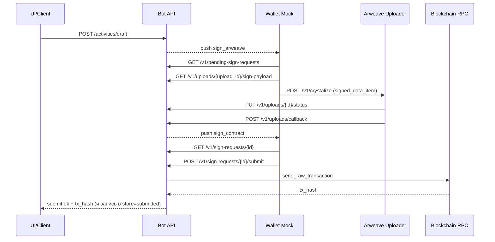
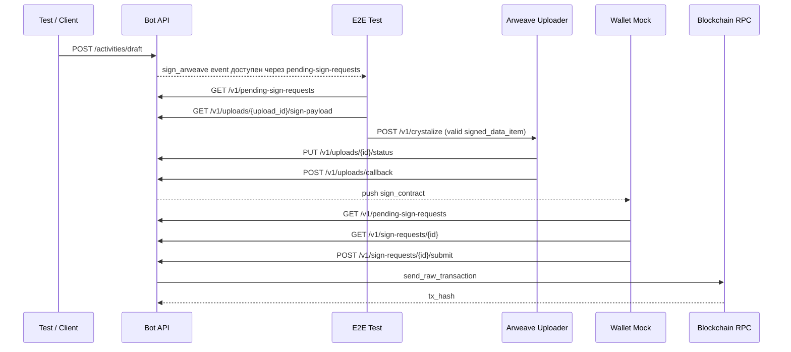
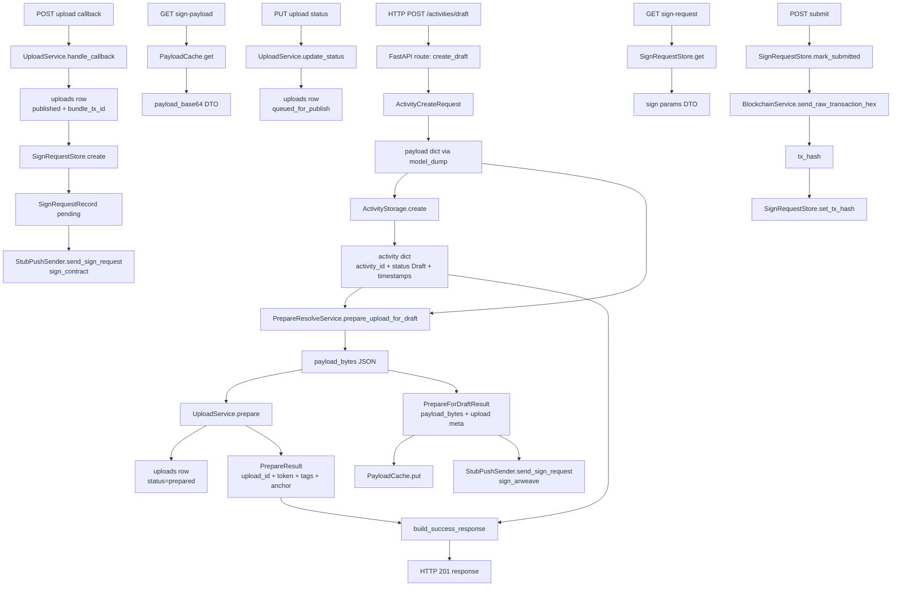

# E2E Floou Orchestration Overview (Bot + Arweave Uploader + Wallet Mock)

## Что уже сделано в задаче

Источник: `bot/docs/analysis/tasks/task-tests-full-flow-signing-mock-wallet-localhost/task-tests-full-flow-signing-mock-wallet-localhost.md`

Важно: в самом task-файле статус пока `draft`, но по факту в коде уже реализованы оба режима:

- `bot/tests/integration/test_activity_full_floou_mock_wallet.py`
  - **In-process режим** (`@pytest.mark.full_floou_mock_wallet`): тест сам эмулирует runner.
  - **E2E real services режим** (`@pytest.mark.full_floou_real_services`): поднимаются реальные процессы `arweave-uploader` и `wallet-mock`, bot стартует в потоке uvicorn.
- Есть рабочий ручной мануал:
  - `bot/docs/tests/e2e-floou-manual.md`
- Есть скрипт оркестрации из корня репо:
  - `scripts/shell/run-bullrun-floou.sh`

Итого: предметно сценарий уже покрыт, формальный статус task-дока просто не синхронизирован.

---

## Как запускается процесс

## 1) Быстрый запуск всего оркестра (рекомендуется)

Из корня репозитория:

```bash
./scripts/shell/run-bullrun-floou.sh
```

Скрипт поднимает:
- bot (API),
- arweave-uploader,
- wallet-mock runner,
- вызывает `POST /activities/draft`,
- ждёт прохождение подписи.

## 2) Запуск через pytest (реальные сервисы)

Из `bot/`:

```bash
python3 -m pytest tests/integration/test_activity_full_floou_mock_wallet.py -m full_floou_real_services -v
```

## 3) Локальный CI-friendly режим (без внешних процессов)

```bash
python3 -m pytest tests/integration/test_activity_full_floou_mock_wallet.py -m full_floou_mock_wallet -v
```

---

## Визуальная диаграмма системы (оркестрация)

```mermaid
flowchart LR
    U[Client / GPT UI / curl] -->|POST /activities/draft| B[Bot API]
    B -->|push sign_arweave event| W[Wallet Mock Runner]
    W -->|GET sign-payload| B
    W -->|POST /v1/crystalize| A[Arweave Uploader]
    A -->|PUT upload status| B
    A -->|POST upload callback| B
    B -->|create sign_request + push sign_contract| W
    W -->|GET /v1/sign-requests/{id}| B
    W -->|POST /v1/sign-requests/{id}/submit| B
    B -->|broadcast raw tx| C[(Blockchain RPC)]
    B -->|store tx_hash, submitted| S[(SignRequestStore)]
```

---

## Последовательность событий (runtime)

Ниже важно разделять **два разных сценария**, которые есть в коде:

- **Сценарий A: wallet-driven runtime**
  - `wallet/mock-runner/index.js`
  - здесь именно `wallet-mock` вызывает `GET /v1/uploads/{upload_id}/sign-payload`, затем `POST /v1/crystalize` в `arweave-uploader`
- **Сценарий B: hybrid E2E test**
  - `bot/tests/integration/test_activity_full_floou_mock_wallet.py`
  - в `full_floou_real_services` шаг `crystalize` делает **сам тест**, а `wallet-mock` запускается только после callback и обрабатывает только `sign_contract`

### Сценарий A: wallet-driven flow

Это общий runtime-контракт между ботом, `wallet-mock` и `arweave-uploader`.



---

### Сценарий B: hybrid E2E real-services flow

Это фактический сценарий теста `full_floou_real_services`.



---

## Ключевые ограничения

- В `wallet/mock-runner/index.js` вызов `arweave-uploader` происходит внутри `handleSignArweave()`:
  - бот возвращает `arweave_uploader_url` в `GET /v1/uploads/{upload_id}/sign-payload`
  - затем `wallet-mock` вызывает `POST {uploaderUrl}/v1/crystalize`
- В `bot/tests/integration/test_activity_full_floou_mock_wallet.py` для `full_floou_real_services` `POST /v1/crystalize` делает не wallet, а сам тест.
- Если wallet-mock работает в режиме `dummy` для `sign_arweave`, uploader вернёт `signature_invalid`.
- Для полноценного прохода нужен валидный Data Item (например режим `local-valid` или сборка через `build-full-cycle-data-item.js`).
- В real-services режиме обязательны JWT ключи для пары bot/uploader.

---

## Связанные документы

- `bot/docs/tests/e2e-floou-manual.md`
- `bot/tests/integration/test_activity_full_floou_mock_wallet.py`
- `bot/docs/analysis/tasks/task-tests-full-flow-signing-mock-wallet-localhost/task-tests-full-flow-signing-mock-wallet-localhost.md`
- `scripts/shell/run-bullrun-floou.sh`

---

## Кто вызывает кого

### Runtime orchestration matrix

| Шаг | Кто инициирует | Кого вызывает | Метод / точка | Что передаётся | Что получается |
|-----|----------------|---------------|---------------|----------------|----------------|
| 1 | UI / curl / test | Bot API | `POST /activities/draft` | `ActivityCreateRequest`, `X-User-Id` | Draft response + `upload_id` + `upload_token` |
| 2 | Bot API | StubPushSender | `send_sign_request()` | `user_id`, `sign_arweave`, `upload_id` | Событие в in-memory очереди |
| 3 | Wallet-mock **или тест** | Bot API | `GET /v1/pending-sign-requests` | `user_id`, `X-User-Id` | Claim события `sign_arweave` |
| 4 | Wallet-mock **или тест** | Bot API | `GET /v1/uploads/{upload_id}/sign-payload` | `upload_id`, `X-User-Id` | `payload_base64`, `upload_token`, `arweave_uploader_url` |
| 5 | Wallet-mock **или тест** | Arweave Uploader | `POST /v1/crystalize` | `upload_id`, `upload_token`, `signed_data_item`, `payload_size` | 200/400 от uploader |
| 6 | Arweave Uploader | Bot API | `PUT /v1/uploads/{upload_id}/status` | `queued_for_publish` или `failed` | Upload status updated |
| 7 | Arweave Uploader | Bot API | `POST /v1/uploads/callback` | `upload_id`, `item_id`, `bundle_tx_id`, `published_at` | Upload published + создан `sign_request` |
| 8 | Bot API | StubPushSender | `send_sign_request()` | `user_id`, `sign_contract`, `sign_request_id` | Событие в очереди |
| 9 | Wallet-mock | Bot API | `GET /v1/pending-sign-requests` | `user_id`, `X-User-Id` | Claim события `sign_contract` |
| 10 | Wallet-mock | Bot API | `GET /v1/sign-requests/{id}` | `sign_request_id`, `X-User-Id` | `cid`, `chain_id`, `contract_address` |
| 11 | Wallet-mock | Bot API | `POST /v1/sign-requests/{id}/submit` | `signedTransaction` | `ok`, `tx_hash` |
| 12 | Bot API | BlockchainService / RPC | `send_raw_transaction_hex()` | Raw tx hex | `tx_hash` |

### Кто вызывает Arweave Uploader

| Сценарий | Кто вызывает `POST /v1/crystalize` | Где это видно в коде |
|----------|------------------------------------|----------------------|
| Обычный wallet-driven runtime | `wallet-mock` | `wallet/mock-runner/index.js` -> `handleSignArweave()` |
| Hybrid E2E (`full_floou_real_services`) | сам тест | `bot/tests/integration/test_activity_full_floou_mock_wallet.py` |
| In-process test | никто не вызывает real uploader | тест эмулирует `PUT status` и `POST callback` напрямую в bot |

---

## Внутренний flow внутри Bot: сохранение Activity по слоям

Ниже описан не только внешний HTTP flow, а именно **внутренняя логика `bot`**, где одна и та же сущность несколько раз меняет форму:

- Pydantic request model
- `dict` payload
- draft activity record
- upload prepare result
- cached payload entry
- upload DB row
- sign request record

### Таблица трансформаций по слоям

| Фаза | Слой / компонент | Входная сущность | Выходная сущность | Что меняется |
|------|------------------|------------------|-------------------|--------------|
| 1 | FastAPI route `create_draft()` | HTTP JSON body | `ActivityCreateRequest` | Валидация обязательных полей (`activity_type`, `title`, описание) |
| 2 | API route `create_draft()` | `ActivityCreateRequest` | `payload: dict` | `body.model_dump(exclude_none=True)` убирает `None` |
| 3 | `ActivityStorage.create()` | `payload: dict` | `activity: dict` | Добавляются `activity_id`, `status=Draft`, `created_at`, `updated_at` |
| 4 | `PrepareResolveService.prepare_upload_for_draft()` | `draft_id`, `user_id`, `payload_descriptor: dict` | `payload_bytes` + `PrepareForDraftResult` | JSON сериализуется в байты; добавляется доменный ответ для wallet |
| 5 | `UploadService.prepare()` | `payload_bytes`, `user_id`, `activity_id` | `PrepareResult` + row в `uploads` | Создаётся `upload_id`, JWT token, tags, anchor, payload hash, DB row `prepared` |
| 6 | `PayloadCache.put()` | `upload_id` + payload/meta | `CachedPayload` | Данные для подписи кладутся в in-memory cache по `upload_id` |
| 7 | `StubPushSender.send_sign_request()` | `user_id`, `sign_arweave`, `upload_id` | event dict | В очередь добавляется событие для wallet |
| 8 | `build_success_response()` | `activity`, `upload_id`, `upload_token`, `expires_at` | success JSON | Из внутренних сущностей собирается API response |
| 9 | `GET /v1/uploads/{id}/sign-payload` | `upload_id` | JSON payload for wallet | `CachedPayload` преобразуется в `payload_base64`, `tags`, `anchor` |
| 10 | `PUT /v1/uploads/{id}/status` | upload status from uploader | updated upload row | `prepared -> queued_for_publish` или `failed` |
| 11 | `POST /v1/uploads/callback` | callback body | published upload row + `sign_request_id` | `bundle_tx_id` становится CID для дальнейшего on-chain шага |
| 12 | `SignRequestStore.create()` | `user_id`, `upload_id`, `bundle_tx_id` | `SignRequestRecord` | Создаётся запись `pending` для `create_activity` |
| 13 | `StubPushSender.send_sign_request()` | `user_id`, `sign_contract`, `sign_request_id` | event dict | В очередь уходит второе событие для wallet |
| 14 | `GET /v1/sign-requests/{id}` | `SignRequestRecord` | JSON sign params | Из store собирается DTO для подписи контракта |
| 15 | `POST /v1/sign-requests/{id}/submit` | `signedTransaction` | submitted sign_request + `tx_hash` | `status=submitted`, сохраняется подпись, затем broadcast |

### Внутренние сущности и их ответственность

| Сущность | Где живёт | Назначение |
|----------|-----------|------------|
| `ActivityCreateRequest` | `bot/api/models/activity.py` | API-модель входного тела draft |
| `activity: dict` | `bot/api/services/activity_storage.py` | In-memory mock представление Activity |
| `PrepareForDraftResult` | `bot/services/upload/storage.py` | Доменный ответ для wallet: содержит `payload_bytes`, которых нет в infra-слое |
| `PrepareResult` | `bot/services/upload/upload_service.py` | Infra-ответ upload слоя: JWT, tags, anchor, hash, size |
| `UploadRecord` | `bot/model/upload.py` | DTO записи `uploads` |
| `CachedPayload` | `bot/services/wallet_push/payload_cache.py` | In-memory данные для `GET sign-payload` |
| event dict | `bot/services/wallet_push/stub.py` | Push-событие для wallet runner |
| `SignRequestRecord` | `bot/services/wallet_push/sign_request_store.py` | In-memory запись второго шага подписи (`sign_contract`) |

---

## Глубокая диаграмма внутренних слоёв Bot



---

## Критическое понимание архитектуры

### 1. В draft ещё нет on-chain Activity

На шаге `POST /activities/draft`:
- создаётся только **mock Activity record** в `ActivityStorage`,
- создаётся **upload row** в статусе `prepared`,
- создаётся **cached payload** для подписи,
- отправляется **push event** `sign_arweave`.

То есть это ещё не «сохранение Activity в блокчейне», а только подготовка к нему.

### 2. CID появляется только после callback

Настоящий CID для следующего шага возникает не в `draft`, а в:
- `POST /v1/uploads/callback`
- поле `bundle_tx_id`

Именно этот `bundle_tx_id` потом кладётся в `SignRequestStore` как `cid` для `create_activity`.

### 3. Bot использует смесь in-memory и infra-state

Внутри одного flow одновременно живут:
- `ActivityStorage` — in-memory mock Activity
- `PayloadCache` — in-memory payload cache
- `StubPushSender` — in-memory очередь событий
- `SignRequestStore` — in-memory sign requests
- `UploadService` / `UploadRecord` — уже infra-слой таблицы `uploads`

Поэтому в этом flow действительно много переходов между разными моделями данных и уровнями абстракции.

---

## Слойная карта сущностей (короткий срез)

### 1) HTTP-сущности (API contract)

| Сущность | Где используется | Назначение |
|----------|------------------|------------|
| `ActivityCreateRequest` | `POST /activities/draft` | Входной контракт создания draft |
| `sign-payload response` | `GET /v1/uploads/{upload_id}/sign-payload` | Контракт для подписи Data Item (`payload_base64`, `upload_token`) |
| `CallbackBody` | `POST /v1/uploads/callback` | Контракт обратного вызова от uploader (`bundle_tx_id`) |
| `SubmitBody` | `POST /v1/sign-requests/{id}/submit` | Контракт передачи подписи/сырой tx |

### 2) Domain-сущности (оркестрация сценария)

| Сущность | Где живёт | Назначение |
|----------|-----------|------------|
| `activity: dict` | `ActivityStorage` | Черновик и статусная модель Activity на mock-уровне |
| `PrepareForDraftResult` | `PrepareResolveService` | Доменный bridge: то, что нужно wallet (включая `payload_bytes`) |
| `cid` (`bundle_tx_id`) | callback -> sign_request | Доменная связь между upload-публикацией и контрактным шагом |

### 3) Infra-сущности (хранилище/интеграции)

| Сущность | Где живёт | Назначение |
|----------|-----------|------------|
| `PrepareResult` | `UploadService.prepare()` | Infra-результат создания upload (JWT, теги, anchor, hash, size) |
| `UploadRecord` | `model/upload.py` + DB `uploads` | Стейт-машина загрузки (`prepared -> queued_for_publish -> published`) |
| `tx_hash` | `SignRequestStore` + blockchain service | Результат broadcast подписанной транзакции |

### 4) Runtime event-сущности (очередь подписи)

| Сущность | Где живёт | Назначение |
|----------|-----------|------------|
| push event `sign_arweave` | `StubPushSender` | Сигнал кошельку, что нужен crystalize шаг |
| push event `sign_contract` | `StubPushSender` | Сигнал кошельку, что нужен submit в blockchain |
| `SignRequestRecord` | `SignRequestStore` | Runtime-хранилище второго шага подписи (`pending/submitted`) |

### 5) Мосты между слоями

| Мост | Что соединяет | Ключевая точка |
|------|----------------|----------------|
| `PrepareResolveService` | Domain -> Infra | Преобразует `payload dict` в `payload_bytes` и вызывает `UploadService.prepare()` |
| `payload_cache` | Domain -> HTTP | Отдаёт wallet данные через `GET sign-payload` |
| `callback route` | Infra -> Runtime events | Превращает `bundle_tx_id` в `SignRequestRecord` + `sign_contract` push |
| `submit route` | Runtime events -> Infra | Фиксирует `submitted` и пишет `tx_hash` после broadcast |
