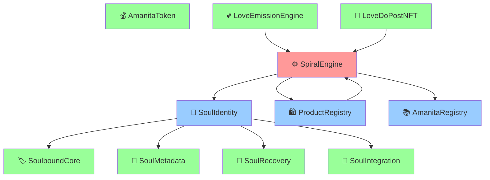
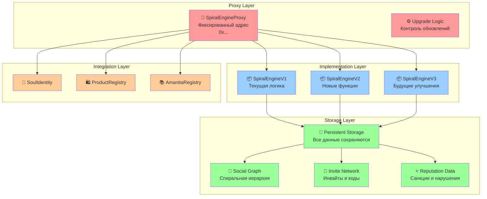
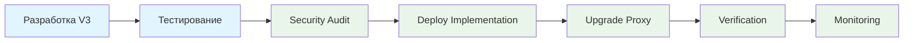

# AI Journal - Upgradeable SpiralEngine Architecture

## 🎯 Mission Statement

**Цель:** Создать архитектуру upgradeable смарт-контрактов для SpiralEngine, которая обеспечит бесшовные обновления без потери данных в контексте спиральной экономики AMANITA.

## 📊 Глубокий анализ контекста SpiralEngine

### 🔍 Анализ интеграций в экосистеме AMANITA

#### **1. Критические зависимости SpiralEngine**



#### **2. Анализ критических данных SpiralEngine**

**Социальный капитал (Social Capital):**
```solidity
// Спиральная иерархия - основа доверия
mapping(address => address) public userActivator;        // Кто активировал пользователя
mapping(address => address[]) public activatedBy;        // Кого активировал пользователь
mapping(address => address) public sellerNominator;      // Кто назначил селлером
mapping(address => address[]) public nominatedSellers;   // Кого назначил селлером
```

**Экономические активы (Economic Assets):**
```solidity
// Инвайты как ограниченный ресурс
mapping(address => uint256[]) private userInvites;       // Инвайты пользователя
mapping(string => uint256) public inviteCodeToTokenId;   // Уникальные коды инвайтов
uint256 public totalInvitesMinted;                       // Общий лимит инвайтов
uint256 public totalInvitesUsed;                         // Использованные инвайты
```

**Репутационная система (Reputation System):**
```solidity
// Система санкций и ответственности
mapping(address => uint256) public violationCount;       // Нарушения пользователя
mapping(address => uint256) public suspensionUntil;      // Временные блокировки
mapping(address => uint256) public activationViolations; // Ответственность активатора
mapping(address => uint256) public nominationViolations; // Ответственность номинатора
```

#### **3. Анализ бизнес-логики спиральной экономики**

**Принцип 12-гранных кругов:**
- Каждый активатор может активировать максимум 12 пользователей
- Создается органическая сеть доверия с каскадной ответственностью
- Нарушения пользователей влияют на их активаторов

**Экономическая модель:**
- Инвайты = ограниченный ресурс = ценность
- Активация = инвестиция в репутацию активатора
- Нарушения = экономические санкции для всех участников цепочки

## 🏗️ Архитектура Proxy Pattern для SpiralEngine

### **Концептуальная модель**



### **Техническая архитектура**

#### **1. Proxy Contract (SpiralEngineProxy)**

```solidity
// contracts/SpiralEngineProxy.sol
pragma solidity ^0.8.20;

import "@openzeppelin/contracts/proxy/ERC1967/ERC1967Proxy.sol";
import "@openzeppelin/contracts/access/AccessControl.sol";

/**
 * @title SpiralEngineProxy
 * @dev Upgradeable proxy для SpiralEngine с контролем спиральной экономики
 * @notice Сохраняет фиксированный адрес контракта при всех обновлениях
 */
contract SpiralEngineProxy is ERC1967Proxy, AccessControl {
    
    // Роли для управления обновлениями
    bytes32 public constant UPGRADER_ROLE = keccak256("UPGRADER_ROLE");
    bytes32 public constant EMERGENCY_ROLE = keccak256("EMERGENCY_ROLE");
    
    // Трекинг версий для совместимости
    string public constant PROXY_VERSION = "1.0.0";
    uint256 public lastUpgradeTime;
    
    constructor(
        address implementation,
        address admin,
        bytes memory data
    ) ERC1967Proxy(implementation, data) {
        _grantRole(DEFAULT_ADMIN_ROLE, admin);
        _grantRole(UPGRADER_ROLE, admin);
        _grantRole(EMERGENCY_ROLE, admin);
        
        lastUpgradeTime = block.timestamp;
    }
    
    /**
     * @dev Обновление реализации с проверкой совместимости
     * @param newImplementation Адрес новой реализации
     * @param data Данные инициализации
     */
    function upgradeToAndCall(
        address newImplementation,
        bytes memory data
    ) external onlyRole(UPGRADER_ROLE) {
        // Проверка совместимости версий
        require(validateUpgrade(newImplementation), "SpiralEngine: incompatible upgrade");
        
        _upgradeToAndCall(newImplementation, data);
        lastUpgradeTime = block.timestamp;
        
        emit Upgraded(newImplementation, block.timestamp);
    }
    
    /**
     * @dev Экстренная остановка системы
     */
    function emergencyPause() external onlyRole(EMERGENCY_ROLE) {
        // Делегируем в текущую реализацию
        (bool success, ) = _implementation().delegatecall(
            abi.encodeWithSignature("emergencyPause()")
        );
        require(success, "SpiralEngine: emergency pause failed");
        
        emit EmergencyPause(msg.sender, block.timestamp);
    }
    
    /**
     * @dev Валидация совместимости обновления
     */
    function validateUpgrade(address newImplementation) internal view returns (bool) {
        // Проверяем, что новая реализация поддерживает необходимые интерфейсы
        try IERC165(newImplementation).supportsInterface(type(IERC721).interfaceId) returns (bool supported) {
            return supported;
        } catch {
            return false;
        }
    }
    
    event Upgraded(address indexed implementation, uint256 timestamp);
    event EmergencyPause(address indexed admin, uint256 timestamp);
}
```

#### **2. Upgradeable Implementation (SpiralEngineV2)**

```solidity
// contracts/SpiralEngineV2.sol
pragma solidity ^0.8.20;

import "@openzeppelin/contracts-upgradeable/token/ERC721/ERC721Upgradeable.sol";
import "@openzeppelin/contracts-upgradeable/access/AccessControlUpgradeable.sol";
import "@openzeppelin/contracts-upgradeable/proxy/utils/Initializable.sol";
import "@openzeppelin/contracts-upgradeable/proxy/utils/UUPSUpgradeable.sol";
import "@openzeppelin/contracts-upgradeable/security/ReentrancyGuardUpgradeable.sol";

/**
 * @title SpiralEngineV2
 * @dev Upgradeable версия SpiralEngine с UUPS паттерном
 * @notice Сохраняет все данные спиральной экономики при обновлениях
 */
contract SpiralEngineV2 is 
    Initializable,
    ERC721Upgradeable,
    AccessControlUpgradeable,
    UUPSUpgradeable,
    ReentrancyGuardUpgradeable
{
    
    // === ВЕРСИОНИРОВАНИЕ ===
    string public constant VERSION = "2.0.0";
    uint256 public constant UPGRADE_VERSION = 2;
    uint256 public constant MAX_ACTIVATIONS_PER_CIRCLE = 12;
    
    // === РОЛИ СПИРАЛЬНОЙ ЭКОНОМИКИ ===
    bytes32 public constant SELLER_ROLE = keccak256("SELLER_ROLE");
    bytes32 public constant ACTIVATOR_ROLE = keccak256("ACTIVATOR_ROLE");
    bytes32 public constant CIRCLE_ADMIN_ROLE = keccak256("CIRCLE_ADMIN_ROLE");
    
    // === СОСТОЯНИЕ КОНТРАКТА ===
    uint256 private _tokenIdCounter;
    bool public paused;
    bool public migrationComplete;
    
    // === ОСНОВНЫЕ ДАННЫЕ ИНВАЙТОВ (Сохранены из V1) ===
    mapping(string => uint256) public inviteCodeToTokenId;
    mapping(string => bool) public inviteCodeExists;
    mapping(uint256 => string) public tokenIdToInviteCode;
    mapping(uint256 => bool) public isInviteUsed;
    mapping(address => uint256) public usedInviteByUser;
    mapping(uint256 => uint256) public inviteExpiry;
    mapping(uint256 => uint256) public inviteCreatedAt;
    mapping(uint256 => address) public inviteMinter;
    mapping(uint256 => address) public inviteFirstOwner;
    mapping(address => uint256[]) private userInvites;
    
    uint256 public totalInvitesUsed;
    uint256 public totalInvitesMinted;
    mapping(uint256 => address[]) public inviteTransferHistory;
    address[] public activatedUsers;
    mapping(address => uint256) public userInviteCount;
    
    // === СПИРАЛЬНАЯ ИЕРАРХИЯ (Критически важно сохранить) ===
    mapping(address => address) public userActivator;
    mapping(address => address) public sellerNominator;
    mapping(address => address[]) public activatedBy;
    mapping(address => address[]) public nominatedSellers;
    
    // === СИСТЕМА САНКЦИЙ (Репутационная система) ===
    mapping(address => uint256) public violationCount;
    mapping(address => uint256) public suspensionUntil;
    mapping(address => uint256) public activationViolations;
    mapping(address => uint256) public nominationViolations;
    
    // === ИНТЕГРАЦИЯ С SOUL IDENTITY ===
    ISoulIdentity public soulIdentity;
    
    // === НОВЫЕ ФУНКЦИИ V2 ===
    
    // Миграционные данные
    mapping(address => bool) public migratedFromV1;
    uint256 public migrationTimestamp;
    address public v1ContractAddress;
    
    // Улучшенная аналитика
    mapping(address => uint256) public userActivityScore;
    mapping(uint256 => uint256) public inviteGenerationRate;
    mapping(address => uint256) public circleHealthScore;
    
    // Система уведомлений
    mapping(address => bool) public userNotifications;
    mapping(address => uint256) public lastActivityTime;
    
    // === ИНИЦИАЛИЗАЦИЯ ===
    
    /**
     * @dev Инициализация upgradeable контракта
     * @param admin Адрес администратора
     * @param soulIdentityAddr Адрес контракта SoulIdentity
     */
    function initialize(
        address admin,
        address soulIdentityAddr
    ) public initializer {
        __ERC721_init("SpiralInvite", "SPIRAL");
        __AccessControl_init();
        __UUPSUpgradeable_init();
        __ReentrancyGuard_init();
        
        _grantRole(DEFAULT_ADMIN_ROLE, admin);
        _grantRole(SELLER_ROLE, admin);
        _grantRole(ACTIVATOR_ROLE, admin);
        _grantRole(CIRCLE_ADMIN_ROLE, admin);
        
        soulIdentity = ISoulIdentity(soulIdentityAddr);
        migrationTimestamp = block.timestamp;
        paused = false;
        migrationComplete = false;
    }
    
    /**
     * @dev Авторизация обновлений (только админ может обновлять)
     */
    function _authorizeUpgrade(address newImplementation) 
        internal 
        override 
        onlyRole(DEFAULT_ADMIN_ROLE) 
    {
        require(!paused, "SpiralEngine: contract is paused");
        require(migrationComplete, "SpiralEngine: migration not complete");
    }
    
    // === МИГРАЦИОННЫЕ ФУНКЦИИ ===
    
    /**
     * @dev Миграция данных из V1 контракта
     * @param v1Contract Адрес V1 контракта
     * @param users Массив адресов пользователей для миграции
     */
    function migrateFromV1(address v1Contract, address[] memory users) 
        external 
        onlyRole(DEFAULT_ADMIN_ROLE) 
        nonReentrant 
    {
        require(!migrationComplete, "SpiralEngine: migration already complete");
        require(v1Contract != address(0), "SpiralEngine: invalid V1 contract");
        
        ISpiralEngineV1 v1 = ISpiralEngineV1(v1Contract);
        v1ContractAddress = v1Contract;
        
        for (uint256 i = 0; i < users.length; i++) {
            address user = users[i];
            if (migratedFromV1[user]) continue;
            
            // Миграция данных активации пользователя
            uint256 usedInvite = v1.usedInviteByUser(user);
            if (usedInvite > 0) {
                usedInviteByUser[user] = usedInvite;
                activatedUsers.push(user);
            }
            
            // Миграция инвайтов пользователя
            uint256[] memory userInvitesV1 = v1.getUserInvites(user);
            for (uint256 j = 0; j < userInvitesV1.length; j++) {
                userInvites[user].push(userInvitesV1[j]);
            }
            
            // Миграция ролей
            if (v1.hasRole(SELLER_ROLE, user)) {
                _grantRole(SELLER_ROLE, user);
            }
            if (v1.hasRole(ACTIVATOR_ROLE, user)) {
                _grantRole(ACTIVATOR_ROLE, user);
            }
            
            // Миграция спиральной иерархии
            address activator = v1.userActivator(user);
            if (activator != address(0)) {
                userActivator[user] = activator;
                activatedBy[activator].push(user);
            }
            
            address nominator = v1.sellerNominator(user);
            if (nominator != address(0)) {
                sellerNominator[user] = nominator;
                nominatedSellers[nominator].push(user);
            }
            
            // Миграция репутационных данных
            violationCount[user] = v1.violationCount(user);
            suspensionUntil[user] = v1.suspensionUntil(user);
            
            migratedFromV1[user] = true;
            
            emit UserMigrated(user, activator, nominator);
        }
        
        // Обновление счетчиков
        totalInvitesMinted = v1.totalInvitesMinted();
        totalInvitesUsed = v1.totalInvitesUsed();
        
        emit MigrationProgress(users.length, block.timestamp);
    }
    
    /**
     * @dev Завершение миграции
     */
    function completeMigration() external onlyRole(DEFAULT_ADMIN_ROLE) {
        require(!migrationComplete, "SpiralEngine: migration already complete");
        migrationComplete = true;
        emit MigrationCompleted(block.timestamp);
    }
    
    // === НОВЫЕ ФУНКЦИИ V2 ===
    
    /**
     * @dev Получение информации о версии контракта
     */
    function getVersionInfo() external pure returns (
        string memory version,
        uint256 upgradeVersion,
        uint256 maxActivationsPerCircle
    ) {
        return (VERSION, UPGRADE_VERSION, MAX_ACTIVATIONS_PER_CIRCLE);
    }
    
    /**
     * @dev Получение здоровья спирального круга
     * @param activator Адрес активатора
     */
    function getCircleHealth(address activator) external view returns (
        uint256 totalActivated,
        uint256 activeUsers,
        uint256 violationRate,
        uint256 healthScore
    ) {
        address[] memory activated = activatedBy[activator];
        totalActivated = activated.length;
        
        uint256 violations = 0;
        for (uint256 i = 0; i < activated.length; i++) {
            if (violationCount[activated[i]] > 0) {
                violations++;
            }
            if (suspensionUntil[activated[i]] > block.timestamp) {
                activeUsers++;
            }
        }
        
        violationRate = totalActivated > 0 ? (violations * 100) / totalActivated : 0;
        healthScore = totalActivated > 0 ? ((totalActivated - violations) * 100) / totalActivated : 100;
        
        return (totalActivated, activeUsers, violationRate, healthScore);
    }
    
    /**
     * @dev Экстренная остановка системы
     */
    function emergencyPause() external onlyRole(DEFAULT_ADMIN_ROLE) {
        paused = true;
        emit EmergencyPause(msg.sender, block.timestamp);
    }
    
    /**
     * @dev Возобновление работы системы
     */
    function emergencyUnpause() external onlyRole(DEFAULT_ADMIN_ROLE) {
        paused = false;
        emit EmergencyUnpause(msg.sender, block.timestamp);
    }
    
    // === МОДИФИКАТОРЫ ===
    
    modifier whenNotPaused() {
        require(!paused, "SpiralEngine: contract is paused");
        _;
    }
    
    modifier migrationComplete() {
        require(migrationComplete, "SpiralEngine: migration not complete");
        _;
    }
    
    // === СОБЫТИЯ V2 ===
    
    event UserMigrated(address indexed user, address indexed activator, address indexed nominator);
    event MigrationProgress(uint256 usersMigrated, uint256 timestamp);
    event MigrationCompleted(uint256 timestamp);
    event EmergencyPause(address indexed admin, uint256 timestamp);
    event EmergencyUnpause(address indexed admin, uint256 timestamp);
    event CircleHealthUpdated(address indexed activator, uint256 healthScore, uint256 timestamp);
    
    // Все существующие функции из SpiralEngine V1...
    // (mintInvite, activateUser, grantSellerRole, etc.)
}
```

#### **3. Интерфейсы для совместимости**

```solidity
// contracts/interfaces/ISpiralEngineV1.sol
pragma solidity ^0.8.20;

/**
 * @title ISpiralEngineV1
 * @dev Интерфейс для совместимости с V1 контрактом при миграции
 */
interface ISpiralEngineV1 {
    function usedInviteByUser(address user) external view returns (uint256);
    function getUserInvites(address user) external view returns (uint256[] memory);
    function hasRole(bytes32 role, address account) external view returns (bool);
    function userActivator(address user) external view returns (address);
    function sellerNominator(address user) external view returns (address);
    function violationCount(address user) external view returns (uint256);
    function suspensionUntil(address user) external view returns (uint256);
    function totalInvitesMinted() external view returns (uint256);
    function totalInvitesUsed() external view returns (uint256);
}
```

## 📋 Двухуровневый план реализации

### **Уровень 1: Фундаментальная архитектура (Недели 1-4)**

#### **Неделя 1: Подготовка инфраструктуры**
- [ ] **Анализ текущего состояния**
  - Аудит всех интеграций SpiralEngine
  - Документирование критических данных
  - Анализ зависимостей в экосистеме
  
- [ ] **Настройка development окружения**
  - Установка OpenZeppelin Upgrades
  - Настройка Hardhat для proxy контрактов
  - Создание тестовой сети для upgrade scenarios

#### **Неделя 2: Реализация Proxy Layer**
- [ ] **Создание SpiralEngineProxy**
  - Базовая proxy логика с ERC1967
  - Система ролей для управления обновлениями
  - Валидация совместимости версий
  
- [ ] **Создание SpiralEngineV2**
  - Конвертация существующего SpiralEngine в upgradeable
  - Сохранение всех существующих функций
  - Добавление миграционных функций

#### **Неделя 3: Система миграции данных**
- [ ] **Интерфейсы совместимости**
  - ISpiralEngineV1 для чтения данных
  - ISpiralEngineV2 для новой функциональности
  
- [ ] **Миграционные скрипты**
  - Batch миграция пользователей
  - Верификация целостности данных
  - Rollback механизмы

#### **Неделя 4: Тестирование и валидация**
- [ ] **Комплексное тестирование**
  - Unit тесты для всех новых функций
  - Integration тесты с существующими контрактами
  - Upgrade scenario тесты
  
- [ ] **Валидация на testnet**
  - Деплой на Polygon Mumbai
  - Тестирование миграции с реальными данными
  - Проверка производительности

### **Уровень 2: Production deployment и интеграция (Недели 5-8)**

#### **Неделя 5: Подготовка к production**
- [ ] **Security audit**
  - Аудит proxy контрактов
  - Проверка миграционных функций
  - Валидация access control логики
  
- [ ] **Documentation и процедуры**
  - Руководство по обновлениям
  - Emergency procedures
  - Monitoring и alerting система

#### **Неделя 6: Production deployment**
- [ ] **Деплой proxy контракта**
  - Создание SpiralEngineProxy на Polygon mainnet
  - Инициализация с текущим SpiralEngine как V1
  - Обновление AmanitaRegistry
  
- [ ] **Миграция критических данных**
  - Миграция всех активированных пользователей
  - Миграция всех инвайтов и ролей
  - Верификация целостности данных

#### **Неделя 7: Интеграция с экосистемой**
- [ ] **Обновление зависимых контрактов**
  - Обновление ProductRegistry для работы с proxy
  - Обновление SoulIdentity интеграции
  - Обновление LoveEmissionEngine
  
- [ ] **Обновление bot и frontend**
  - Обновление адресов контрактов
  - Тестирование всех функций
  - Мониторинг производительности

#### **Неделя 8: Мониторинг и оптимизация**
- [ ] **Система мониторинга**
  - Отслеживание здоровья контракта
  - Мониторинг gas usage
  - Alert система для критических событий
  
- [ ] **Документация и обучение**
  - Финальная документация
  - Обучение команды процедурам обновления
  - Создание runbook для emergency scenarios

## 🔄 Процесс обновления контрактов

### **Development Workflow**



### **Production Upgrade Process**

1. **Подготовка**
   ```bash
   # Компиляция новой версии
   npx hardhat compile
   
   # Деплой новой реализации
   npx hardhat run scripts/deploy-implementation.js --network polygon
   ```

2. **Обновление**
   ```bash
   # Обновление proxy
   npx hardhat run scripts/upgrade-proxy.js --network polygon
   
   # Верификация обновления
   npx hardhat run scripts/verify-upgrade.js --network polygon
   ```

3. **Мониторинг**
   ```bash
   # Проверка здоровья контракта
   npx hardhat run scripts/monitor-contract.js --network polygon
   ```

## 🛡️ Безопасность и контроль

### **Access Control Matrix**

| Роль | Upgrade | Emergency Pause | Migration | Admin |
|------|---------|-----------------|-----------|-------|
| DEFAULT_ADMIN_ROLE | ✅ | ✅ | ✅ | ✅ |
| UPGRADER_ROLE | ✅ | ❌ | ❌ | ❌ |
| EMERGENCY_ROLE | ❌ | ✅ | ❌ | ❌ |

### **Emergency Procedures**

1. **Emergency Pause**
   - Немедленная остановка всех операций
   - Уведомление всех пользователей
   - Анализ проблемы

2. **Rollback Process**
   - Откат к предыдущей версии
   - Восстановление данных
   - Верификация целостности

3. **Data Recovery**
   - Восстановление из backup
   - Миграция критических данных
   - Валидация состояния

## 📊 Метрики успеха

### **Технические метрики**
- ✅ **Zero Data Loss**: 100% сохранение данных при обновлениях
- ⚡ **Upgrade Time**: < 5 минут для обновления
- 🔒 **Security**: 0 критических уязвимостей
- 📈 **Performance**: Gas usage не увеличивается > 10%

### **Бизнес метрики**
- 👥 **User Retention**: 100% пользователей сохраняются
- 🎯 **Functionality**: 100% функций работают после обновления
- 💰 **Economic Impact**: 0 потерь в спиральной экономике
- 🔄 **Upgrade Frequency**: Возможность обновлений каждые 2 недели

## 🎯 Заключение

Данная архитектура обеспечивает:

1. **Полную совместимость** с существующей экосистемой AMANITA
2. **Сохранение спиральной экономики** - все социальные связи и репутация
3. **Бесшовные обновления** - пользователи не замечают изменений
4. **Безопасность** - контролируемый процесс обновлений
5. **Масштабируемость** - возможность добавления новых функций

**Критический успех**: SpiralEngine становится future-proof контрактом, который может эволюционировать вместе с экосистемой AMANITA, сохраняя при этом все ценные данные спиральной экономики.

---

**Следующие шаги:**
1. Получить одобрение архитектуры от команды
2. Начать реализацию Уровня 1
3. Создать детальные технические спецификации
4. Настроить development окружение для proxy контрактов
