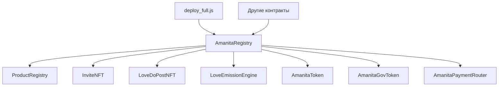

# AmanitaRegistry - Центральный реестр контрактов экосистемы

## Обзор

`AmanitaRegistry` - это **инфраструктурный контракт** экосистемы Amanita, реализующий централизованный реестр адресов всех контрактов. Он обеспечивает единую точку доступа к контрактам через человеко-читаемые имена и упрощает интеграцию и обновления в экосистеме.

## Архитектура

### Централизованный реестр


### Система управления
- **Владелец** - единственный адрес, управляющий реестром
- **Человеко-читаемые имена** - удобные ключи для доступа
- **События** - отслеживание всех изменений
- **Валидация** - проверка адресов при добавлении

## Основные функции

### Управление адресами

#### `setAddress(string calldata name, address newAddress)`
Добавляет или обновляет адрес контракта в реестре.

**Параметры:**
- `name` - человеко-читаемое имя контракта (например, "SpiralEngine")
- `newAddress` - адрес контракта

**Требования:**
- Вызывающий должен быть владельцем реестра
- Адрес не должен быть нулевым

**Процесс добавления:**
1. ✅ Проверка прав владельца
2. ✅ Валидация адреса (не нулевой)
3. ✅ Проверка, является ли это новым контрактом
4. ✅ Добавление имени в массив (если новый)
5. ✅ Сохранение адреса в маппинг
6. ✅ Эмиссия события AddressUpdated

**Событие:**
```solidity
event AddressUpdated(string indexed name, address indexed newAddress);
```

### Получение адресов

#### `getAddress(string calldata name)`
Возвращает адрес контракта по его имени.

**Параметры:**
- `name` - имя контракта

**Возвращает:**
- `address` - адрес контракта

**Использование:**
```javascript
const registry = new ethers.Contract(address, abi, provider);
const productRegistryAddress = await registry.getAddress("ProductRegistry");
```

#### `getAllContractNames()`
Возвращает список всех зарегистрированных контрактов.

**Возвращает:**
- `string[]` - массив имен всех контрактов

**Использование:**
```javascript
const contractNames = await registry.getAllContractNames();
console.log("Зарегистрированные контракты:", contractNames);
```

### Управление владельцем

#### `transferOwnership(address newOwner)`
Передает права управления реестром новому владельцу.

**Параметры:**
- `newOwner` - новый адрес владельца

**Требования:**
- Вызывающий должен быть текущим владельцем
- Новый владелец не должен быть нулевым адресом

**Процесс передачи:**
1. ✅ Проверка прав текущего владельца
2. ✅ Валидация нового адреса
3. ✅ Обновление владельца

## Структуры данных

### Основные переменные
```solidity
address public owner;                                    // Владелец реестра
mapping(string => address) private addresses;           // Имя => Адрес
string[] private contractNames;                         // Список всех имен
```

### События
```solidity
event AddressUpdated(string indexed name, address indexed newAddress);
```

## Безопасность

### Контроль доступа
```solidity
modifier onlyOwner() {
    require(msg.sender == owner, "AmanitaRegistry: not owner");
    _;
}
```

### Валидация данных
```solidity
require(newAddress != address(0), "AmanitaRegistry: zero address");
require(newOwner != address(0), "AmanitaRegistry: zero address");
```

### Защита от ошибок
- Проверка нулевых адресов
- Проверка прав доступа
- Валидация входных параметров

## Интеграция с экосистемой

### Регистрация контрактов
Все контракты экосистемы регистрируются в AmanitaRegistry:

```javascript
// В deploy_full.js
await amanitaRegistry.methods.setAddress("InviteNFT", inviteNFT.options.address).send({
    from: deployerAccount.address,
    gas: 200000
});

await amanitaRegistry.methods.setAddress("ProductRegistry", productRegistry.options.address).send({
    from: deployerAccount.address,
    gas: 200000
});
```

### Использование в контрактах
Другие контракты используют реестр для получения адресов:

```solidity
// В LoveDoPostNFT
IAmanitaRegistry public amanitaRegistry;

// Проверка роли продавца
require(amanitaRegistry.hasSellerRole(loveDos[tokenId].sellerTo), "LoveDo: target seller not registered");
```

### Управление версиями
Реестр позволяет обновлять контракты без изменения кода:

```javascript
// Обновление контракта
await registry.setAddress("ProductRegistry", newProductRegistryAddress);
```

## Использование

### Получение адреса контракта
```javascript
const registry = new ethers.Contract(registryAddress, abi, provider);

// Получение адреса ProductRegistry
const productRegistryAddress = await registry.getAddress("ProductRegistry");

// Получение адреса InviteNFT
const inviteNFTAddress = await registry.getAddress("InviteNFT");
```

### Подключение к контрактам
```javascript
// Получение адреса и подключение
const productRegistryAddress = await registry.getAddress("ProductRegistry");
const ProductRegistry = await ethers.getContractFactory("ProductRegistry");
const productRegistry = ProductRegistry.attach(productRegistryAddress);
```

### Мониторинг контрактов
```javascript
// Получение списка всех контрактов
const contractNames = await registry.getAllContractNames();

// Получение адресов всех контрактов
const contracts = {};
for (const name of contractNames) {
    contracts[name] = await registry.getAddress(name);
}
```

## События и мониторинг

### Событие обновления
```solidity
event AddressUpdated(string indexed name, address indexed newAddress);
```

### Отслеживание изменений
- Все изменения адресов логируются
- Индексация по имени и адресу
- Возможность отслеживания истории изменений

### Мониторинг экосистемы
```javascript
// Слушание событий обновления
registry.on("AddressUpdated", (name, newAddress) => {
    console.log(`Контракт ${name} обновлен: ${newAddress}`);
});
```

## Роль в экосистеме

### Центральный хаб
AmanitaRegistry служит **центральным хабом** экосистемы:

- 🔗 **Единая точка доступа** ко всем контрактам
- 📝 **Управление версиями** контрактов
- 🔄 **Упрощение обновлений** без изменения кода
- 📊 **Мониторинг** состояния экосистемы

### Интеграция с развертыванием
```javascript
// В deploy_full.js
if (amanitaRegistry != null) {
    await amanitaRegistry.methods.setAddress(contractName, instance.options.address).send({
        from: deployerAccount.address,
        gas: 200000
    });
}
```

### Использование в контрактах
```solidity
// Проверка ролей через реестр
require(amanitaRegistry.hasSellerRole(user), "Not a seller");
```

## Ограничения и особенности

### Централизация
- ✅ **Простота управления** - единая точка контроля
- ❌ **Единая точка отказа** - владелец может изменить адреса
- 🔒 **Контроль доступа** - только владелец может управлять

### Безопасность
- 🛡️ **Проверка адресов** - защита от нулевых адресов
- 🔐 **Контроль владельца** - только авторизованные изменения
- 📝 **Логирование** - все изменения отслеживаются

### Гибкость
- 🔄 **Обновления** - легкое обновление контрактов
- 📋 **Мониторинг** - отслеживание всех контрактов
- 🔗 **Интеграция** - упрощение подключения к контрактам

## Мониторинг и аналитика

### Метрики реестра
- Количество зарегистрированных контрактов
- Частота обновлений адресов
- Активность владельца

### Отслеживание изменений
- История обновлений каждого контракта
- Временные метки изменений
- Анализ стабильности экосистемы

## Заключение

`AmanitaRegistry` - это **фундаментальный инфраструктурный контракт** экосистемы Amanita, который:

- 🏗️ **Обеспечивает архитектуру** - централизованный реестр контрактов
- 🔗 **Упрощает интеграцию** - единая точка доступа
- 🔄 **Обеспечивает гибкость** - легкие обновления контрактов
- 📊 **Обеспечивает мониторинг** - отслеживание состояния экосистемы
- 🛡️ **Обеспечивает безопасность** - контролируемые изменения

Контракт является **критически важным компонентом** экосистемы, обеспечивающим ее стабильность, гибкость и возможность развития. Без него было бы невозможно эффективно управлять множеством взаимосвязанных контрактов в децентрализованной экосистеме Amanita.
