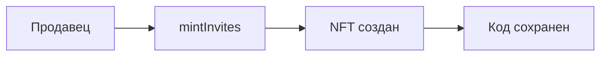
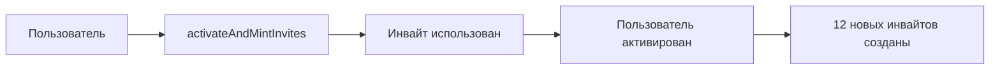
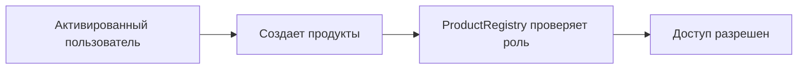

# InviteNFT - Контракт системы приглашений

## Обзор

`InviteNFT` - это смарт-контракт системы приглашений в экосистеме Amanita, реализующий **Soulbound NFT** для управления доступом пользователей. Контракт обеспечивает создание, валидацию и активацию инвайтов с полным контролем жизненного цикла.

## Архитектура

### Soulbound NFT
Инвайты реализованы как **Soulbound NFT** (непередаваемые токены):
- ✅ Можно создавать (минт)
- ✅ Можно сжигать (burn)
- ❌ **НЕЛЬЗЯ передавать** между пользователями
- 🛡️ Защита от спекуляций и перепродажи

### Система ролей
```solidity
bytes32 public constant SELLER_ROLE = keccak256("SELLER_ROLE");
```
- **SELLER_ROLE** - создание и управление инвайтами
- **DEFAULT_ADMIN_ROLE** - управление ролями и системой

## Основные функции

### Создание инвайтов

#### `mintInvites(string[] calldata inviteCodes, uint256 expiry)`
Создает пакет инвайтов для раздачи стартовой аудитории.

**Параметры:**
- `inviteCodes` - массив уникальных кодов инвайтов
- `expiry` - срок действия (0 = бессрочные)

**Требования:**
- Вызывающий должен иметь `SELLER_ROLE`
- Все коды должны быть уникальными
- Срок действия должен быть в будущем или 0

**Особенности:**
- Batch-операция для эффективности
- Автоматическое создание NFT для каждого кода
- Инициализация всех маппингов

#### `_mintInvite(string memory inviteCode, address to, uint256 expiry)`
Внутренний метод создания одного инвайта.

**Функциональность:**
- Генерация уникального `tokenId`
- Создание NFT на адрес `to`
- Инициализация всех маппингов
- Обновление счетчиков

### Активация пользователей

#### `activateAndMintInvites(string memory inviteCode, address user, string[] memory newInviteCodes, uint256 expiry)`
**Главная функция активации** - активирует пользователя и создает для него новые инвайты.

**Параметры:**
- `inviteCode` - код инвайта для активации
- `user` - адрес пользователя для активации
- `newInviteCodes` - массив новых кодов (должно быть ровно 12)
- `expiry` - срок действия новых инвайтов

**Требования:**
- Вызывающий должен иметь `SELLER_ROLE`
- Пользователь не должен быть активирован ранее
- Инвайт должен быть валидным и неиспользованным
- Все новые коды должны быть уникальными

**Процесс активации:**
1. ✅ Проверка, что пользователь не активирован
2. ✅ Валидация инвайта (существование, неиспользованность, срок)
3. ✅ Проверка уникальности новых кодов
4. ✅ Отметка инвайта как использованного
5. ✅ Добавление пользователя в активированные
6. ✅ Создание 12 новых инвайтов для пользователя
7. ✅ Эмиссия событий

**События:**
```solidity
event InviteActivated(address indexed user, string inviteCode, uint256 tokenId, uint256 timestamp);
event BatchInvitesMinted(address indexed to, uint256[] tokenIds, string[] inviteCodes, uint256 expiry);
```

### Валидация инвайтов

#### `validateInviteCode(string memory inviteCode)`
Проверяет валидность инвайта по коду.

**Возвращает:**
- `bool success` - валиден ли инвайт
- `string reason` - причина невалидности

**Возможные причины невалидности:**
- `"not_found"` - инвайт не существует
- `"already_used"` - инвайт уже использован
- `"expired"` - инвайт истек
- `"user_already_activated"` - пользователь уже активирован

#### `batchValidateInviteCodes(string[] memory inviteCodes, address user)`
Batch-валидация массива инвайтов для пользователя.

**Возвращает:**
- `bool[] success` - массив результатов валидации
- `string[] reasons` - массив причин невалидности

### Управление пользователями

#### `isUserActivated(address user)`
Проверяет, активирован ли пользователь.

**Возвращает:**
- `bool` - true если пользователь активирован

#### `getAllActivatedUsers()`
Возвращает массив всех активированных пользователей.

### Управление инвайтами

#### `getUserInvites(address user)`
Возвращает все инвайты пользователя.

#### `getInviteTransferHistory(uint256 tokenId)`
Возвращает историю владельцев инвайта (для аудита).

#### `isInviteTokenUsed(uint256 tokenId)`
Проверяет, использован ли конкретный инвайт.

### Управление ролями

#### `addSeller(address seller)`
Назначает роль продавца (только админ).

#### `removeSeller(address seller)`
Убирает роль продавца (только админ).

#### `isSeller(address user)`
Проверяет, является ли пользователь продавцом.

## Структуры данных

### Основные маппинги
```solidity
// Код инвайта => ID токена
mapping(string => uint256) public inviteCodeToTokenId;

// ID токена => код инвайта
mapping(uint256 => string) public tokenIdToInviteCode;

// ID токена => использован ли
mapping(uint256 => bool) public isInviteUsed;

// Пользователь => использованный токен
mapping(address => uint256) public usedInviteByUser;

// ID токена => срок действия
mapping(uint256 => uint256) public inviteExpiry;

// ID токена => дата создания
mapping(uint256 => uint256) public inviteCreatedAt;

// ID токена => создатель
mapping(uint256 => address) public inviteMinter;

// ID токена => первый владелец
mapping(uint256 => address) public inviteFirstOwner;

// Пользователь => его инвайты
mapping(address => uint256[]) public userInvites;

// ID токена => история владельцев
mapping(uint256 => address[]) public inviteTransferHistory;
```

### Счетчики
```solidity
uint256 public totalInvitesUsed;    // Всего использованных инвайтов
uint256 public totalInvitesMinted;  // Всего созданных инвайтов
uint256 private _tokenIdCounter;    // Счетчик ID токенов
```

### Массивы
```solidity
address[] public activatedUsers;    // Все активированные пользователи
```

## Безопасность

### Soulbound NFT защита
```solidity
function _update(address to, uint256 tokenId, address auth) internal virtual override returns (address) {
    address from = _ownerOf(tokenId);
    
    // Разрешаем только минт (from == address(0)) и сжигание (to == address(0))
    require(from == address(0) || to == address(0), "InviteNFT: soulbound");
    
    return super._update(to, tokenId, auth);
}
```

### Контроль доступа
- **SELLER_ROLE** - создание инвайтов
- **DEFAULT_ADMIN_ROLE** - управление ролями
- Проверка уникальности кодов
- Защита от повторной активации

### Валидация данных
- Проверка сроков действия инвайтов
- Проверка уникальности кодов в batch-операциях
- Защита от активации уже активированных пользователей

## События

### Основные события
```solidity
event InviteActivated(address indexed user, string inviteCode, uint256 tokenId, uint256 timestamp);
event BatchInvitesMinted(address indexed to, uint256[] tokenIds, string[] inviteCodes, uint256 expiry);
event InviteTransferred(uint256 indexed tokenId, address from, address to, uint256 timestamp);
```

### События активации
- `InviteActivated` - пользователь активирован через инвайт
- `BatchInvitesMinted` - создан пакет новых инвайтов

## Использование

### Создание инвайтов для продавца
```javascript
const inviteNFT = new ethers.Contract(address, abi, seller);

// Создание пакета инвайтов
const inviteCodes = ["INVITE-001", "INVITE-002", "INVITE-003"];
const expiry = 0; // Бессрочные

await inviteNFT.mintInvites(inviteCodes, expiry);
```

### Активация пользователя
```javascript
const inviteNFT = new ethers.Contract(address, abi, seller);

// Активация пользователя
const inviteCode = "INVITE-001";
const user = "0x...";
const newInviteCodes = ["NEW-001", "NEW-002", /* ... 12 кодов */];
const expiry = 0;

await inviteNFT.activateAndMintInvites(inviteCode, user, newInviteCodes, expiry);
```

### Проверка статуса
```javascript
// Проверка активации пользователя
const isActivated = await inviteNFT.isUserActivated(userAddress);

// Валидация инвайта
const [isValid, reason] = await inviteNFT.validateInviteCode(inviteCode);

// Получение инвайтов пользователя
const userInvites = await inviteNFT.getUserInvites(userAddress);
```

## Интеграция с экосистемой

### Зависимости
- **OpenZeppelin ERC721** - базовая функциональность NFT
- **OpenZeppelin AccessControl** - система ролей

### Связь с другими контрактами
- **ProductRegistry** - использует `isSeller()` и `isUserActivated()`
- **AmanitaRegistry** - регистрация адреса контракта

## Жизненный цикл инвайта

### 1. Создание


### 2. Активация


### 3. Использование


## Ограничения и особенности

### Soulbound NFT
- ❌ Инвайты нельзя передавать
- ✅ Можно создавать и сжигать
- 🛡️ Защита от спекуляций

### Batch-операции
- ✅ Эффективное создание множества инвайтов
- ✅ Batch-валидация для проверки
- ⚠️ Ограничение на 12 новых инвайтов при активации

### Уникальность
- ✅ Все коды инвайтов должны быть уникальными
- ✅ Проверка на уровне контракта
- ✅ Защита от дублирования

## Аудит и мониторинг

### Счетчики
- `totalInvitesUsed` - общее количество использованных инвайтов
- `totalInvitesMinted` - общее количество созданных инвайтов
- `userInviteCount[user]` - количество инвайтов конкретного пользователя

### История
- `inviteTransferHistory[tokenId]` - полная история владельцев инвайта
- `inviteCreatedAt[tokenId]` - дата создания инвайта
- `inviteMinter[tokenId]` - кто создал инвайт

### События
- Все операции логируются через события
- Индексация по пользователям и токенам
- Timestamp для временного анализа

## Заключение

`InviteNFT` - это комплексная система управления доступом, которая:

- 🛡️ **Безопасна** - Soulbound NFT + система ролей
- ⚡ **Эффективна** - batch-операции и оптимизированные алгоритмы
- 🔍 **Прозрачна** - полное логирование и аудит
- 🔗 **Интегрирована** - тесная связь с экосистемой Amanita
- 📈 **Масштабируема** - поддержка больших объемов инвайтов

Контракт обеспечивает надежную основу для системы приглашений в децентрализованной экосистеме Amanita.
