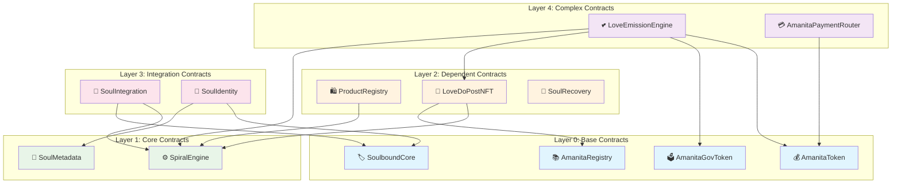

# ItemY1.3: Анализ зависимостей в экосистеме AMANITA

## 📊 Обзор зависимостей

SpiralEngine является центральным компонентом экосистемы AMANITA с множественными зависимостями от других контрактов и сервисов. Анализ зависимостей критичен для планирования upgradeable архитектуры.

## 🏗️ Deployment зависимости

### Анализ SUPPORTED_CONTRACTS

На основе анализа `deploy_full.js` выявлена следующая структура зависимостей:

```javascript
const SUPPORTED_CONTRACTS = {
    'AmanitaRegistry': {
        dependencies: [],           // Базовый контракт
        needsSetup: false
    },
    'SpiralEngine': {
        dependencies: [],           // Независимый контракт
        needsSetup: true
    },
    'ProductRegistry': {
        dependencies: ['SpiralEngine'],  // Зависит от SpiralEngine
        needsSetup: true
    },
    'LoveDoPostNFT': {
        dependencies: ['SpiralEngine', 'AmanitaRegistry'],  // Двойная зависимость
        needsSetup: true
    },
    'LoveEmissionEngine': {
        dependencies: ['AmanitaToken', 'AmanitaGovToken', 'LoveDoPostNFT', 'SpiralEngine'],
        needsSetup: true
    },
    'SoulIntegration': {
        dependencies: ['SpiralEngine', 'SoulboundCore'],  // Зависит от SpiralEngine
        needsSetup: true
    },
    'SoulIdentity': {
        dependencies: ['SoulboundCore', 'SoulMetadata'],  // Косвенная зависимость через SoulIntegration
        needsSetup: true
    }
};
```

### Карта deployment зависимостей



### Порядок деплоя контрактов

#### Этап 1: Базовые контракты (Layer 0)
```yaml
Порядок деплоя:
  1. AmanitaRegistry - центральный реестр адресов
  2. AmanitaToken - утилити токены
  3. AmanitaGovToken - governance токены
  4. SoulboundCore - базовый SBT контракт

Зависимости: Нет
Критичность: Высокая (база для всех остальных)
```

#### Этап 2: Основные контракты (Layer 1)
```yaml
Порядок деплоя:
  1. SpiralEngine - центральный контракт спиральной экономики
  2. SoulMetadata - метаданные SBT

Зависимости: Нет (независимые контракты)
Критичность: Максимальная (SpiralEngine - сердце системы)
```

#### Этап 3: Зависимые контракты (Layer 2)
```yaml
Порядок деплоя:
  1. ProductRegistry - зависит от SpiralEngine
  2. LoveDoPostNFT - зависит от SpiralEngine + AmanitaRegistry
  3. SoulRecovery - зависит от SoulboundCore

Зависимости: Layer 0 + Layer 1
Критичность: Высокая (функциональные контракты)
```

#### Этап 4: Интеграционные контракты (Layer 3)
```yaml
Порядок деплоя:
  1. SoulIntegration - зависит от SpiralEngine + SoulboundCore
  2. SoulIdentity - зависит от SoulboundCore + SoulMetadata

Зависимости: Layer 0 + Layer 1 + Layer 2
Критичность: Средняя (интеграционные функции)
```

#### Этап 5: Сложные контракты (Layer 4)
```yaml
Порядок деплоя:
  1. LoveEmissionEngine - зависит от всех предыдущих слоев
  2. AmanitaPaymentRouter - зависит от AmanitaToken

Зависимости: Все предыдущие слои
Критичность: Средняя (специализированные функции)
```

## 🔄 Функциональные зависимости

### Анализ вызовов функций

#### 1. ProductRegistry → SpiralEngine
```solidity
// Проверка активации пользователя
function onlyActivatedUser() {
    require(spiralEngine.usedInviteByUser(msg.sender) > 0, "Not activated");
}

// Проверка роли продавца
function hasSellerRole(address user) {
    return spiralEngine.hasRole(SELLER_ROLE, user);
}
```

**Тип зависимости:** View функции (чтение)  
**Критичность:** Высокая (блокирует создание товаров)  
**Риск при обновлении:** Изменение интерфейса сломает ProductRegistry

#### 2. LoveEmissionEngine → SpiralEngine
```solidity
// Проверка социальных связей
function emitForSuperlike(uint256 tokenId, address liker) {
    address author = loveDo.getPostAuthor(tokenId);
    require(inviteGraph.isConnected(liker, author), "Not connected");
}
```

**Тип зависимости:** Интерфейс IInviteGraph  
**Критичность:** Высокая (блокирует эмиссию токенов)  
**Риск при обновлении:** Изменение логики связей нарушит экономику

#### 3. SoulIntegration → SpiralEngine
```solidity
// Интеграция SBT с спиральной системой
function integrateWithSpiral(address user) {
    require(spiralEngine.usedInviteByUser(user) > 0, "User not activated");
    // Создание SBT для активированного пользователя
}
```

**Тип зависимости:** Проверка активации + события  
**Критичность:** Средняя (SBT функциональность)  
**Риск при обновлении:** Изменение событий нарушит синхронизацию

### Анализ событий и слушателей

#### События SpiralEngine
```solidity
event InviteMinted(address indexed minter, uint256 indexed tokenId, string inviteCode, uint256 expiry);
event InviteUsed(address indexed user, uint256 indexed tokenId, string inviteCode);
event UserActivated(address indexed user, address indexed activator, uint256 timestamp);
event SellerRoleGranted(address indexed user, address indexed nominator, uint256 timestamp);
event UserSuspended(address indexed user, uint256 until, string reason);
```

#### Слушатели событий
```javascript
// Bot services слушают события активации
spiralEngine.on('UserActivated', (user, activator, timestamp) => {
    // Обновление локального состояния
    // Уведомление пользователя
    // Синхронизация с другими сервисами
});

// ProductRegistry может слушать события ролей
spiralEngine.on('SellerRoleGranted', (user, nominator, timestamp) => {
    // Обновление кэша ролей
    // Уведомление о новых возможностях
});
```

## 🎯 Критические точки отказа

### 1. Каскадные сбои

#### Сценарий 1: Обновление SpiralEngine
```yaml
Потенциаlные сбои:
  - ProductRegistry: Не может проверить активацию → товары не создаются
  - LoveEmissionEngine: Не может проверить связи → эмиссия токенов останавливается
  - SoulIntegration: Не может синхронизировать SBT → потеря идентичности
  - Bot services: Не могут активировать пользователей → система недоступна

Время восстановления: 2-4 часа
Влияние на пользователей: Полная блокировка системы
```

#### Сценарий 2: Обновление SoulIdentity
```yaml
Потенциaльные сбои:
  - SpiralEngine: Не может обновить репутацию → потеря SBT функций
  - SoulIntegration: Не может работать с SBT → потеря метаданных

Время восстановления: 1-2 часа
Влияние на пользователей: Потеря репутации и SBT
```

### 2. Циклические зависимости

#### Выявленные циклы:
```yaml
SpiralEngine ↔ SoulIdentity:
  - SpiralEngine вызывает SoulIdentity для SBT функций
  - SoulIdentity требует SPIRAL_ENGINE_ROLE от SpiralEngine

SpiralEngine ↔ LoveEmissionEngine:
  - LoveEmissionEngine использует SpiralEngine как IInviteGraph
  - SpiralEngine может использовать LoveEmissionEngine для репутации
```

**Риск:** Зацикливание при обновлении  
**Митигация:** Четкое разделение ответственности, асинхронные обновления

## ⚠️ Риски при обновлении

### 1. Критические риски

#### Изменение интерфейса
```yaml
Риск: Изменение сигнатуры функций
Пример: usedInviteByUser(address) → usedInviteByUser(address, uint256)
Влияние: ProductRegistry, LoveEmissionEngine, Bot services
Митигация: Обратная совместимость, версионирование API
```

#### Изменение логики
```yaml
Риск: Изменение бизнес-логики активации
Пример: Новые ограничения на активацию
Влияние: Все зависимые контракты
Митигация: Постепенное внедрение, feature flags
```

#### Изменение событий
```yaml
Риск: Изменение структуры событий
Пример: Новые параметры в UserActivated
Влияние: Bot services, мониторинг
Митигация: Дополнительные события, не удаление существующих
```

### 2. Средние риски

#### Изменение ролей
```yaml
Риск: Изменение системы ролей
Пример: Новые роли, изменение существующих
Влияние: ProductRegistry, система доступа
Митигация: Сохранение существующих ролей, добавление новых
```

#### Изменение структуры данных
```yaml
Риск: Изменение возвращаемых структур
Пример: Новые поля в SellerDiagnostics
Влияние: Bot services, фронтенд
Митигация: Расширение структур, не удаление полей
```

### 3. Низкие риски

#### Изменение констант
```yaml
Риск: Изменение константных значений
Пример: Новые лимиты, таймауты
Влияние: Минимальное
Митигация: Документирование изменений
```

## 🔄 План миграции зависимостей

### Стратегия поэтапного обновления

#### Фаза 1: Подготовка (1-2 дня)
```yaml
Задачи:
  - Создание upgradeable версии SpiralEngine
  - Тестирование на локальной сети
  - Подготовка скриптов миграции

Риски: Минимальные
Откат: Простой (локальная среда)
```

#### Фаза 2: Деплой proxy (1 день)
```yaml
Задачи:
  - Деплой SpiralEngineProxy
  - Миграция данных
  - Обновление AmanitaRegistry

Риски: Средние (данные)
Откат: Возможен (rollback к старой версии)
```

#### Фаза 3: Обновление зависимых контрактов (3-5 дней)
```yaml
Порядок обновления:
  1. ProductRegistry (проверка совместимости)
  2. SoulIntegration (обновление SBT интеграции)
  3. LoveEmissionEngine (проверка экономики)
  4. Bot services (обновление API)

Риски: Высокие (функциональность)
Откат: Сложный (множественные контракты)
```

#### Фаза 4: Валидация и мониторинг (2-3 дня)
```yaml
Задачи:
  - Тестирование всех интеграций
  - Мониторинг производительности
  - Валидация целостности данных

Риски: Низкие (проверка)
Откат: Не требуется
```

### Критерии успеха миграции

#### Функциональные критерии
```yaml
- Все существующие функции работают без изменений
- Производительность не ухудшилась > 10%
- Gas costs не увеличились > 15%
- Все интеграции функционируют корректно
```

#### Бизнес-критерии
```yaml
- Пользователи не заметили изменений
- Все данные сохранены
- Система доступна 99.9% времени
- Нет потери функциональности
```

#### Технические критерии
```yaml
- Все тесты проходят
- Мониторинг показывает нормальные метрики
- Логи не содержат ошибок
- Backup и recovery работают
```

## 📊 Матрица рисков

| Компонент | Вероятность сбоя | Влияние | Критичность | Митигация |
|-----------|------------------|---------|-------------|-----------|
| ProductRegistry | Средняя | Высокое | 🔴 Высокая | Тестирование совместимости |
| LoveEmissionEngine | Низкая | Высокое | 🟡 Средняя | Постепенное обновление |
| SoulIntegration | Средняя | Среднее | 🟡 Средняя | Асинхронная миграция |
| Bot Services | Высокая | Высокое | 🔴 Высокая | Канареечные деплои |
| SoulIdentity | Низкая | Среднее | 🟡 Средняя | Координированное обновление |

## 🎯 Рекомендации

### 1. Архитектурные решения
- **Обратная совместимость** - все существующие интерфейсы должны работать
- **Версионирование API** - новые функции в новых версиях
- **Graceful degradation** - система должна работать даже при частичных сбоях

### 2. Процессные решения
- **Поэтапное обновление** - обновление по одному компоненту
- **Канареечные деплои** - тестирование на подмножестве пользователей
- **Мониторинг** - отслеживание всех метрик в реальном времени

### 3. Технические решения
- **Comprehensive testing** - тестирование всех интеграций
- **Rollback план** - возможность быстрого отката
- **Data validation** - проверка целостности данных после миграции

---

**Статус:** ✅ Завершен  
**Дата:** 2025-01-23  
**Следующий шаг:** Создание сводного отчета ItemY1
