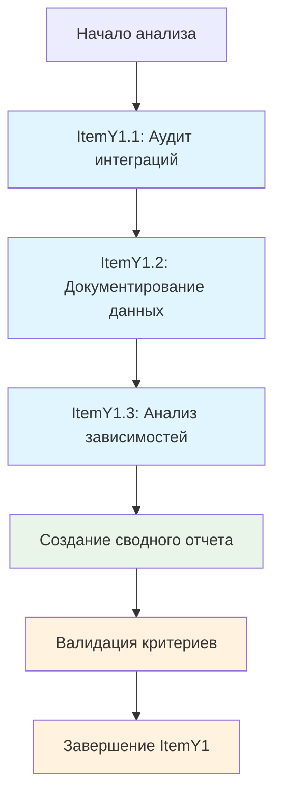

# ItemY1: План реализации - Анализ текущего состояния

## 🎯 Общая стратегия

**Цель:** Провести комплексный анализ текущего состояния SpiralEngine и его интеграций в экосистеме AMANITA для подготовки к внедрению upgradeable архитектуры.

**Подход:** Систематический анализ по трем направлениям с созданием структурированной документации и визуализации.

## 📋 Детальный план выполнения

### ItemY1.1: Аудит всех интеграций SpiralEngine

#### Шаг 1.1.1: Анализ прямых интеграций
**Время:** 2 часа
**Инструменты:** codebase_search, grep, анализ кода

**Действия:**
1. Поиск всех прямых вызовов SpiralEngine в контрактах
2. Анализ интерфейсов и взаимодействий
3. Документирование типов интеграций

**Результат:** Список прямых интеграций с описанием типов взаимодействий

#### Шаг 1.1.2: Анализ косвенных зависимостей
**Время:** 3 часа
**Инструменты:** Анализ зависимостей, трассировка вызовов

**Действия:**
1. Анализ цепочки зависимостей через SoulIdentity
2. Поиск зависимостей через AmanitaRegistry
3. Анализ интеграций в bot services

**Результат:** Карта косвенных зависимостей

#### Шаг 1.1.3: Создание диаграммы зависимостей
**Время:** 1 час
**Инструменты:** Mermaid

**Действия:**
1. Создание визуальной диаграммы всех связей
2. Цветовое кодирование типов зависимостей
3. Добавление в документацию

**Результат:** Mermaid диаграмма интеграций

### ItemY1.2: Документирование критических данных

#### Шаг 1.2.1: Категоризация данных
**Время:** 2 часа
**Инструменты:** Анализ SpiralEngine.sol

**Действия:**
1. Группировка всех state variables по категориям
2. Анализ важности каждой категории
3. Оценка критичности для спиральной экономики

**Результат:** Структурированная категоризация данных

#### Шаг 1.2.2: Документирование структур
**Время:** 1.5 часа
**Инструменты:** Анализ кода, создание документации

**Действия:**
1. Описание всех mapping переменных
2. Документирование структур InviteInfo и SellerDiagnostics
3. Анализ связей между данными

**Результат:** Полная документация структур данных

#### Шаг 1.2.3: Оценка объема данных
**Время:** 1 час
**Инструменты:** Анализ тестовых данных, расчеты

**Действия:**
1. Подсчет количества пользователей в тестах
2. Оценка размера инвайт-сети
3. Расчет объема репутационных данных

**Результат:** Количественная оценка данных для миграции

### ItemY1.3: Анализ зависимостей в экосистеме

#### Шаг 1.3.1: Анализ deployment зависимостей
**Время:** 2 часа
**Инструменты:** Анализ deploy_full.js, SUPPORTED_CONTRACTS

**Действия:**
1. Изучение порядка деплоя контрактов
2. Анализ критических зависимостей
3. Выявление циклических зависимостей

**Результат:** Карта deployment зависимостей

#### Шаг 1.3.2: Анализ функциональных зависимостей
**Время:** 2.5 часа
**Инструменты:** Анализ кода, трассировка вызовов

**Действия:**
1. Поиск всех вызовов функций SpiralEngine
2. Анализ событий и их слушателей
3. Изучение использования ролей

**Результат:** Карта функциональных зависимостей

#### Шаг 1.3.3: Оценка рисков
**Время:** 1 час
**Инструменты:** Анализ рисков, экспертная оценка

**Действия:**
1. Идентификация критических точек отказа
2. Анализ возможных конфликтов версий
3. Оценка необходимости синхронных обновлений

**Результат:** Матрица рисков с приоритизацией

## 🔄 Последовательность выполнения

## 📊 Критерии успеха

### Количественные метрики:
- **Покрытие интеграций:** 100% контрактов проанализированы
- **Документирование:** 100% state variables задокументированы
- **Анализ рисков:** Минимум 5 критических рисков выявлены

### Качественные критерии:
- **Полнота:** Все аспекты SpiralEngine покрыты
- **Структурированность:** Четкая категоризация и организация
- **Практичность:** Результаты применимы для реализации

## 🛡️ Управление рисками

### Потенциальные риски:
1. **Неполный анализ** - может пропустить критические зависимости
2. **Неточная оценка** - неправильная оценка объема данных
3. **Устаревшая информация** - анализ может не отражать текущее состояние

### Меры минимизации:
1. **Систематический подход** - использование структурированных методов
2. **Валидация** - перекрестная проверка результатов
3. **Актуальность** - анализ на основе последней версии кода

## 📋 Deliverables

### Основные результаты:
1. **Документ интеграций** - полный анализ всех связей SpiralEngine
2. **Каталог данных** - структурированное описание всех критических данных
3. **Матрица зависимостей** - карта всех зависимостей в экосистеме
4. **Диаграммы** - визуализация архитектуры и связей

### Формат результатов:
- **Markdown документы** с Mermaid диаграммами
- **YAML файлы** для структурированных данных
- **Таблицы и матрицы** для анализа рисков

## ⏱️ Временные рамки

**Общее время:** 14.5 часов
**Распределение:**
- ItemY1.1: 6 часов (41%)
- ItemY1.2: 4.5 часа (31%)
- ItemY1.3: 4 часа (28%)

**Дедлайн:** 3 рабочих дня
