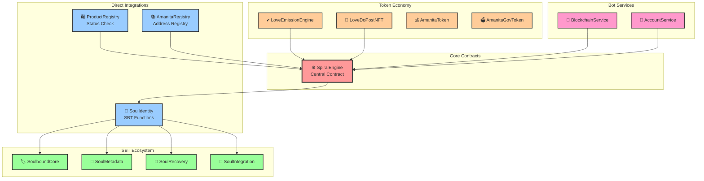

# ItemY1.1: Аудит всех интеграций SpiralEngine

## 📊 Обзор интеграций

SpiralEngine является центральным контрактом в экосистеме AMANITA, который интегрируется с множеством других компонентов системы. Ниже представлен полный аудит всех интеграций.

## 🔗 Прямые интеграции

### 1. SoulIdentity (SBT функциональность)

**Тип интеграции:** Делегирование SBT функций  
**Направление:** SpiralEngine → SoulIdentity  
**Критичность:** Высокая

#### Функции взаимодействия:
```solidity
// SpiralEngine вызывает SoulIdentity
function getSoulLevel(address user) public view returns (uint256)
function getSoulReputation(address user) public view returns (uint256)
function getSoulIdentity(address user) public view returns (string memory)
function getSoulVerificationLevel(address user) public view returns (uint256)
function updateSoulReputation(address user, int256 change) external
```

#### Обратные вызовы:
```solidity
// SoulIdentity требует SPIRAL_ENGINE_ROLE для обновления репутации
bytes32 public constant SPIRAL_ENGINE_ROLE = keccak256("SPIRAL_ENGINE_ROLE");
```

#### Данные, передаваемые между контрактами:
- **Адрес пользователя** - для получения SBT данных
- **Изменения репутации** - для обновления soul reputation
- **DID данные** - для связи с внешними идентичностями

### 2. ProductRegistry (Роли и статус активации)

**Тип интеграции:** Проверка статуса активации  
**Направление:** ProductRegistry → SpiralEngine  
**Критичность:** Высокая

#### Интерфейс интеграции:
```solidity
interface ISpiralEngine {
    function usedInviteByUser(address user) external view returns (uint256);
    function hasRole(bytes32 role, address account) external view returns (bool);
}
```

#### Функции взаимодействия:
```solidity
// ProductRegistry проверяет активацию пользователя
modifier onlyActivatedUser() {
    require(spiralEngine.usedInviteByUser(msg.sender) > 0, "Not activated in SpiralEngine");
    _;
}

// Проверка роли продавца
function hasSellerRole(address user) external view returns (bool) {
    return spiralEngine.hasRole(SELLER_ROLE, user);
}
```

#### Данные, передаваемые между контрактами:
- **Статус активации** - проверка активации пользователя
- **Роли пользователя** - проверка SELLER_ROLE

### 3. AmanitaRegistry (Регистрация адреса)

**Тип интеграции:** Регистрация адреса контракта  
**Направление:** SpiralEngine → AmanitaRegistry  
**Критичность:** Средняя

#### Функции взаимодействия:
```javascript
// deploy_full.js регистрирует адрес SpiralEngine
await amanitaRegistry.setAddress("SpiralEngine", spiralEngineAddress);
```

#### Данные, передаваемые между контрактами:
- **Адрес контракта** - для регистрации в центральном реестре

## 🔄 Косвенные зависимости

### 1. SoulboundCore, SoulMetadata, SoulRecovery, SoulIntegration

**Тип интеграции:** Через SoulIdentity  
**Направление:** SpiralEngine → SoulIdentity → SBT контракты  
**Критичность:** Высокая

#### Цепочка интеграции:
```
SpiralEngine → SoulIdentity → SoulboundCore + SoulMetadata + SoulRecovery + SoulIntegration
```

#### Функции взаимодействия:
```solidity
// SoulIdentity делегирует к SBT контрактам
ISoulboundCore public soulboundCore;
ISoulMetadata public soulMetadata;
```

### 2. LoveEmissionEngine (Токеновая экосистема)

**Тип интеграции:** Проверка социальных связей  
**Направление:** LoveEmissionEngine → SpiralEngine  
**Критичность:** Высокая

#### Функции взаимодействия:
```solidity
// LoveEmissionEngine использует SpiralEngine как IInviteGraph
IInviteGraph public inviteGraph; // SpiralEngine

// Проверка социальных связей для эмиссии токенов
function emitForSuperlike(uint256 tokenId, address liker) external {
    // Проверка связей через inviteGraph
    address author = loveDo.getPostAuthor(tokenId);
    require(inviteGraph.isConnected(liker, author), "Not connected in invite graph");
}
```

#### Данные, передаваемые между контрактами:
- **Социальные связи** - для проверки прав на эмиссию токенов
- **Статус активации** - для валидации участников эмиссии

### 3. LoveDoPostNFT (Социальная сеть)

**Тип интеграции:** Проверка социальных связей  
**Направление:** LoveDoPostNFT → SpiralEngine  
**Критичность:** Средняя

#### Функции взаимодействия:
```solidity
// LoveDoPostNFT проверяет связи через SpiralEngine
IInviteGraph public inviteGraph; // SpiralEngine

// Проверка при создании поста
function createLoveDoPost(string memory content, address sellerTo) external {
    require(inviteGraph.isConnected(msg.sender, sellerTo), "Not connected in invite graph");
}
```

## 🤖 Bot Services интеграции

### 1. BlockchainService

**Тип интеграции:** Прямые вызовы функций  
**Направление:** Bot → SpiralEngine  
**Критичность:** Высокая

#### Функции взаимодействия:
```python
# Активация пользователя
async def activate_invite(self, invite_code: str, wallet_address: str, new_invite_codes: List[str], expiry: int, private_key: str)

# Проверка статуса инвайта
def invite_code_exists(self, invite_code: str) -> bool
def invite_code_to_token_id(self, invite_code: str) -> int
def is_invite_used(self, token_id: int) -> bool
def used_invite_by_user(self, user_address: str) -> int

# Проверка ролей
def has_role(self, role_hash: str, user_address: str) -> bool

# Управление кругами
def get_circle_size(self, activator_address: str) -> int
def get_circle_members(self, activator_address: str) -> List[str]
```

#### Специальная обработка:
```python
# Увеличенный лимит газа для activateUser
if contract_name == "SpiralEngine" and function_name == "activateUser":
    gas_limit = max(estimated_gas, 5000000)  # Минимум 5M газа
```

### 2. AccountService

**Тип интеграции:** Высокоуровневые операции  
**Направление:** Bot → SpiralEngine  
**Критичность:** Высокая

#### Функции взаимодействия:
```python
# Проверка активации пользователя
def is_user_activated(self, user_address: str) -> bool

# Активация и создание инвайтов
async def activate_and_mint_invites(self, invite_code: str, wallet_address: str) -> List[str]
```

## 📊 Диаграмма интеграций



## 🎯 Критические точки интеграции

### 1. Высокая критичность
- **SoulIdentity** - SBT функциональность критична для репутации
- **ProductRegistry** - проверка активации блокирует создание товаров
- **LoveEmissionEngine** - социальные связи влияют на эмиссию токенов
- **Bot Services** - прямые вызовы функций для активации пользователей

### 2. Средняя критичность
- **AmanitaRegistry** - регистрация адреса для других контрактов
- **LoveDoPostNFT** - проверка связей при создании постов

### 3. Низкая критичность
- **SBT контракты** - косвенные зависимости через SoulIdentity

## ⚠️ Риски при обновлении

### 1. Критические риски
- **Изменение интерфейса** - может сломать все интеграции
- **Изменение логики активации** - влияет на ProductRegistry и bot
- **Изменение системы ролей** - нарушает проверки прав доступа

### 2. Средние риски
- **Изменение структуры данных** - может потребовать миграции
- **Изменение событий** - может нарушить мониторинг

### 3. Митигация рисков
- **Обратная совместимость** - сохранение существующих интерфейсов
- **Постепенная миграция** - поэтапное обновление зависимых контрактов
- **Тестирование** - комплексное тестирование всех интеграций

## 📋 Рекомендации для upgradeable архитектуры

### 1. Сохранение интерфейсов
- Все существующие функции должны оставаться доступными
- Добавление новых функций без изменения существующих
- Использование версионирования для новых функций

### 2. Обратная совместимость
- Сохранение всех существующих событий
- Сохранение структуры возвращаемых данных
- Сохранение логики проверок ролей

### 3. План миграции
- Поэтапное обновление зависимых контрактов
- Синхронное обновление критических интеграций
- Откат к предыдущей версии при проблемах

---

**Статус:** ✅ Завершен  
**Дата:** 2025-01-23  
**Следующий шаг:** ItemY1.2 - Документирование критических данных
