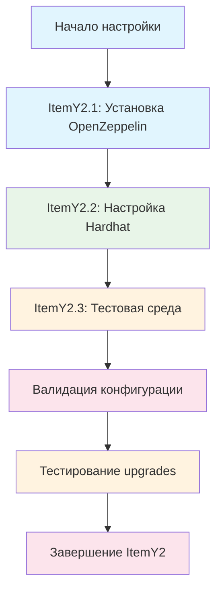

# ItemY2: План реализации - Настройка development окружения

## 🎯 Общая стратегия

**Цель:** Настроить development окружение для работы с upgradeable контрактами SpiralEngine, обеспечив совместимость с существующей инфраструктурой и подготовив инструменты для реализации proxy архитектуры.

**Подход:** Поэтапная настройка с сохранением обратной совместимости и созданием новых инструментов для работы с upgrades.

## 📋 Детальный план выполнения

### ItemY2.1: Установка OpenZeppelin Upgrades

#### Шаг 2.1.1: Установка пакетов
**Время:** 30 минут
**Инструменты:** npm, package.json

**Действия:**
1. Установка @openzeppelin/contracts-upgradeable
2. Установка @openzeppelin/hardhat-upgrades
3. Проверка совместимости версий
4. Обновление package.json

**Результат:** Все необходимые пакеты установлены без конфликтов

#### Шаг 2.1.2: Проверка совместимости
**Время:** 30 минут
**Инструменты:** npm, существующие тесты

**Действия:**
1. Проверка совместимости с @openzeppelin/contracts@5.3.0
2. Запуск существующих тестов
3. Проверка деплоя существующих контрактов
4. Валидация версий Solidity

**Результат:** Подтверждение совместимости с существующей инфраструктурой

### ItemY2.2: Настройка Hardhat для proxy контрактов

#### Шаг 2.2.1: Обновление hardhat.config.js
**Время:** 45 минут
**Инструменты:** hardhat.config.js, OpenZeppelin плагины

**Действия:**
1. Добавление @openzeppelin/hardhat-upgrades плагина
2. Настройка сетей для upgrade тестирования
3. Добавление конфигурации для proxy контрактов
4. Настройка gas и timeout параметров

**Результат:** Обновленная конфигурация Hardhat с поддержкой upgrades

#### Шаг 2.2.2: Создание скриптов для upgrades
**Время:** 2 часа
**Инструменты:** JavaScript, OpenZeppelin upgrades API

**Действия:**
1. Создание scripts/deploy-proxy.js
2. Создание scripts/upgrade-implementation.js
3. Создание scripts/verify-upgrade.js
4. Интеграция с существующими скриптами

**Результат:** Полный набор скриптов для работы с upgrades

### ItemY2.3: Создание тестовой сети для upgrade scenarios

#### Шаг 2.3.1: Настройка тестовой среды
**Время:** 1 час
**Инструменты:** Hardhat, тестовые сети

**Действия:**
1. Создание отдельной тестовой сети для upgrades
2. Настройка тестовых аккаунтов
3. Создание утилит для тестирования upgrades
4. Настройка fixtures для upgrade тестов

**Результат:** Готовая тестовая среда для upgrade scenarios

#### Шаг 2.3.2: Создание upgrade тестов
**Время:** 2 часа
**Инструменты:** Mocha, Chai, OpenZeppelin upgrades

**Действия:**
1. Создание contracts/tests/SpiralEngine.upgrade.test.js
2. Тестирование деплоя proxy контракта
3. Тестирование обновления implementation
4. Тестирование миграции данных
5. Тестирование rollback сценариев

**Результат:** Полное покрытие upgrade scenarios тестами

## 🔄 Последовательность выполнения



## 📊 Критерии успеха

### Технические критерии:
- ✅ **Установка пакетов:** Все пакеты установлены без конфликтов
- ✅ **Конфигурация:** Hardhat настроен для работы с upgrades
- ✅ **Совместимость:** Существующие тесты продолжают работать
- ✅ **Скрипты:** Созданы все необходимые скрипты для upgrades

### Функциональные критерии:
- ✅ **Деплой proxy:** Можно деплоить proxy контракты
- ✅ **Обновление:** Можно обновлять implementations
- ✅ **Тестирование:** Можно тестировать upgrade scenarios
- ✅ **Миграция:** Можно мигрировать данные между версиями

### Производительные критерии:
- ⚡ **Время сборки:** Увеличение < 20%
- ⚡ **Время тестов:** Увеличение < 30%
- ⚡ **Память:** Увеличение < 15%

## 🛡️ Управление рисками

### Потенциальные риски:
1. **Конфликт версий** - несовместимость с существующими пакетами
2. **Нарушение тестов** - существующие тесты могут перестать работать
3. **Проблемы с деплоем** - изменения могут нарушить существующий деплой
4. **Производительность** - новые пакеты могут замедлить сборку

### Меры минимизации:
1. **Поэтапная установка** - установка по одному пакету с проверкой
2. **Тестирование совместимости** - проверка после каждого изменения
3. **Backup конфигурации** - сохранение рабочей версии перед изменениями
4. **Мониторинг производительности** - отслеживание времени сборки и тестов

## 📋 Deliverables

### Основные результаты:
1. **Обновленный package.json** - с новыми зависимостями
2. **Обновленный hardhat.config.js** - с поддержкой upgrades
3. **Скрипты для upgrades** - полный набор инструментов
4. **Upgrade тесты** - покрытие всех сценариев
5. **Документация** - инструкции по использованию

### Формат результатов:
- **JavaScript файлы** для скриптов и конфигурации
- **Test файлы** для upgrade scenarios
- **Markdown документация** с инструкциями
- **Package.json** с обновленными зависимостями

## ⏱️ Временные рамки

**Общее время:** 6 часов
**Распределение:**
- ItemY2.1: 1 час (17%)
- ItemY2.2: 2.75 часа (46%)
- ItemY2.3: 2.25 часа (37%)

**Дедлайн:** 1 рабочий день

## 🔧 Технические детали

### Устанавливаемые пакеты:
```json
{
  "@openzeppelin/contracts-upgradeable": "^5.3.0",
  "@openzeppelin/hardhat-upgrades": "^2.5.0"
}
```

### Новые скрипты:
- `scripts/deploy-proxy.js` - деплой proxy контракта
- `scripts/upgrade-implementation.js` - обновление implementation
- `scripts/verify-upgrade.js` - верификация upgrades
- `scripts/test-upgrade.js` - тестирование upgrade scenarios

### Новые тесты:
- `contracts/tests/SpiralEngine.upgrade.test.js` - тесты upgrades
- `contracts/tests/SpiralEngine.migration.test.js` - тесты миграции
- `contracts/tests/SpiralEngine.rollback.test.js` - тесты rollback

### Конфигурация сетей:
```javascript
networks: {
  upgradeTest: {
    url: "http://localhost:8546",
    chainId: 31338,
    accounts: [...]
  }
}
```
