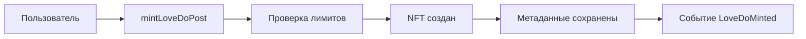
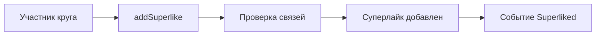
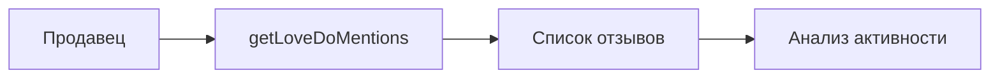

# LoveDoPostNFT - Контракт системы отзывов и признаний

## Обзор

`LoveDoPostNFT` - это смарт-контракт системы отзывов и признаний в экосистеме Amanita, реализующий **NFT-отзывы** для продавцов от их аудитории. Контракт обеспечивает создание отзывов, систему суперлайков с социальной моделью доверия и защиту от манипуляций.

## Архитектура

### NFT-отзывы
Каждый отзыв представляет собой **ERC721 NFT** с метаданными:
- ✅ **Уникальность** - каждый отзыв имеет уникальный ID
- ✅ **IPFS метаданные** - контент отзыва хранится в IPFS
- ✅ **Неделимость** - отзыв нельзя разделить или передать частично
- ✅ **Владелец** - автор отзыва является владельцем NFT

### Социальная модель доверия
Система основана на **графе инвайтов**:
- 🔗 **Горизонтальные связи** - суперлайки только от участников одного круга
- 🛡️ **Защита от манипуляций** - проверка социальных связей
- 📊 **Аналитика поведения** - отслеживание активности аудитории

### Система лимитов
- 📅 **Месячные лимиты** - ограничения на посты и лайки
- 👥 **Лимиты упоминаний** - защита от спама продавцов
- ⚡ **Защита от фронтраннинга** - nonce для транзакций

## Основные функции

### Создание отзывов

#### `mintLoveDoPost(address sellerTo, string calldata uri)`
Создает новый отзыв-признание для продавца.

**Параметры:**
- `sellerTo` - адрес продавца, которому адресован отзыв
- `uri` - IPFS ссылка на метаданные отзыва

**Требования:**
- Пользователь должен быть приглашен через граф инвайтов
- Не превышен месячный лимит постов (8 в месяц)
- Не превышен лимит упоминаний продавца (8 раз)
- Нельзя создавать отзыв самому себе

**Процесс создания:**
1. ✅ Проверка месячного лимита постов
2. ✅ Проверка, что пользователь приглашен
3. ✅ Проверка лимита упоминаний продавца
4. ✅ Создание NFT с уникальным ID
5. ✅ Сохранение метаданных в структуре LoveDo
6. ✅ Обновление счетчиков и лимитов
7. ✅ Эмиссия события LoveDoMinted

**Событие:**
```solidity
event LoveDoMinted(uint256 indexed tokenId, address indexed author, address indexed sellerTo);
```

### Система суперлайков

#### `addSuperlike(uint256 tokenId, uint256 expectedNonce)`
Ставит суперлайк на отзыв от участника того же круга доверия.

**Параметры:**
- `tokenId` - ID отзыва для лайка
- `expectedNonce` - ожидаемый nonce для защиты от фронтраннинга

**Требования:**
- Не превышен месячный лимит суперлайков (8 в месяц)
- Пост должен существовать
- Нельзя лайкать собственные посты
- Автор и лайкер должны быть из одного круга доверия
- Продавец-получатель должен быть зарегистрирован

**Процесс суперлайка:**
1. ✅ Проверка месячного лимита суперлайков
2. ✅ Проверка nonce для защиты от фронтраннинга
3. ✅ Проверка существования поста
4. ✅ Проверка, что лайк еще не поставлен
5. ✅ Запрет на лайки собственных постов
6. ✅ Проверка социальных связей через граф инвайтов
7. ✅ Проверка регистрации продавца-получателя
8. ✅ Обновление счетчика суперлайков
9. ✅ Эмиссия события Superliked

**Событие:**
```solidity
event Superliked(uint256 indexed tokenId, address indexed bySeller, uint8 newTotal);
```

### Получение данных

#### `getLoveDoMentions(address seller)`
Возвращает все отзывы, направленные конкретному продавцу.

**Возвращает:**
- `uint256[] tokenIds` - массив ID отзывов

#### `getPost(uint256 tokenId)`
Возвращает полную информацию о посте.

**Возвращает:**
- `LoveDo memory` - структура с метаданными поста

#### `getSuperlikes(uint256 tokenId)`
Возвращает количество суперлайков у поста.

**Возвращает:**
- `uint8` - количество суперлайков

### Проверка лимитов

#### `getRemainingMentionsForSeller(address seller)`
Возвращает оставшиеся упоминания для продавца.

#### `getRemainingPostsThisMonth(address user)`
Возвращает оставшиеся посты в текущем месяце.

#### `getRemainingSuperlikes(address user)`
Возвращает оставшиеся суперлайки в текущем месяце.

## Структуры данных

### LoveDo
```solidity
struct LoveDo {
    address author;          // автор поста
    address sellerTo;        // продавец-получатель
    address linkedSeller;    // продавец-пригласивший автора
    uint8 superlikes;        // количество суперлайков
    uint256 timestamp;       // время создания
}
```

### Основные маппинги
```solidity
// ID поста => метаданные
mapping(uint256 => LoveDo) public loveDos;

// Продавец => массив ID постов
mapping(address => uint256[]) private postsBySeller;

// ID поста => продавец => лайкнул ли
mapping(uint256 => mapping(address => bool)) public hasSuperliked;

// Продавец => месяц => использованные лайки
mapping(address => mapping(uint256 => uint8)) public monthlyLikesUsed;

// Пользователь => месяц => количество постов
mapping(address => mapping(uint256 => uint8)) public postsPerUserPerMonth;

// Продавец => количество упоминаний
mapping(address => uint8) public mentionsOf;

// Пользователь => массив лайкнутых постов
mapping(address => uint256[]) public superlikedPostsByUser;
```

### Константы
```solidity
uint8 public constant MAX_MONTHLY_POSTS_PER_USER = 8;    // Максимум постов в месяц
uint8 public constant MAX_MENTIONS_PER_SELLER = 8;       // Максимум упоминаний продавца
uint8 public constant MAX_SUPERLIKES_PER_MONTH = 8;      // Максимум суперлайков в месяц
```

## Безопасность

### Защита от манипуляций

#### Nonce защита
```solidity
mapping(address => uint256) public superlikeNonces;

// Проверка nonce
require(superlikeNonces[msg.sender] == expectedNonce, "Invalid nonce");
superlikeNonces[msg.sender]++;
```

#### Запрет на само-лайки
```solidity
require(msg.sender != loveDos[tokenId].author, "LoveDo: cannot superlike own post");
```

#### Проверка социальных связей
```solidity
address inviterOfAuthor = inviteGraph.invitedBy(loveDos[tokenId].author);
address inviterOfLiker = inviteGraph.invitedBy(msg.sender);
require(inviterOfLiker == inviterOfAuthor, "LoveDo: liker not in same circle");
```

### Лимиты и ограничения

#### Месячные лимиты
- **Посты**: максимум 8 в месяц на пользователя
- **Суперлайки**: максимум 8 в месяц на пользователя
- **Упоминания**: максимум 8 раз на продавца

#### Временные ограничения
- Лимиты сбрасываются каждый месяц
- Время рассчитывается как `block.timestamp / 30 days`

### Проверка ролей
```solidity
require(amanitaRegistry.hasSellerRole(loveDos[tokenId].sellerTo), "LoveDo: target seller not registered");
```

## События

### Основные события
```solidity
event LoveDoMinted(uint256 indexed tokenId, address indexed author, address indexed sellerTo);
event Superliked(uint256 indexed tokenId, address indexed bySeller, uint8 newTotal);
```

### События создания постов
- `LoveDoMinted` - новый отзыв создан
- Индексация по автору и продавцу-получателю

### События суперлайков
- `Superliked` - поставлен суперлайк
- Обновление общего количества лайков

## Интеграция с экосистемой

### Зависимости
- **OpenZeppelin ERC721URIStorage** - базовая функциональность NFT с URI
- **OpenZeppelin AccessControl** - система ролей
- **OpenZeppelin EnumerableSet** - эффективные множества

### Внешние контракты
- **IInviteGraph** - граф инвайтов для проверки социальных связей
- **IAmanitaRegistry** - проверка ролей продавцов

### Интерфейсы
```solidity
interface IInviteGraph {
    function getInviterOf(address user) external view returns (address);
    function invitedBy(address user) external view returns (address);
}

interface IAmanitaRegistry {
    function hasSellerRole(address user) external view returns (bool);
}
```

## Использование

### Создание отзыва
```javascript
const loveDoNFT = new ethers.Contract(address, abi, signer);

// Создание отзыва
const sellerTo = "0x...";
const ipfsURI = "ipfs://Qm...";

await loveDoNFT.mintLoveDoPost(sellerTo, ipfsURI);
```

### Постановка суперлайка
```javascript
const loveDoNFT = new ethers.Contract(address, abi, signer);

// Получение текущего nonce
const nonce = await loveDoNFT.superlikeNonces(sellerAddress);

// Постановка суперлайка
const tokenId = 123;
await loveDoNFT.addSuperlike(tokenId, nonce);
```

### Получение данных
```javascript
// Получение отзывов продавца
const mentions = await loveDoNFT.getLoveDoMentions(sellerAddress);

// Получение информации о посте
const post = await loveDoNFT.getPost(tokenId);

// Проверка лимитов
const remainingPosts = await loveDoNFT.getRemainingPostsThisMonth(userAddress);
const remainingLikes = await loveDoNFT.getRemainingSuperlikes(userAddress);
```

## Жизненный цикл отзыва

### 1. Создание


### 2. Суперлайк


### 3. Аналитика


## Административные функции

### Управление контрактами
```solidity
function setInviteGraph(address newGraph) external onlyRole(ADMIN_ROLE);
function setAmanitaRegistry(address newRegistry) external onlyRole(ADMIN_ROLE);
```

### Проверка существования
```solidity
function postExists(uint256 tokenId) public view returns (bool);
```

## Экономическая модель

### Стимулы
- **Создание отзывов** - ограниченное количество в месяц
- **Суперлайки** - только от участников круга доверия
- **Эмиссия токенов** - на основе суперлайков

### Защита от злоупотреблений
- Лимиты на количество постов и лайков
- Проверка социальных связей
- Защита от фронтраннинга

## Мониторинг и аналитика

### Счетчики
- `postsMintedBy[user]` - количество постов пользователя
- `mentionsOf[seller]` - количество упоминаний продавца
- `monthlyLikesUsed[seller][month]` - использованные лайки

### История
- `superlikedPostsByUser[user]` - посты, которые лайкнул пользователь
- `loveDos[tokenId].timestamp` - время создания поста

## Ограничения и особенности

### Soulbound NFT
- ✅ Отзывы можно создавать и просматривать
- ❌ Отзывы нельзя передавать (не реализовано явно)
- 🔒 Владелец = автор отзыва

### Социальная модель
- 🔗 Суперлайки только от участников одного круга
- 🛡️ Защита от манипуляций через проверку связей
- 📊 Аналитика поведения аудитории

### Временные ограничения
- 📅 Месячные лимиты с автоматическим сбросом
- ⏰ Время рассчитывается в 30-дневных периодах
- 🔄 Лимиты обновляются каждый месяц

## Заключение

`LoveDoPostNFT` - это инновационная система отзывов, которая:

- 🎯 **Социально-ориентирована** - основана на графе доверия
- 🛡️ **Защищена от манипуляций** - множественные проверки и лимиты
- ⚡ **Эффективна** - оптимизированные алгоритмы и структуры данных
- 📊 **Аналитична** - полное отслеживание активности
- 🔗 **Интегрирована** - тесная связь с экосистемой Amanita

Контракт обеспечивает честную и прозрачную систему отзывов, где качество контента определяется социальными связями и ограничениями, предотвращающими спам и манипуляции.
