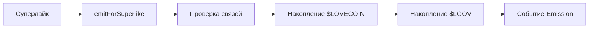
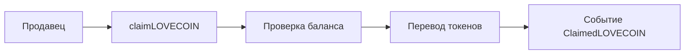
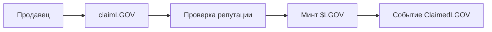

# LoveEmissionEngine - Контракт эмиссии токенов Loveconomy

## Обзор

`LoveEmissionEngine` - это контракт эмиссии токенов в экосистеме Amanita, реализующий **Loveconomy** (экономику любви) через эмиссию $LOVECOIN (утилити) и $LGOV (governance) токенов на основе суперлайков в системе отзывов. Контракт обеспечивает справедливое распределение токенов с учетом социальных связей и репутации.

## Архитектура

### Двухуровневая система токенов
- **$LOVECOIN** - утилити токены, накапливаются и клеймятся сразу
- **$LGOV** - governance токены, активируются только при достижении репутации

### Система репутации
- **Порог активации** - 8 LoveDo постов для активации $LGOV
- **Накопление** - токены накапливаются, но не активируются до достижения порога
- **Одноразовая активация** - $LGOV можно активировать только один раз

### Интеграция с экосистемой
- **LoveDoPostNFT** - источник данных о суперлайках и постах
- **InviteGraph** - проверка социальных связей
- **Lovecoin** - утилити токены
- **AmanitaGovToken** - governance токены (LGOV)

## Основные функции

### Эмиссия токенов

#### `emitForSuperlike(uint256 tokenId, address liker)`
Эмитирует токены на основе суперлайка в системе LoveDo.

**Параметры:**
- `tokenId` - ID поста, который лайкнули
- `liker` - адрес пользователя, поставившего лайк

**Требования:**
- Вызывающий должен иметь `EMITTER_ROLE`
- Автор поста должен быть приглашен
- Лайкер и автор должны быть из одного круга доверия
- Лайкер не может быть автором поста

**Процесс эмиссии:**
1. ✅ Получение данных о посте из LoveDoPostNFT
2. ✅ Проверка социальных связей через граф инвайтов
3. ✅ Постановка суперлайка в LoveDoPostNFT
4. ✅ Накопление $LOVECOIN для продавца-получателя
5. ✅ Накопление $LGOV для продавца-получателя
6. ✅ Эмиссия события Emission

**Событие:**
```solidity
event Emission(address indexed seller, uint256 amanitaAmount, uint256 agovAccrued);
```

### Клейм утилити токенов

#### `claimLOVECOIN()`
Позволяет продавцу получить накопленные $LOVECOIN токены.

**Требования:**
- У продавца должны быть накопленные $LOVECOIN
- Вызывается вручную для экономии газа

**Процесс клейма:**
1. ✅ Проверка наличия накопленных токенов
2. ✅ Обнуление баланса (защита от reentrancy)
3. ✅ Перевод токенов на адрес продавца
4. ✅ Эмиссия события ClaimedLOVECOIN

**Событие:**
```solidity
event ClaimedLOVECOIN(address indexed seller, uint256 amount);
```

### Активация governance токенов

#### `claimLGOV()`
Активирует накопленные $LGOV токены при достижении репутации.

**Требования:**
- Продавец не должен был ранее активировать $LGOV
- У продавца должно быть ≥ 8 LoveDo постов
- Должны быть накопленные $LGOV токены

**Процесс активации:**
1. ✅ Проверка, что $LGOV еще не активированы
2. ✅ Проверка количества LoveDo постов (≥ 8)
3. ✅ Проверка наличия накопленных $LGOV
4. ✅ Обнуление накопленного баланса
5. ✅ Отметка об активации
6. ✅ Минт $LGOV токенов
7. ✅ Эмиссия события ClaimedLGOV

**Событие:**
```solidity
event ClaimedLGOV(address indexed seller, uint256 amount);
```

### Мониторинг репутации

#### `getReputationProgress(address seller)`
Возвращает текущее состояние репутации продавца.

**Возвращает:**
- `uint256 pending` - накопленные, но не активированные $LGOV
- `uint256 active` - баланс уже заминченных $LGOV
- `uint8 loveDoCount` - количество LoveDo постов

**Использование:**
```javascript
const [pending, active, loveDoCount] = await loveEmission.getReputationProgress(sellerAddress);
console.log(`Накоплено: ${pending} $LGOV`);
console.log(`Активировано: ${active} $LGOV`);
console.log(`LoveDo постов: ${loveDoCount}`);
```

## Структуры данных

### Основные маппинги
```solidity
// Продавец => накопленные $LOVECOIN
mapping(address => uint256) public amanitaAccrued;

// Продавец => накопленные $LGOV
mapping(address => uint256) public agovAccrued;

// Продавец => активировал ли $LGOV
mapping(address => bool) public agovClaimed;
```

### Константы
```solidity
uint256 public constant EMISSION_RATE = 1 ether;        // Эмиссия на суперлайк
uint8 public constant LOVE_DO_THRESHOLD = 8;            // Порог для $LGOV
```

### Внешние контракты
```solidity
IERC20 public immutable lovecoin;                   // $LOVECOIN токен
IAGovToken public immutable lgovToken;                  // $LGOV токен
ILoveDoPostNFT public immutable loveDo;                 // LoveDoPostNFT
IInviteGraph public inviteGraph;                        // Граф инвайтов
```

## Безопасность

### Защита от reentrancy
```solidity
// Обнуляем до трансфера — защита от reentrancy
loveAccrued[msg.sender] = 0;
bool success = lovecoin.transfer(msg.sender, amount);
```

### Проверка социальных связей
```solidity
address inviterOfAuthor = inviteGraph.invitedBy(author);
address inviterOfLiker = inviteGraph.invitedBy(liker);
require(inviterOfAuthor == inviterOfLiker, "Liker must be from same inviter group");
```

### Одноразовая активация
```solidity
require(!agovClaimed[msg.sender], "LoveEmission: already claimed");
agovClaimed[msg.sender] = true;
```

### Проверка ролей
- `EMITTER_ROLE` - только для эмиссии токенов
- `ADMIN_ROLE` - для управления контрактом

## События

### Основные события
```solidity
event Emission(address indexed seller, uint256 amanitaAmount, uint256 agovAccrued);
event ClaimedLOVECOIN(address indexed seller, uint256 amount);
event ClaimedLGOV(address indexed seller, uint256 amount);
```

### События эмиссии
- `Emission` - токены начислены за суперлайк
- Индексация по продавцу-получателю

### События клейма
- `ClaimedLOVECOIN` - $LOVECOIN получены
- `ClaimedLGOV` - $LGOV активированы

## Интеграция с LoveDoPostNFT

### Тесная связь
LoveEmissionEngine тесно интегрирован с LoveDoPostNFT:

```solidity
// Получение данных о посте
(address author, address sellerTo, address linkedSeller, uint8 superlikes) = loveDo.getPost(tokenId);

// Постановка суперлайка
bool success = loveDo.addSuperlike(tokenId);

// Проверка количества постов
uint8 count = loveDo.getLoveDoCount(msg.sender);
```

### Интерфейс интеграции
```solidity
interface ILoveDoPostNFT {
    function mentionsOf(address seller) external view returns (uint8);
    function addSuperlike(uint256 tokenId) external returns (bool);
    function getPost(uint256 tokenId) external view returns (
        address author,
        address sellerTo,
        address linkedSeller,
        uint8 superlikes
    );
    function getLoveDoCount(address seller) external view returns (uint8);
}
```

## Использование

### Эмиссия токенов
```javascript
const loveEmission = new ethers.Contract(address, abi, emitter);

// Эмиссия за суперлайк
const tokenId = 123;
const liker = "0x...";
await loveEmission.emitForSuperlike(tokenId, liker);
```

### Клейм токенов
```javascript
const loveEmission = new ethers.Contract(address, abi, seller);

// Получение $LOVECOIN
await loveEmission.claimLOVECOIN();

// Активация $LGOV (требует ≥ 8 LoveDo постов)
await loveEmission.claimLGOV();
```

### Мониторинг
```javascript
// Проверка прогресса репутации
const [pending, active, loveDoCount] = await loveEmission.getReputationProgress(sellerAddress);

console.log(`Накоплено $LGOV: ${ethers.utils.formatEther(pending)}`);
console.log(`Активировано $LGOV: ${ethers.utils.formatEther(active)}`);
console.log(`LoveDo постов: ${loveDoCount}`);
```

## Экономическая модель

### Система стимулов
- **Суперлайки** - основа для эмиссии токенов
- **Репутация** - порог для активации governance токенов
- **Социальные связи** - проверка через граф инвайтов

### Распределение токенов
- **$LOVECOIN** - накапливаются и клеймятся сразу
- **$LGOV** - накапливаются, но активируются только при репутации
- **Коэффициент** - 1 ether на суперлайк для каждого токена

### Защита от злоупотреблений
- Проверка социальных связей
- Одноразовая активация $LGOV
- Порог репутации для governance токенов

## Жизненный цикл токенов

### 1. Накопление


### 2. Клейм $LOVECOIN


### 3. Активация $LGOV


## Мониторинг и аналитика

### Счетчики
- `amanitaAccrued[seller]` - накопленные $LOVECOIN
- `agovAccrued[seller]` - накопленные $LGOV
- `agovClaimed[seller]` - статус активации $LGOV

### Прогресс репутации
- Количество LoveDo постов
- Накопленные vs активированные токены
- Готовность к активации $LGOV

## Ограничения и особенности

### Одноразовая активация
- ✅ $LOVECOIN можно клеймить многократно
- ❌ $LGOV можно активировать только один раз
- 🔒 После активации $LGOV становятся "реальными" governance токенами

### Порог репутации
- 📊 Требуется ≥ 8 LoveDo постов для активации $LGOV
- 🛡️ Защита от злоупотреблений governance токенами
- ⚖️ Баланс между доступностью и качеством

### Социальная модель
- 🔗 Эмиссия только от участников одного круга доверия
- 🛡️ Защита от манипуляций через проверку связей
- 📈 Стимулирование качественного контента

## Заключение

`LoveEmissionEngine` - это сердце экономики любви в экосистеме Amanita, которое:

- 💰 **Справедливо распределяет токены** - на основе реальной активности и репутации
- 🛡️ **Защищает от злоупотреблений** - через социальные проверки и пороги
- ⚡ **Эффективно работает** - с накоплением и ручным клеймом
- 🔗 **Интегрировано с экосистемой** - тесная связь с LoveDoPostNFT и графом инвайтов
- 📊 **Прозрачно** - полное отслеживание прогресса и событий

Контракт обеспечивает устойчивую экономическую модель, где качество контента и социальные связи определяют доступ к governance токенам, создавая здоровую экосистему взаимного доверия и признания.
