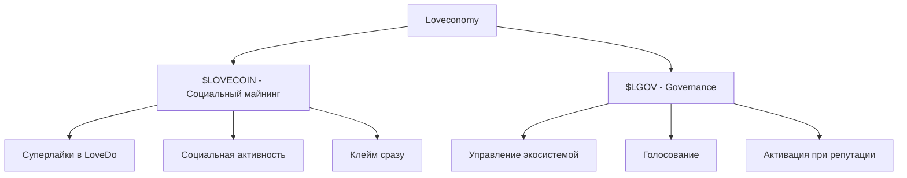

# Lovecoin Tokens - Токены экосистемы Amanita

## Обзор

Экосистема Amanita использует **два токена** для реализации экономической модели **Loveconomy** (экономики любви):

- **$LOVECOIN** - утилити токен для социального майнинга через суперлайки
- **$LGOV** - governance токен для управления экосистемой и принятия решений

## Архитектура токенов

### Двухуровневая система


### Роли и функции
- **$LOVECOIN** - социальный майнинг, вознаграждения, клейм
- **$LGOV** - стратегические решения, управление, голосование
- **Интеграция** - оба токена эмитируются через LoveEmissionEngine

## Lovecoin ($LOVECOIN)

### Назначение
**$LOVECOIN** - это утилити токен для социального майнинга в экосистеме Amanita.

### Технические характеристики
- **Стандарт**: ERC20
- **Символ**: LOVECOIN
- **Децимали**: 18
- **Начальная эмиссия**: 888,888,888 LOVECOIN
- **Дополнительная эмиссия**: через MINTER_ROLE

### Основные функции

#### Конструктор
```solidity
constructor(address owner) ERC20("Lovecoin", "LOVECOIN") {
    _mint(owner, INITIAL_SUPPLY);
    _grantRole(DEFAULT_ADMIN_ROLE, owner);
    _grantRole(MINTER_ROLE, owner);
}
```

**Функциональность:**
- Создание токена с начальной эмиссией
- Назначение ролей владельцу
- Установка 18 децималей

#### Минтинг
```solidity
function mint(address to, uint256 amount) external onlyRole(MINTER_ROLE) {
    _mint(to, amount);
}
```

**Требования:**
- Вызывающий должен иметь `MINTER_ROLE`
- Используется LoveEmissionEngine для эмиссии

#### Сжигание
```solidity
function burn(address from, uint256 amount) external onlyRole(MINTER_ROLE) {
    _burn(from, amount);
}
```

**Требования:**
- Вызывающий должен иметь `MINTER_ROLE`
- Уменьшение общего предложения токенов

### Использование в экосистеме

#### LoveEmissionEngine
- **Эмиссия**: 1 LOVECOIN за суперлайк
- **Клейм**: продавцы клеймят накопленные токены
- **Накопление**: токены накапливаются до клейма

#### Экономическая модель
- **Социальный майнинг**: через суперлайки в LoveDo постах
- **Вознаграждения**: за активность в социальной сети
- **Ликвидность**: доступны для клейма сразу

## AmanitaGovToken ($LGOV)

### Назначение
**$LGOV** - это governance токен для управления экосистемой Amanita.

### Технические характеристики
- **Стандарт**: ERC20Votes + ERC20Permit
- **Символ**: LGOV
- **Децимали**: 18
- **Начальная эмиссия**: 0 (только минтинг)
- **Дополнительная эмиссия**: через MINTER_ROLE

### Расширенные возможности

#### ERC20Votes
- **Делегирование**: передача голосов другим адресам
- **Snapshot**: снимки балансов для голосования
- **История**: отслеживание изменений делегирования

#### ERC20Permit
- **Gasless транзакции**: подписание без газа
- **Meta-transactions**: транзакции через релееры
- **Удобство**: улучшенный UX для пользователей

### Основные функции

#### Конструктор
```solidity
constructor(address admin)
    ERC20("Love Governance", "LGOV")
    ERC20Permit("Love Governance")
{
    require(admin != address(0), "Admin address required");
    _grantRole(DEFAULT_ADMIN_ROLE, admin);
    _grantRole(MINTER_ROLE, admin);
}
```

**Функциональность:**
- Создание governance токена
- Инициализация ERC20Permit
- Назначение ролей администратору

#### Минтинг
```solidity
function mint(address to, uint256 amount) external onlyRole(MINTER_ROLE) {
    _mint(to, amount);
}
```

**Требования:**
- Вызывающий должен иметь `MINTER_ROLE`
- Используется LoveEmissionEngine для активации

### Использование в экосистеме

#### LoveEmissionEngine
- **Накопление**: 1 LGOV за суперлайк
- **Активация**: только при достижении 8+ LoveDo постов
- **Одноразовая активация**: можно активировать только один раз

#### Governance функции
- **Голосование**: участие в управлении экосистемой
- **Делегирование**: передача голосов другим участникам
- **Предложения**: создание и голосование по предложениям

## Система ролей

### Роли токенов
```solidity
bytes32 public constant MINTER_ROLE = keccak256("MINTER_ROLE");
bytes32 public constant DEFAULT_ADMIN_ROLE = keccak256("DEFAULT_ADMIN_ROLE");
```

### Назначение ролей
- **DEFAULT_ADMIN_ROLE** - управление ролями и контрактом
- **MINTER_ROLE** - эмиссия и сжигание токенов
- **Владелец** - получает обе роли при создании

### Безопасность
- **Контроль доступа**: только авторизованные адреса
- **Проверка ролей**: через модификаторы OpenZeppelin
- **Администрирование**: централизованное управление ролями

## Интеграция с LoveEmissionEngine

### Эмиссия токенов
```solidity
// В LoveEmissionEngine
loveAccrued[sellerTo] += EMISSION_RATE;  // 1 ether LOVECOIN
lgovAccrued[sellerTo] += EMISSION_RATE;  // 1 ether LGOV
```

### Клейм $LOVECOIN
```solidity
// Немедленный клейм утилити токенов
function claimLOVECOIN() external {
    uint256 amount = loveAccrued[msg.sender];
    loveAccrued[msg.sender] = 0;
    lovecoin.transfer(msg.sender, amount);
}
```

### Активация $LGOV
```solidity
// Активация при достижении репутации
function claimLGOV() external {
    require(loveDo.getLoveDoCount(msg.sender) >= 8, "Not enough reputation");
    uint256 amount = lgovAccrued[msg.sender];
    lgovToken.mint(msg.sender, amount);
}
```

## Экономическая модель

### Распределение токенов
- **$LOVECOIN**: 888,888,888 (начальная эмиссия) + эмиссия за активность
- **$LGOV**: только эмиссия за активность (без начальной эмиссии)

### Механизм эмиссии
- **Суперлайки**: 1 LOVECOIN + 1 LGOV за суперлайк
- **Социальная проверка**: только от участников одного круга
- **Репутация**: LGOV активируются при 8+ LoveDo постах

### Стимулы
- **Социальная активность**: создание качественного контента
- **Социальные связи**: участие в кругах доверия
- **Репутация**: долгосрочное участие в экосистеме

## Использование

### Работа с $LOVECOIN
```javascript
const lovecoin = new ethers.Contract(address, abi, signer);

// Проверка баланса
const balance = await lovecoin.balanceOf(userAddress);

// Перевод токенов
await lovecoin.transfer(recipient, amount);

// Клейм через LoveEmissionEngine
await loveEmission.claimLOVECOIN();
```

### Работа с $LGOV
```javascript
const lgovToken = new ethers.Contract(address, abi, signer);

// Проверка баланса
const balance = await lgovToken.balanceOf(userAddress);

// Делегирование голосов
await lgovToken.delegate(delegateAddress);

// Активация через LoveEmissionEngine
await loveEmission.claimLGOV();
```

### Governance функции
```javascript
// Получение текущих голосов
const votes = await lgovToken.getVotes(userAddress);

// Получение голосов на определенный блок
const votesAtBlock = await lgovToken.getPastVotes(userAddress, blockNumber);

// Получение делегата
const delegate = await lgovToken.delegates(userAddress);
```

## События

### Lovecoin события
```solidity
event Transfer(address indexed from, address indexed to, uint256 value);
event Approval(address indexed owner, address indexed spender, uint256 value);
```

### LGOV события
```solidity
event Transfer(address indexed from, address indexed to, uint256 value);
event Approval(address indexed owner, address indexed spender, uint256 value);
event DelegateChanged(address indexed delegator, address indexed fromDelegate, address indexed toDelegate);
event DelegateVotesChanged(address indexed delegate, uint256 previousVotes, uint256 newVotes);
```

## Безопасность

### Защита от манипуляций
- **Контроль ролей**: только авторизованные адреса могут минтить
- **Проверка адресов**: валидация адресов при создании
- **Стандарты OpenZeppelin**: проверенные реализации

### Governance безопасность
- **Делегирование**: защита от централизации власти
- **Snapshot**: защита от манипуляций во время голосования
- **Permit**: безопасные gasless транзакции

## Мониторинг и аналитика

### Метрики $LOVECOIN
- Общее предложение
- Распределение между пользователями
- Активность клейма
- Социальная активность

### Метрики $LGOV
- Количество активированных токенов
- Распределение голосов
- Активность делегирования

### Интеграция с экосистемой
- Связь с LoveDoPostNFT через LoveEmissionEngine
- Отслеживание эмиссии по суперлайкам
- Мониторинг репутации для активации LGOV

## Ограничения и особенности

### $LOVECOIN
- ✅ Можно клеймить многократно
- ✅ Доступны сразу после накопления
- ✅ Социальный майнинг через суперлайки
- ❌ Нет governance функций
- 🔄 Постоянная эмиссия за активность

### $LGOV
- ✅ Governance функции и делегирование
- ✅ Gasless транзакции через Permit
- ❌ Активация только при репутации
- 🔒 Одноразовая активация

## Заключение

Токены Lovecoin реализуют **двухуровневую экономическую модель**:

- **$LOVECOIN** - обеспечивает **социальный майнинг** и **немедленные вознаграждения**
- **$LGOV** - обеспечивает **стратегическое управление** и **долгосрочную репутацию**

Эта модель создает **сбалансированную экосистему**, где:
- 🎯 **Социальная активность поощряется** через $LOVECOIN
- 🏛️ **Управление децентрализовано** через $LGOV
- 🔗 **Социальные связи важны** для эмиссии
- 📈 **Репутация определяет** доступ к governance

Токены являются **фундаментом Loveconomy**, обеспечивая справедливое распределение власти и вознаграждений в децентрализованной экосистеме Amanita.