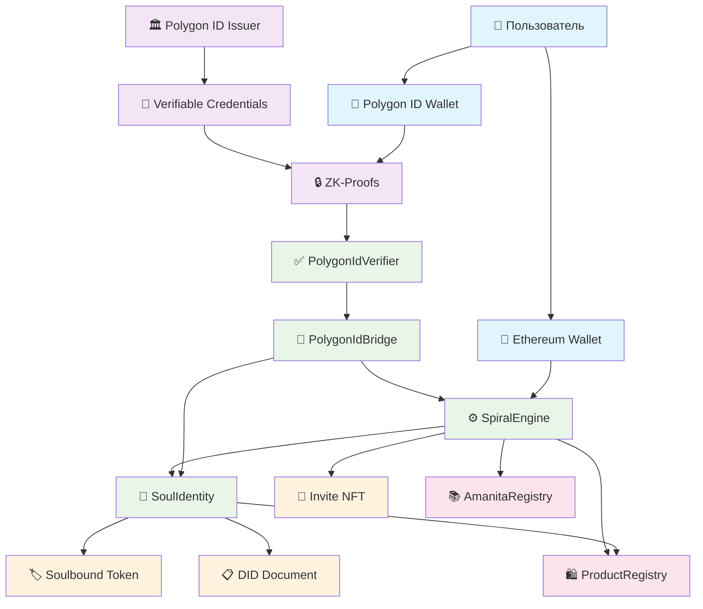
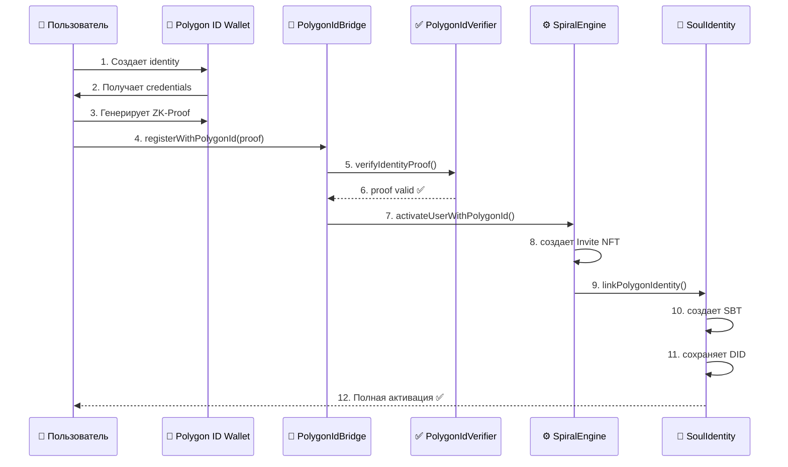
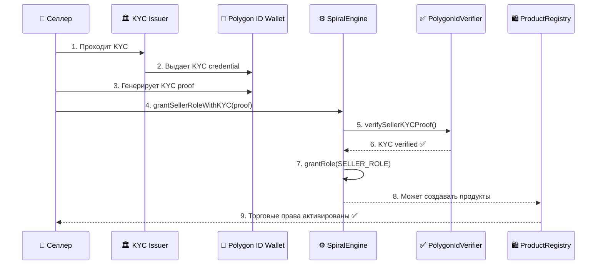

# 🔐 АНАЛИЗ ИНТЕГРАЦИИ POLYGON ID В SBT АРХИТЕКТУРУ

**Дата**: 18 сентября 2025  
**Метод**: @analysis.mdc - глубокий анализ требований и архитектурных решений  
**Цель**: Интеграция Polygon ID в систему Soulbound Token для децентрализованной идентификации  

---

## 🎯 **ТРЕБОВАНИЯ К POLYGON ID**

### **1. ТЕХНИЧЕСКИЕ ТРЕБОВАНИЯ**

#### **1.1 Основные компоненты Polygon ID**
```javascript
// Ключевые технологии
const polygonIdStack = {
    // Основа - Zero-Knowledge Proofs
    zkProofs: {
        protocol: "Circom/SnarkJS",
        curves: ["BN254", "BLS12-381"],
        proofSystem: "Groth16"
    },
    
    // DID стандарт W3C
    didMethod: {
        format: "did:polygon:mainnet:0x...",
        document: "JSON-LD DID Document",
        resolution: "Universal Resolver"
    },
    
    // Verifiable Credentials
    credentials: {
        standard: "W3C VC Data Model",
        format: "JSON-LD",
        proofTypes: ["BbsBlsSignature2020", "Ed25519Signature2020"]
    },
    
    // Smart Contract интеграция
    contracts: {
        verifier: "PolygonIDVerifier.sol",
        state: "StateContract.sol", 
        identity: "IdentityContract.sol"
    }
};
```

#### **1.2 SDK и инфраструктурные требования**
```javascript
// Polygon ID SDK компоненты
const requiredSDK = {
    // JavaScript SDK
    js: {
        package: "@0xpolygonid/js-sdk",
        version: "^1.10.0",
        features: [
            "Identity creation",
            "Credential issuance", 
            "Proof generation",
            "Verification"
        ]
    },
    
    // Smart Contract Libraries
    solidity: {
        package: "@0xpolygonid/contracts",
        version: "^2.0.0",
        contracts: [
            "ERC20Verifier",
            "UniversalVerifier", 
            "StateLib",
            "PoseidonUnit"
        ]
    },
    
    // Infrastructure
    infrastructure: {
        issuerNode: "Self-hosted or SaaS",
        ipfs: "Metadata storage",
        polygonNetwork: "Mainnet/Mumbai testnet"
    }
};
```

### **2. ФУНКЦИОНАЛЬНЫЕ ТРЕБОВАНИЯ**

#### **2.1 Пользовательские сценарии**
```javascript
// Use Cases для нашей системы
const useCases = {
    // Базовая идентификация
    basicIdentity: {
        requirement: "Подтверждение владения кошельком",
        credential: "AddressOwnership",
        zkProof: "address_ownership_proof",
        integration: "SpiralEngine.activateUser()"
    },
    
    // KYC верификация для селлеров
    sellerKYC: {
        requirement: "Подтверждение личности для торговли",
        credential: "KYCCredential", 
        zkProof: "kyc_verification_proof",
        integration: "SpiralEngine.grantSellerRole()"
    },
    
    // Репутационные доказательства
    reputation: {
        requirement: "Подтверждение репутации без раскрытия истории",
        credential: "ReputationCredential",
        zkProof: "reputation_threshold_proof", 
        integration: "SoulIdentity.updateSoulReputation()"
    },
    
    // Возрастные ограничения
    ageVerification: {
        requirement: "Подтверждение возраста 18+ без раскрытия даты рождения",
        credential: "AgeCredential",
        zkProof: "age_over_18_proof",
        integration: "ProductRegistry.createProduct()"
    }
};
```

#### **2.2 Схемы данных и Claims**
```json
{
  "credentialSchemas": {
    "BasicIdentity": {
      "type": "object",
      "properties": {
        "address": {"type": "string"},
        "network": {"type": "string"},
        "timestamp": {"type": "integer"}
      }
    },
    "SellerKYC": {
      "type": "object", 
      "properties": {
        "verified": {"type": "boolean"},
        "jurisdiction": {"type": "string"},
        "riskLevel": {"type": "string"},
        "validUntil": {"type": "integer"}
      }
    },
    "ReputationScore": {
      "type": "object",
      "properties": {
        "score": {"type": "integer"},
        "category": {"type": "string"},
        "threshold": {"type": "integer"},
        "period": {"type": "string"}
      }
    }
  }
}
```

---

## 🏗️ **АНАЛИЗ ИНТЕГРАЦИИ В SBT АРХИТЕКТУРУ**

### **3. ТЕКУЩАЯ АРХИТЕКТУРА ИДЕНТИЧНОСТИ**

#### **3.1 Существующие связи контрактов**
```solidity
// Текущая структура (упрощенно)
contract SpiralEngine {
    ISoulIdentity public soulIdentity; // Делегирование SBT функций
    
    // Активация создает связь с SoulIdentity
    function activateUser(...) {
        // 1. Создает инвайты (NFT в SpiralEngine)
        // 2. Устанавливает каскадную ответственность
        // 3. МОЖЕТ создать SBT в SoulIdentity (если настроен)
    }
    
    // Делегирование к SoulIdentity
    function getSoulLevel(address user) returns (uint256) {
        return soulIdentity.getSoulLevel(user);
    }
}

contract SoulIdentity implements ISoulIdentity {
    // Управляет SBT токенами
    // Хранит DID (текущий формат: did:spiral:address)
    // Управляет репутацией и уровнем души
    // Система восстановления доступа
}
```

#### **3.2 Проблемы текущей архитектуры**
```javascript
const currentIssues = {
    // Централизованное создание идентичности
    centralization: {
        problem: "DID создается скриптом, не пользователем",
        impact: "Нарушает принципы Self-Sovereign Identity",
        solution: "Пользователь создает Polygon ID самостоятельно"
    },
    
    // Отсутствие верификации
    noVerification: {
        problem: "Нет проверки подлинности DID",
        impact: "Возможны поддельные идентичности", 
        solution: "ZK-Proofs для верификации claims"
    },
    
    // Ограниченная интероперабельность
    limitedInterop: {
        problem: "Кастомный формат DID",
        impact: "Не работает с внешними системами",
        solution: "Стандартный Polygon DID формат"
    },
    
    // Отсутствие privacy
    noPrivacy: {
        problem: "Все данные публичны в блокчейне",
        impact: "Нет конфиденциальности",
        solution: "Selective disclosure через ZK-Proofs"
    }
};
```

### **4. ПРОЕКТИРУЕМАЯ POLYGON ID АРХИТЕКТУРА**

#### **4.1 Новая архитектура интеграции**
```solidity
// Обновленная архитектура с Polygon ID
contract SpiralEngine {
    ISoulIdentity public soulIdentity;
    IPolygonIdVerifier public polygonIdVerifier; // НОВЫЙ компонент
    
    // Активация с Polygon ID верификацией
    function activateUserWithPolygonId(
        string memory inviteCode,
        address user,
        string[] memory newInviteCodes,
        uint256 expiry,
        uint256[2] memory zkProof_a,     // ZK-Proof компоненты
        uint256[2][2] memory zkProof_b,
        uint256[2] memory zkProof_c,
        uint256[] memory zkProof_inputs
    ) external onlyRole(ACTIVATOR_ROLE) {
        // 1. Верификация ZK-Proof
        require(
            polygonIdVerifier.verifyProof(
                zkProof_a, zkProof_b, zkProof_c, zkProof_inputs
            ),
            "SpiralEngine: invalid identity proof"
        );
        
        // 2. Извлекаем DID из proof inputs
        string memory polygonDid = extractDIDFromProof(zkProof_inputs);
        
        // 3. Стандартная активация
        _activateUser(inviteCode, user, newInviteCodes, expiry);
        
        // 4. Связываем с Polygon ID
        if (address(soulIdentity) != address(0)) {
            soulIdentity.linkPolygonIdentity(user, polygonDid);
        }
    }
}

contract SoulIdentity {
    // Маппинги для Polygon ID
    mapping(address => string) public polygonDID;
    mapping(string => address) public didToAddress;
    mapping(address => bool) public polygonIdVerified;
    
    // Интеграция с Polygon ID
    function linkPolygonIdentity(
        address user, 
        string memory did
    ) external onlyRole(SPIRAL_ENGINE_ROLE) {
        polygonDID[user] = did;
        didToAddress[did] = user;
        polygonIdVerified[user] = true;
        
        emit PolygonIdLinked(user, did, block.timestamp);
    }
    
    // Верификация claims через ZK-Proofs
    function verifyUserClaim(
        address user,
        string memory claimType,
        uint256[8] memory proof
    ) external view returns (bool) {
        // Делегируем верификацию специализированному контракту
        return IPolygonIdVerifier(polygonIdVerifier).verifyClaim(
            polygonDID[user],
            claimType, 
            proof
        );
    }
}
```

#### **4.2 Новые контракты для Polygon ID**
```solidity
// Специализированный верификатор
contract PolygonIdVerifier {
    using PoseidonUnit for uint256;
    
    // Верификация базовой идентичности
    function verifyIdentityProof(
        uint256[2] memory a,
        uint256[2][2] memory b,
        uint256[2] memory c,
        uint256[] memory inputs
    ) public view returns (bool) {
        // Используем Groth16 верификатор
        return groth16Verifier.verifyProof(a, b, c, inputs);
    }
    
    // Верификация специфических claims
    function verifySellerKYCProof(
        string memory did,
        uint256[8] memory proof
    ) external view returns (bool verified, uint256 riskLevel) {
        // Проверяем KYC статус без раскрытия личных данных
        // Возвращаем только необходимую информацию
    }
    
    // Верификация возрастных ограничений
    function verifyAgeProof(
        string memory did,
        uint256 minimumAge,
        uint256[8] memory proof
    ) external view returns (bool) {
        // Проверяем что возраст >= minimumAge
        // Не раскрываем точный возраст
    }
}

// Мост между Polygon ID и нашими контрактами
contract PolygonIdBridge {
    ISpiralEngine public spiralEngine;
    ISoulIdentity public soulIdentity;
    IPolygonIdVerifier public verifier;
    
    // Регистрация нового пользователя через Polygon ID
    function registerWithPolygonId(
        string memory inviteCode,
        string[] memory newInviteCodes,
        PolygonIdProof memory identityProof,
        PolygonIdProof memory kycProof
    ) external {
        // 1. Верификация identity proof
        require(
            verifier.verifyIdentityProof(identityProof),
            "Invalid identity proof"
        );
        
        // 2. Верификация KYC proof (если требуется)
        if (kycProof.isPresent) {
            require(
                verifier.verifySellerKYCProof(identityProof.did, kycProof.proof),
                "Invalid KYC proof"
            );
        }
        
        // 3. Активация в SpiralEngine
        spiralEngine.activateUserWithPolygonId(
            inviteCode,
            msg.sender,
            newInviteCodes,
            0,
            identityProof.a,
            identityProof.b,
            identityProof.c,
            identityProof.inputs
        );
    }
}
```

---

## 📊 **СХЕМА ВЗАИМОСВЯЗЕЙ ИДЕНТИЧНОСТЕЙ**

### **5. ДИАГРАММА АРХИТЕКТУРЫ**



### **6. ДЕТАЛЬНАЯ СХЕМА ПОТОКОВ ДАННЫХ**

#### **6.1 Поток активации пользователя с Polygon ID**


#### **6.2 Поток верификации селлера**


---

## 🔧 **ПЛАН РЕАЛИЗАЦИИ ИНТЕГРАЦИИ**

### **7. ПОЭТАПНАЯ РЕАЛИЗАЦИЯ**

#### **7.1 Этап 1: Подготовка инфраструктуры (2-3 недели)**
```javascript
const phase1Tasks = {
    // Исследование и настройка
    research: [
        "Изучение Polygon ID SDK",
        "Настройка тестовой среды Mumbai",
        "Создание тестового Issuer Node"
    ],
    
    // Разработка схем
    schemas: [
        "Создание credential schemas",
        "Настройка circuit для ZK-proofs",
        "Тестирование proof generation"
    ],
    
    // Базовые контракты
    contracts: [
        "Развертывание PolygonIdVerifier",
        "Создание базовых верификационных функций",
        "Интеграция с существующими контрактами"
    ]
};
```

#### **7.2 Этап 2: Интеграция с SoulIdentity (3-4 недели)**
```solidity
// Обновления SoulIdentity контракта
contract SoulIdentity {
    // Новые события
    event PolygonIdLinked(address indexed user, string did, uint256 timestamp);
    event PolygonIdVerified(address indexed user, string claimType, uint256 timestamp);
    event CredentialVerified(address indexed user, string credentialType, bool result);
    
    // Новые функции
    function linkPolygonIdentity(address user, string memory did) external;
    function verifyPolygonIdClaim(address user, string memory claimType, uint256[8] memory proof) external;
    function getPolygonIdStatus(address user) external view returns (bool verified, string memory did);
    
    // Обратная совместимость
    function getSoulIdentity(address user) external view returns (string memory) {
        // Возвращает Polygon DID если есть, иначе legacy DID
        if (bytes(polygonDID[user]).length > 0) {
            return polygonDID[user];
        }
        return legacySoulIdentity[user];
    }
}
```

#### **7.3 Этап 3: Обновление SpiralEngine (2-3 недели)**
```solidity
// Расширение SpiralEngine для Polygon ID
contract SpiralEngine {
    // Новые функции активации
    function activateUserWithPolygonId(...) external;
    function grantSellerRoleWithKYC(...) external;
    function verifyUserReputation(...) external view returns (bool);
    
    // Обратная совместимость
    function activateUser(...) external {
        // Стандартная активация без Polygon ID
        _activateUser(...);
        
        // Опционально: предложить пользователю связать Polygon ID
        emit PolygonIdIntegrationAvailable(user);
    }
}
```

#### **7.4 Этап 4: Frontend интеграция (3-4 недели)**
```javascript
// Интеграция в пользовательский интерфейс
class PolygonIdIntegration {
    constructor(network = 'polygon-mumbai') {
        this.sdk = new PolygonIdSDK(network);
        this.wallet = new PolygonIdWallet();
    }
    
    async createIdentity(userAddress) {
        // Создание Polygon ID identity
        const identity = await this.sdk.createIdentity();
        return {
            did: identity.did,
            privateKey: identity.privateKey
        };
    }
    
    async generateProof(credential, request) {
        // Генерация ZK-Proof для верификации
        return await this.wallet.generateProof(credential, request);
    }
    
    async registerUser(inviteCode, proof) {
        // Регистрация через PolygonIdBridge
        const bridge = await this.getContract('PolygonIdBridge');
        return await bridge.registerWithPolygonId(inviteCode, proof);
    }
}
```

### **8. КРИТЕРИИ УСПЕХА И МЕТРИКИ**

#### **8.1 Технические метрики**
```javascript
const successMetrics = {
    // Производительность
    performance: {
        proofGeneration: "< 5 секунд",
        proofVerification: "< 1 секунда",
        gasConsumption: "< 500k gas per verification"
    },
    
    // Безопасность
    security: {
        zkProofSoundness: "128-bit security level",
        privacyPreservation: "Zero knowledge disclosure",
        resistanceToAttacks: "Formal verification passed"
    },
    
    // Интеграция
    integration: {
        backwardCompatibility: "100% legacy support",
        userExperience: "Seamless onboarding",
        systemReliability: "99.9% uptime"
    }
};
```

#### **8.2 Бизнес-метрики**
```javascript
const businessMetrics = {
    adoption: {
        polygonIdUsers: "> 50% of new users",
        verifiedSellers: "> 80% KYC completion",
        userRetention: "> 90% monthly retention"
    },
    
    compliance: {
        kycCompliance: "100% regulatory compliance",
        dataPrivacy: "GDPR/CCPA compliant",
        auditResults: "Security audit passed"
    },
    
    ecosystem: {
        interoperability: "Integration with 3+ external systems",
        credentialTypes: "Support for 5+ credential types",
        issuerPartners: "Partnership with 3+ credential issuers"
    }
};
```

---

## 🚀 **ЗАКЛЮЧЕНИЕ И РЕКОМЕНДАЦИИ**

### **9. КЛЮЧЕВЫЕ ВЫВОДЫ**

#### **9.1 Преимущества интеграции Polygon ID**
- ✅ **Децентрализованная идентичность** - пользователи контролируют свои данные
- ✅ **Privacy-preserving** - selective disclosure через ZK-Proofs  
- ✅ **Стандартизация** - соответствие W3C DID и VC стандартам
- ✅ **Интероперабельность** - работа с внешними системами
- ✅ **Масштабируемость** - оптимизация для Polygon сети

#### **9.2 Риски и митигация**
```javascript
const risks = {
    technical: {
        risk: "Сложность ZK-Proofs",
        mitigation: "Использование проверенных библиотек и extensive testing"
    },
    
    adoption: {
        risk: "Медленное принятие пользователями", 
        mitigation: "Постепенное внедрение с обратной совместимостью"
    },
    
    regulatory: {
        risk: "Изменения в регулировании",
        mitigation: "Гибкая архитектура с возможностью адаптации"
    }
};
```

#### **9.3 Рекомендации по реализации**
1. **Начать с MVP** - базовая интеграция для identity verification
2. **Обеспечить обратную совместимость** - поддержка legacy системы
3. **Поэтапное развертывание** - тестирование на малых группах пользователей
4. **Мониторинг и аналитика** - отслеживание метрик принятия и производительности
5. **Партнерства с Issuers** - интеграция с KYC и другими провайдерами

**Интеграция Polygon ID кардинально улучшит нашу SBT экосистему, обеспечив истинную децентрализованную идентичность с сохранением конфиденциальности! 🎯**

---

*Анализ проведен методом @analysis.mdc*  
*Дата: 18 сентября 2025*  
*Статус: Готов к началу реализации*
