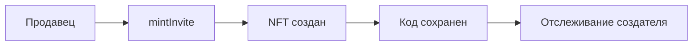
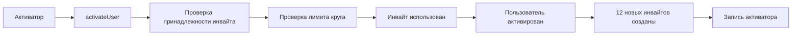
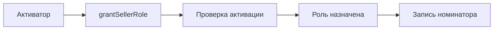
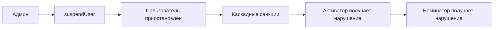

# SpiralEngine - Контракт спиральной иерархии

## Обзор

`SpiralEngine` - это авторский смарт-контракт спиральной иерархии через 12-гранные круги в экосистеме Amanita, созданный **Zeya888** (https://zeya888.me). Контракт реализует систему инвайтов как **Soulbound NFT** для управления доступом пользователей в спиральной структуре с каскадной ответственностью и системой санкций.

## Архитектура

### Спиральная иерархия через 12-гранные круги
`SpiralEngine` реализует уникальную систему спиральной иерархии:
- 🔄 **12-гранные круги** - каждый активатор может активировать максимум 12 пользователей
- 📈 **Каскадная ответственность** - активаторы несут ответственность за своих активированных пользователей
- ⚖️ **Система санкций** - нарушения пользователей влияют на их активаторов и номинаторов
- 🛡️ **Soulbound NFT** - инвайты непередаваемы, защищены от спекуляций

### Система ролей
```solidity
bytes32 public constant SELLER_ROLE = keccak256("SELLER_ROLE");
bytes32 public constant ACTIVATOR_ROLE = keccak256("ACTIVATOR_ROLE");
```
- **SELLER_ROLE** - создание инвайтов
- **ACTIVATOR_ROLE** - активация пользователей и назначение ролей. При успешном вызове `activateUser` **активированному пользователю автоматически выдаётся** `ACTIVATOR_ROLE` (каждый активированный = базовый Activator; см. Roles Security Policy, MVP Scope). Отзыв — через `revokeRole(ACTIVATOR_ROLE, user)`; возврат — через `grantRole` админом или пост-MVP `restoreActivatorRole` с проверкой eligibility.
- **DEFAULT_ADMIN_ROLE** - управление ролями, санкции и система

### Интеграция с SoulIdentity
- **SBT функциональность** делегируется в контракт `SoulIdentity`
- **Духовные аспекты** (DID, репутация, восстановление) обрабатываются через мост
- **SpiralEngine** фокусируется на спиральной иерархии и ролях
- **Архитектурная целостность**: Четкое разделение ответственности между контрактами
- **100% тестовое покрытие**: Все SBT функции протестированы через SoulIdentity

## Основные функции

### Создание инвайтов

#### `mintInvite(string memory inviteCode, uint256 expiry)`
Создает один инвайт для раздачи в спиральной системе.

**Параметры:**
- `inviteCode` - уникальный код инвайта
- `expiry` - срок действия (0 = бессрочный)

**Требования:**
- Вызывающий должен иметь `SELLER_ROLE`
- Код должен быть уникальным
- Код не должен быть пустым

**Особенности:**
- Создание NFT на адрес вызывающего
- Автоматическая инициализация всех маппингов
- Отслеживание создателя инвайта
- Обновление счетчиков и статистики

**Возвращает:**
- `uint256 tokenId` - идентификатор созданного NFT

#### `mintInviteBatch(string[] calldata inviteCodes, uint256[] calldata expiries)`
Создаёт несколько инвайтов за одну транзакцию (batch). Те же гарантии, что и у `mintInvite`: валидация, события, роли, пауза, reentrancy guard на всю batch.

**Параметры:**
- `inviteCodes` - массив уникальных кодов инвайтов
- `expiries` - массив сроков действия (0 = бессрочный) для каждого инвайта; длина должна совпадать с `inviteCodes`

**Требования:**
- Вызывающий должен иметь `SELLER_ROLE`
- `inviteCodes.length == expiries.length`, `inviteCodes.length > 0`, `inviteCodes.length <= MAX_BATCH_SIZE` (50)
- Все коды уникальны (в т.ч. внутри batch)

**Возвращает:**
- `uint256[] tokenIds` - массив идентификаторов созданных NFT

**Константа:** `uint256 public constant MAX_BATCH_SIZE = 50` — максимальный размер batch (защита от переполнения газа).

### Активация пользователей

#### `activateUser(string memory inviteCode, address user, string[] memory newInviteCodes, uint256 expiry)`
**Главная функция активации** - активирует пользователя в спиральной системе и создает для него новые инвайты.

**Параметры:**
- `inviteCode` - код инвайта для активации
- `user` - адрес пользователя для активации
- `newInviteCodes` - массив новых кодов (должно быть ровно 12)
- `expiry` - срок действия новых инвайтов

**Требования:**
- Вызывающий должен иметь `ACTIVATOR_ROLE`
- Пользователь не должен быть активирован ранее
- Инвайт должен быть создан вызывающим активатором
- Инвайт должен быть валидным и неиспользованным
- Все новые коды должны быть уникальными
- Активатор не должен превышать лимит круга (12 пользователей)

**Процесс активации:**
1. ✅ Проверка, что пользователь не активирован
2. ✅ Валидация инвайта (существование, принадлежность активатору, неиспользованность, срок)
3. ✅ Проверка лимита круга активатора (максимум 12)
4. ✅ Проверка уникальности новых кодов
5. ✅ Отметка инвайта как использованного
6. ✅ Добавление пользователя в активированные
7. ✅ Создание 12 новых инвайтов для пользователя
8. ✅ Запись активатора и обновление статистики
9. ✅ **Автовыдача ACTIVATOR_ROLE** активированному пользователю (`_grantRole(ACTIVATOR_ROLE, user)`)
10. ✅ Эмиссия событий

**События:**
```solidity
event UserActivated(address indexed user, address indexed activator, uint256 timestamp);
event InviteMinted(address indexed minter, uint256 indexed tokenId, string inviteCode, uint256 expiry);
```

### Управление ролями

#### `grantSellerRole(address user)`
Назначает роль продавца активированному пользователю.

**Параметры:**
- `user` - адрес пользователя для назначения роли

**Требования (MVP, SEC-SE-1):**
- Вызывающий должен иметь **ADMIN_ROLE** (в MVP выдача SELLER только админом)
- Пользователь должен быть активирован (`usedInviteByUser != 0`)
- Пользователь не должен уже иметь роль продавца

**Особенности:**
- Запись номинатора для отслеживания ответственности
- Обновление статистики номинаций
- **Эмиссия события** `SellerRoleGranted(user, nominator, timestamp)` — оффчейн-системы могут подписываться на него для аудита и мониторинга назначений

**События:**
```solidity
event SellerRoleGranted(address indexed user, address indexed nominator, uint256 timestamp);
```

### Система санкций

#### `suspendUser(address user, uint256 duration, string memory reason)`
Приостанавливает пользователя на определенный период.

**Параметры:**
- `user` - адрес пользователя для приостановки
- `duration` - продолжительность приостановки в секундах
- `reason` - причина приостановки

**Требования:**
- Вызывающий должен иметь `DEFAULT_ADMIN_ROLE`
- Пользователь должен быть активирован
- Продолжительность должна быть больше 0

**Каскадные санкции:**
- Увеличение счетчика нарушений пользователя
- Увеличение счетчика нарушений активатора
- Увеличение счетчика нарушений номинатора (если есть)

**События:**
```solidity
event UserSuspended(address indexed user, uint256 until, string reason);
```

### Управление кругами

#### `getCircleSize(address activator)`
Возвращает размер круга активатора.

**Параметры:**
- `activator` - адрес активатора

**Возвращает:**
- `uint256` - количество активированных пользователей (максимум 12)

#### `getCircleMembers(address activator)`
Возвращает список членов круга активатора.

**Параметры:**
- `activator` - адрес активатора

**Возвращает:**
- `address[]` - массив адресов активированных пользователей

#### `isInviteFromActivator(uint256 tokenId, address activator)`
Проверяет, создан ли инвайт указанным активатором.

**Параметры:**
- `tokenId` - идентификатор токена
- `activator` - адрес активатора

**Возвращает:**
- `bool` - true если инвайт создан активатором

### Интеграция с SoulIdentity

#### `setSoulIdentity(address _soulIdentity)`
Устанавливает адрес контракта SoulIdentity.

**Параметры:**
- `_soulIdentity` - адрес контракта SoulIdentity

**Требования:**
- Вызывающий должен иметь `DEFAULT_ADMIN_ROLE`
- Адрес не должен быть нулевым

#### `getSoulLevel(address user)`
Получает уровень души пользователя.

#### `getSoulReputation(address user)`
Получает репутацию души пользователя.

#### `getSoulIdentity(address user)`
Получает DID идентификатор пользователя.

#### `getSoulVerificationLevel(address user)`
Получает уровень верификации души пользователя.

#### `getSoulProfile(address user)`
Получает полный профиль души пользователя.

**Возвращает:**
- `level` - уровень души
- `reputation` - репутация души
- `identity` - идентичность души
- `verificationLevel` - уровень верификации
- `guardians` - список доверенных лиц

## Структуры данных

### Основные маппинги инвайтов
```solidity
// Код инвайта => ID токена
mapping(string => uint256) public inviteCodeToTokenId;

// Код инвайта => существует ли (для корректной проверки дублирования)
mapping(string => bool) public inviteCodeExists;

// ID токена => код инвайта
mapping(uint256 => string) public tokenIdToInviteCode;

// ID токена => использован ли
mapping(uint256 => bool) public isInviteUsed;

// Пользователь => использованный токен (+1 для избежания конфликта с tokenId = 0)
mapping(address => uint256) public usedInviteByUser;

// ID токена => срок действия
mapping(uint256 => uint256) public inviteExpiry;

// ID токена => дата создания
mapping(uint256 => uint256) public inviteCreatedAt;

// ID токена => создатель
mapping(uint256 => address) public inviteMinter;

// ID токена => первый владелец
mapping(uint256 => address) public inviteFirstOwner;

// Пользователь => его инвайты
mapping(address => uint256[]) public userInvites;

// ID токена => история владельцев
mapping(uint256 => address[]) public inviteTransferHistory;
```

### Отслеживание ответственности
```solidity
// Кто активировал пользователя
mapping(address => address) public userActivator;

// Кто назначил роль SELLER_ROLE
mapping(address => address) public sellerNominator;

// Кого активировал данный активатор
mapping(address => address[]) public activatedBy;

// Кого назначил селлером данный номинатор
mapping(address => address[]) public nominatedSellers;
```

### Система санкций
```solidity
// Счетчик нарушений для каждого пользователя
mapping(address => uint256) public violationCount;

// До какого времени заблокирован пользователь
mapping(address => uint256) public suspensionUntil;

// Нарушения активированных пользователей (для активатора)
mapping(address => uint256) public activationViolations;

// Нарушения назначенных селлеров (для номинатора)
mapping(address => uint256) public nominationViolations;
```

### Счетчики и статистика
```solidity
uint256 public totalInvitesUsed;    // Всего использованных инвайтов
uint256 public totalInvitesMinted;  // Всего созданных инвайтов
uint256 private _tokenIdCounter;    // Счетчик ID токенов
mapping(address => uint256) public userInviteCount; // Количество инвайтов пользователя
```

### Массивы
```solidity
address[] public activatedUsers;    // Все активированные пользователи
```

### Интеграция с SoulIdentity
```solidity
ISoulIdentity public soulIdentity; // Ссылка на контракт SoulIdentity
```

## Безопасность

### Soulbound NFT защита
```solidity
function transferFrom(address /* from */, address /* to */, uint256 /* tokenId */) public pure override {
    revert("SpiralEngine: transfers not allowed");
}

function approve(address /* to */, uint256 /* tokenId */) public pure override {
    revert("SpiralEngine: approvals not allowed");
}

function setApprovalForAll(address /* operator */, bool /* approved */) public pure override {
    revert("SpiralEngine: approvals not allowed");
}

function locked(uint256 tokenId) external view override returns (bool) {
    require(address(soulIdentity) != address(0), "SpiralEngine: soul identity not set");
    return soulIdentity.locked(tokenId);
}
```

**Особенности:**
- ❌ Инвайты нельзя передавать между пользователями
- ❌ Инвайты нельзя делегировать (approve/setApprovalForAll)
- ✅ Можно создавать (минт) и сжигать
- 🛡️ Защита от спекуляций и перепродажи
- 🔒 Полная блокировка всех функций передачи
- 🔗 Делегирование locked() функции в SoulIdentity
- 📋 Поддержка интерфейса IERC5192

### Контроль доступа
- **SELLER_ROLE** - создание инвайтов
- **ACTIVATOR_ROLE** - активация пользователей и назначение ролей; при успешном `activateUser` активированному пользователю автоматически выдаётся `ACTIVATOR_ROLE`. Право на роль (eligibility) инкапсулировано во internal view `_isEligibleForActivatorRole(user)` (usedInviteByUser != 0); отзыв — `revokeRole`, возврат — админ `grantRole` или пост-MVP restore.
- **DEFAULT_ADMIN_ROLE** - управление ролями, санкции и система
- Проверка уникальности кодов инвайтов
- Защита от повторной активации пользователей

### Валидация данных
- Проверка сроков действия инвайтов
- Проверка уникальности кодов инвайтов
- Защита от активации уже активированных пользователей
- Проверка принадлежности инвайта активатору
- Ограничение размера круга активатора (максимум 12)

### Система санкций
- **Каскадная ответственность** - нарушения пользователей влияют на активаторов
- **Отслеживание номинаций** - нарушения селлеров влияют на номинаторов
- **Временные блокировки** - возможность приостановки пользователей
- **Счетчики нарушений** - полная статистика для аудита

## События

### Основные события
```solidity
event InviteMinted(address indexed minter, uint256 indexed tokenId, string inviteCode, uint256 expiry);
event UserActivated(address indexed user, address indexed activator, uint256 timestamp);
event SellerRoleGranted(address indexed user, address indexed nominator, uint256 timestamp);
event UserSuspended(address indexed user, uint256 until, string reason);
event SoulIdentityUpdated(address indexed oldSoulIdentity, address indexed newSoulIdentity);
```

### События активации и ролей
- `InviteMinted` - создан новый инвайт
- `UserActivated` - пользователь активирован в спиральной системе
- `SellerRoleGranted` - назначена роль продавца
- `UserSuspended` - пользователь приостановлен
- `SoulIdentityUpdated` - обновлена ссылка на SoulIdentity

## Использование

### Создание инвайтов
```javascript
const spiralEngine = new ethers.Contract(address, abi, seller);

// Создание одного инвайта
const inviteCode = "INVITE-001";
const expiry = 0; // Бессрочный

const tokenId = await spiralEngine.mintInvite(inviteCode, expiry);

// Создание нескольких инвайтов за одну транзакцию (batch, макс. MAX_BATCH_SIZE = 50)
const inviteCodes = ["INVITE-002", "INVITE-003", "INVITE-004"];
const expiries = [0n, 0n, 0n]; // BigInt для uint256
const tokenIds = await spiralEngine.mintInviteBatch(inviteCodes, expiries);
```

### Активация пользователя
```javascript
const spiralEngine = new ethers.Contract(address, abi, activator);

// Активация пользователя в спиральной системе
const inviteCode = "INVITE-001";
const user = "0x...";
const newInviteCodes = ["NEW-001", "NEW-002", /* ... 12 кодов */];
const expiry = 0;

await spiralEngine.activateUser(inviteCode, user, newInviteCodes, expiry);
```

### Назначение ролей
```javascript
const spiralEngine = new ethers.Contract(address, abi, activator);

// Назначение роли продавца
await spiralEngine.grantSellerRole(userAddress);
```

### Управление санкциями
```javascript
const spiralEngine = new ethers.Contract(address, abi, admin);

// Приостановка пользователя
const duration = 3600; // 1 час
const reason = "Нарушение правил";
await spiralEngine.suspendUser(userAddress, duration, reason);
```

### Проверка статуса
```javascript
// Проверка активации пользователя
const usedInvite = await spiralEngine.usedInviteByUser(userAddress);
const isActivated = usedInvite > 0;

// Проверка размера круга активатора
const circleSize = await spiralEngine.getCircleSize(activatorAddress);

// Проверка принадлежности инвайта
const isFromActivator = await spiralEngine.isInviteFromActivator(tokenId, activatorAddress);
```

### Интеграция с SoulIdentity
```javascript
// Получение профиля души
const [level, reputation, identity, verificationLevel, guardians] = 
    await spiralEngine.getSoulProfile(userAddress);

// Получение уровня души
const soulLevel = await spiralEngine.getSoulLevel(userAddress);
```

## Интеграция с экосистемой

### Зависимости
- **OpenZeppelin ERC721** - базовая функциональность NFT
- **OpenZeppelin AccessControl** - система ролей
- **IERC5192** - интерфейс стандарта Soulbound Tokens
- **ISoulIdentity** - интерфейс для интеграции с SoulIdentity

### Наследование и интерфейсы
```solidity
contract SpiralEngine is ERC721, AccessControl, IERC5192
```

**Реализованные интерфейсы:**
- **ERC721** - стандарт NFT с блокировкой передачи
- **AccessControl** - система ролей OpenZeppelin
- **IERC5192** - стандарт Soulbound Tokens с функцией locked()

### Связь с другими контрактами
- **SoulIdentity** - делегирование SBT функциональности, DID, репутации
- **ProductRegistry** - использует роли и статус активации
- **AmanitaRegistry** - регистрация адреса контракта

## Жизненный цикл в спиральной системе

### 1. Создание инвайта


### 2. Активация пользователя


### 3. Назначение ролей


### 4. Система санкций


## Ограничения и особенности

### Спиральная иерархия
- 🔄 **12-гранные круги** - максимум 12 пользователей на активатора
- 📈 **Каскадная ответственность** - активаторы отвечают за своих пользователей
- ⚖️ **Система санкций** - нарушения влияют на всю цепочку
- 🛡️ **Soulbound NFT** - инвайты непередаваемы, защищены от спекуляций

### Ограничения активации
- ✅ Ровно 12 новых инвайтов при активации
- ✅ Инвайт должен принадлежать активатору
- ✅ Активатор не должен превышать лимит круга
- ✅ Пользователь может быть активирован только один раз

### Уникальность и валидация
- ✅ Все коды инвайтов должны быть уникальными
- ✅ Проверка на уровне контракта
- ✅ Защита от дублирования через `inviteCodeExists`
- ✅ Корректная обработка `tokenId = 0`

## Аудит и мониторинг

### Счетчики и статистика
- `totalInvitesUsed` - общее количество использованных инвайтов
- `totalInvitesMinted` - общее количество созданных инвайтов
- `userInviteCount[user]` - количество инвайтов конкретного пользователя
- `violationCount[user]` - количество нарушений пользователя
- `activationViolations[activator]` - нарушения активированных пользователей
- `nominationViolations[nominator]` - нарушения назначенных селлеров

### Отслеживание ответственности
- `userActivator[user]` - кто активировал пользователя
- `sellerNominator[user]` - кто назначил роль продавца
- `activatedBy[activator]` - кого активировал активатор
- `nominatedSellers[nominator]` - кого назначил селлером номинатор

### История и метаданные
- `inviteTransferHistory[tokenId]` - полная история владельцев инвайта
- `inviteCreatedAt[tokenId]` - дата создания инвайта
- `inviteMinter[tokenId]` - кто создал инвайт
- `suspensionUntil[user]` - до какого времени заблокирован пользователь

### События
- Все операции логируются через события
- Индексация по пользователям, токенам и ролям
- Timestamp для временного анализа
- Полная трассировка активации и назначения ролей

## Тестирование

### ✅ **Покрытие тестами: 100% (24/24 SBT тестов)**

#### **SpiralEngine.sbt.test.js - Комплексные SBT тесты**

##### **Группы тестов**
1. **P0: Critical SBT Core Properties** (6 тестов) - Критические свойства SBT
2. **P0: EIP-5192 SBT Standard Compliance** (3 теста) - Соответствие стандарту
3. **P1: SBT Recovery System** (4 теста) - Система восстановления
4. **P1: DID Integration and Reputation System** (4 теста) - DID и репутация
5. **P1: SBT Metadata and Versioning** (3 теста) - Метаданные и версионирование
6. **P2: Edge Cases and Error Handling** (4 теста) - Граничные случаи

##### **Критические пути покрыты**
- ✅ **Non-transferability**: Полная блокировка transferFrom, safeTransferFrom
- ✅ **Non-approvability**: Блокировка approve, setApprovalForAll
- ✅ **EIP-5192 Compliance**: locked() функция, поддержка интерфейса
- ✅ **SoulIdentity Integration**: Делегирование всех SBT функций
- ✅ **Guardian System**: Добавление guardian'ов, процесс восстановления
- ✅ **DID Management**: Связывание DID, управление идентичностями
- ✅ **Metadata Operations**: Обновление метаданных, версионирование
- ✅ **Access Control**: Проверка ролей и авторизации

##### **Архитектурные принципы тестирования**
- ✅ **Правильная архитектура**: Все SBT функции вызываются через SoulIdentity
- ✅ **Мостовой паттерн**: SoulIdentity как единая точка входа
- ✅ **Честные тесты**: Проверка реальной функциональности, не ложные успехи
- ✅ **Методология @test-to-success.mdc**: Применена для достижения 100% успешности

##### **Примеры тестового паттерна**
```javascript
// Правильный паттерн: получение SoulIdentity через мост
const soulIdentityAddress = await spiralEngine.soulIdentity();
const soulIdentity = await ethers.getContractAt("SoulIdentity", soulIdentityAddress);

// Получение SoulboundCore для создания SBT токенов
const soulboundCoreAddress = await soulIdentity.soulboundCore();
const soulboundCore = await ethers.getContractAt("SoulboundCore", soulboundCoreAddress);
await soulboundCore.connect(deployer).mintSoul(user1.address);

// Вызов SBT функций через SoulIdentity (не напрямую на SpiralEngine)
const soulLevel = await soulIdentity.connect(user1).getSoulLevel(user1.address);
const isLocked = await soulIdentity.connect(user1).locked(tokenId);
```

## Заключение

`SpiralEngine` - это авторская система спиральной иерархии, которая:

- 🔄 **Уникальна** - 12-гранные круги с каскадной ответственностью
- 🛡️ **Безопасна** - Soulbound NFT + система ролей + санкции + EIP-5192
- ⚡ **Эффективна** - оптимизированные алгоритмы и четкие ограничения
- 🔍 **Прозрачна** - полное логирование и аудит всех операций
- 🔗 **Интегрирована** - тесная связь с SoulIdentity и экосистемой Amanita
- 📈 **Масштабируема** - поддержка больших объемов пользователей в спиральной структуре
- ⚖️ **Справедлива** - система санкций обеспечивает ответственность на всех уровнях
- ✅ **Протестирована** - 100% покрытие SBT функциональности через SoulIdentity

Контракт обеспечивает надежную основу для децентрализованной спиральной системы управления пользователями в экосистеме Amanita, созданную **Zeya888** (https://zeya888.me).
