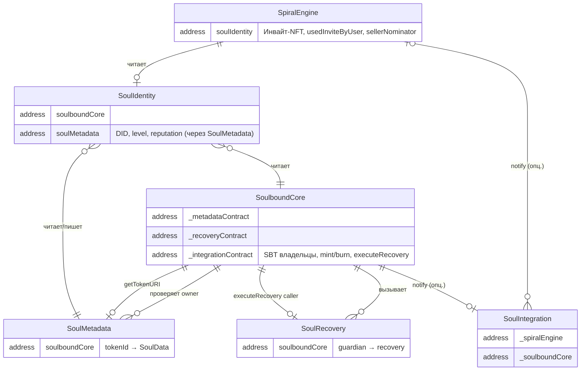
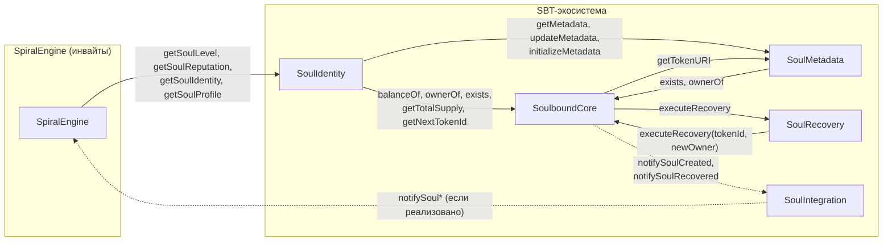

# Схема связей контрактов (без UUPS)

**Версия:** 1.0  
**Дата:** 2026-03-14  
**Стиль:** реляционная модель — контракты как сущности, ссылки как связи. Без Proxy/UUPS.

---

## 1. Диаграмма связей (Mermaid ER)

Ниже диаграмма в формате Mermaid. Её можно рендерить в GitHub, GitLab, в VS Code (Mermaid preview), в Notion и т.п.

```mermaid
erDiagram
    SpiralEngine {
        address soulIdentity "FK → SoulIdentity"
        "NFT инвайтов (собственные)"
        "usedInviteByUser, sellerNominator, роли"
    }

    SoulIdentity {
        address soulboundCore "FK → SoulboundCore"
        address soulMetadata "FK → SoulMetadata"
        "userIdentities, primaryIdentityIndex"
    }

    SoulboundCore {
        address _metadataContract "FK → SoulMetadata"
        address _recoveryContract "FK → SoulRecovery"
        address _integrationContract "FK → SoulIntegration"
        "SBT: _owners, _balances"
    }

    SoulMetadata {
        address soulboundCore "FK → SoulboundCore, immutable"
        "tokenId → SoulData (type, version, attributes, ipfsHash)"
    }

    SoulRecovery {
        address soulboundCore "FK → SoulboundCore, immutable"
        "tokenId → GuardianInfo, RecoveryInfo"
    }

    SoulIntegration {
        address _spiralEngine "FK → SpiralEngine"
        address _soulboundCore "FK → SoulboundCore"
    }

    ProductRegistry {
        address spiralEngine "FK → SpiralEngine"
    }

    ActivityRegistry {
        address spiralEngine "FK → SpiralEngine"
    }

    OrganicComponentRegistry {
        address spiralEngine "FK → SpiralEngine"
    }

    AmanitaInternational {
        address spiralEngine "FK → SpiralEngine"
    }

    SpiralEngine ||--o| SoulIdentity : "1:1 читает душу"
    SoulIdentity }o--|| SoulboundCore : "N:1 читает/ищет токен"
    SoulIdentity }o--|| SoulMetadata : "N:1 читает/пишет level, reputation, DID"
    SoulboundCore ||--o| SoulMetadata : "1:1 getTokenURI"
    SoulboundCore ||--o| SoulRecovery : "1:1 только executeRecovery"
    SoulboundCore ||--o| SoulIntegration : "1:1 опционально notify"
    SoulRecovery }o--|| SoulboundCore : "N:1 вызывает executeRecovery"
    SoulMetadata }o--|| SoulboundCore : "N:1 exists, ownerOf"
    SoulIntegration }o--|| SoulboundCore : "N:1 exists, ownerOf"
    SoulIntegration }o--o| SpiralEngine : "0:1 notifySoul*"
    ProductRegistry }o--|| SpiralEngine : "N:1 usedInvite, SELLER"
    ActivityRegistry }o--|| SpiralEngine : "N:1 ACTIVATOR, usedInvite"
    OrganicComponentRegistry }o--|| SpiralEngine : "N:1 usedInvite, SELLER"
    AmanitaInternational }o--|| SpiralEngine : "N:1 SELLER_ROLE"
```

---

## 2. Упрощённая схема: только SBT-экосистема и SpiralEngine

Фокус на «душа» и инвайты — без реестров продуктов/активностей.



---

## 3. Направления вызовов (flow)

Удобно читать «кто кого вызывает»:



Сплошные стрелки — обязательные/основные вызовы; пунктир — опциональные (SoulIntegration и уведомления SpiralEngine).

---

## 4. Легенда (как в реляционных БД)

| Обозначение | Значение |
|-------------|----------|
| **Сущность (прямоугольник)** | Контракт (логическая единица). Внутри — ключевые ссылки на другие контракты (как FK). |
| **Связь 1:1** | Один контракт хранит один адрес другого (например, SpiralEngine — один SoulIdentity). |
| **Связь N:1** | Много «записей»/вызовов к одному контракту (например, SoulIdentity всегда обращается к одному SoulboundCore). |
| **Читает** | Вызовы только view/read (getSoulLevel, getMetadata, ownerOf и т.д.). |
| **Пишет** | Вызовы, меняющие состояние (updateMetadata, executeRecovery, mintSoul и т.д.). |
| **Опционально** | Связь задаётся снаружи (например, _integrationContract, _recoveryContract могут быть 0). |

---

## 5. Где что хранится (кратко)

| Данные | Контракт |
|--------|----------|
| Владельцы SBT, балансы, минтинг/сжигание | SoulboundCore |
| Level, reputation, атрибуты SBT (JSON), IPFS | SoulMetadata |
| DID, внешние идентичности, «профиль души» (view) | SoulIdentity |
| Guardian и процесс recovery на tokenId | SoulRecovery |
| Инвайт-коды, usedInviteByUser, активатор, номинатор, роли | SpiralEngine (Logic) |
| Уведомления о создании/восстановлении души | SoulIntegration (если настроен) |

Документ можно использовать вместе с [SBT-ecosystem-and-SpiralEngine-analysis.md](./SBT-ecosystem-and-SpiralEngine-analysis.md) для навигации по коду.
