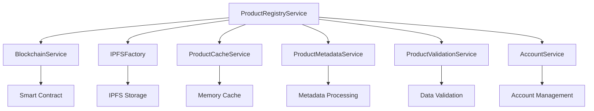

# ProductRegistryService - Сервис реестра продуктов

## Обзор

`ProductRegistryService` - это центральный сервис для работы с реестром продуктов в системе Amanita. Он координирует работу всех подсервисов и обеспечивает единый интерфейс для создания, управления и получения продуктов.

## Архитектура

### Компоненты системы

```
ProductRegistryService
├── BlockchainService (блокчейн-операции)
├── IPFSFactory (хранилище метаданных)
├── ProductCacheService (кэширование)
├── ProductMetadataService (обработка метаданных)
├── ProductValidationService (валидация)
└── AccountService (управление аккаунтами)
```

### Схема взаимодействия



## Основные компоненты

### 1. BlockchainService
- **Назначение**: Взаимодействие со смарт-контрактом ProductRegistry
- **Функции**:
  - Создание продуктов в блокчейне
  - Получение списка продуктов
  - Обновление статусов продуктов
  - Управление версиями каталога

### 2. IPFSFactory
- **Назначение**: Абстракция хранилища метаданных
- **Поддерживаемые провайдеры**:
  - Pinata IPFS
  - Arweave
  - Локальное хранилище (для тестов)

### 3. ProductCacheService
- **Назначение**: Кэширование данных для оптимизации производительности
- **Типы кэша**:
  - `catalog` (TTL: 5 минут)
  - `description` (TTL: 24 часа)
  - `image` (TTL: 12 часов)

### 4. ProductMetadataService
- **Назначение**: Обработка и создание метаданных продуктов
- **Функции**:
  - Создание структурированных метаданных
  - Обработка различных форматов данных
  - Извлечение описаний из разных источников

### 5. ProductValidationService
- **Назначение**: Валидация данных продуктов
- **Проверки**:
  - Обязательные поля
  - Форматы CID
  - Структура цен
  - Валидность категорий и форм

### 6. AccountService
- **Назначение**: Управление аккаунтами продавцов и покупателей (пользователей экосистемы Amanita)
- **Функции**:
  - Получение аккаунта продавца
  - Управление ключами
  - Валидация прав доступа

## Процесс создания продукта

### Детальное описание метода `create_product`

```python
async def create_product(self, product_data: dict) -> Optional[str]:
```

#### Этап 1: Валидация данных
```python
validation_result = await self.validation_service.validate_product_data(product_data)
```

**Проверяемые поля:**
- `id` - уникальный идентификатор продукта
- `title` - название продукта (макс. 255 символов)
- `description_cid` - CID описания в IPFS
- `categories` - список категорий (макс. 10)
- `cover_image` - CID изображения продукта
- `form` - форма выпуска (из предопределенного списка)
- `species` - вид растения/гриба
- `prices` - список цен с валидацией

**Валидация цен:**
```json
{
  "weight": "100",
  "weight_unit": "g",
  "price": "30",
  "currency": "EUR"
}
```

**Поддерживаемые единицы измерения:**
- Вес: `g`, `kg`
- Объем: `ml`, `l`
- Валюты: `EUR`, `USD`

#### Этап 2: Создание метаданных
```python
metadata = self.create_product_metadata(product_data)
```

**Структура метаданных:**
```json
{
  "id": "product_id",
  "title": "Название продукта",
  "description_cid": "Qm...",
  "cover_image": "Qm...",
  "categories": ["категория1", "категория2"],
  "form": "powder",
  "species": "Amanita muscaria",
  "prices": [
    {
      "weight": "100",
      "weight_unit": "g",
      "price": "30",
      "currency": "EUR"
    }
  ],
  "created_at": "2024-01-01T00:00:00Z"
}
```

#### Этап 3: Загрузка в IPFS
```python
metadata_cid = await self.storage_service.upload_json(metadata)
```

**Процесс:**
1. Сериализация JSON метаданных
2. Загрузка через выбранный IPFS провайдер
3. Получение CID для загруженных данных
4. Валидация полученного CID

#### Этап 4: Создание в блокчейне
```python
tx_hash = await self.blockchain.create_product(metadata_cid)
```

**Операции в смарт-контракте:**
1. Проверка прав продавца
2. Создание записи продукта
3. Обновление версии каталога
4. Эмиссия события `ProductCreated`

#### Этап 5: Получение ID продукта
```python
product_id = await self.blockchain.get_product_id_from_tx(tx_hash)
```

**Извлечение из логов транзакции:**
1. Парсинг логов транзакции
2. Поиск события `ProductCreated`
3. Извлечение ID продукта
4. Валидация полученного ID

## Кэширование

### Стратегия кэширования

```python
CACHE_TTL = {
    'catalog': timedelta(minutes=5),
    'description': timedelta(hours=24),
    'image': timedelta(hours=12)
}
```

### Типы кэша

#### 1. Каталог продуктов
- **TTL**: 5 минут
- **Содержимое**: Список всех продуктов с метаданными
- **Инвалидация**: При изменении версии каталога

#### 2. Описания
- **TTL**: 24 часа
- **Содержимое**: Текстовые описания продуктов
- **Инвалидация**: При обновлении описания

#### 3. Изображения
- **TTL**: 12 часов
- **Содержимое**: URL изображений
- **Инвалидация**: При изменении изображения

### Методы кэширования

```python
def get_cached_item(self, key: str, cache_type: str) -> Optional[Any]
def set_cached_item(self, key: str, value: Any, cache_type: str)
def invalidate_cache(self, cache_type: Optional[str] = None)
```

## Валидация данных

### Уровни валидации

#### 1. Базовая валидация (`validation_utils.py`)
- Проверка обязательных полей
- Валидация форматов данных
- Проверка ограничений (длина, количество)

#### 2. Бизнес-валидация (`validation.py`)
- Проверка бизнес-правил
- Валидация связей между объектами
- Проверка уникальности

### Валидация CID

```python
CID_PATTERN = r"^Qm[1-9A-HJ-NP-Za-km-z]{44}$"
```

**Поддерживаемые форматы:**
- IPFS CID v0: `Qm...`
- IPFS CID v1: `bafy...`

### Валидация цен

```python
def validate_price(price_data: Dict) -> None:
```

**Проверки:**
- Положительная цена
- Поддерживаемая валюта
- Корректные единицы измерения
- Либо вес, либо объем (не оба)

## Обработка метаданных

### Извлечение описаний

```python
def _get_cached_description(self, description_cid: str) -> Optional[str]:
```

**Алгоритм:**
1. Проверка кэша
2. Валидация CID
3. Загрузка из IPFS
4. Извлечение текста из различных полей
5. Очистка и нормализация
6. Сохранение в кэш

### Обработка изображений

```python
def _get_cached_image(self, image_cid: str) -> Optional[str]:
```

**Процесс:**
1. Проверка кэша
2. Валидация CID
3. Получение URL через gateway
4. Сохранение в кэш

## Управление продуктами

### Получение продуктов

#### Все продукты
```python
async def get_all_products(self) -> List[Product]:
```

**Процесс:**
1. Проверка версии каталога
2. Проверка кэша
3. Загрузка из блокчейна
4. Обработка метаданных
5. Обновление кэша

#### Отдельный продукт
```python
def get_product_by_id(self, product_id: str) -> Optional[dict]:
```

**Процесс:**
1. Получение данных из блокчейна
2. Загрузка метаданных из IPFS
3. Объединение данных
4. Возврат результата

### Обновление статусов

```python
async def update_product_status(self, product_id: int, new_status: int) -> bool
async def set_product_active(self, product_id: int, is_active: bool) -> bool
```

**Статусы продуктов:**
- `0` - создан
- `1` - в процессе
- `2` - отправлен
- `3` - доставлен

## Обработка ошибок

### Типы ошибок

#### 1. ValidationError
- Ошибки валидации данных
- Содержит поле и описание ошибки

#### 2. BlockchainError
- Ошибки взаимодействия с блокчейном
- Проблемы с транзакциями

#### 3. StorageError
- Ошибки IPFS хранилища
- Проблемы с загрузкой/скачиванием

#### 4. CacheError
- Ошибки кэширования
- Проблемы с памятью

### Стратегия обработки

```python
try:
    # Операция
    result = await self.some_operation()
    return result
except ValidationError as e:
    self.logger.error(f"Validation error: {e}")
    return None
except Exception as e:
    self.logger.error(f"Unexpected error: {e}")
    self.logger.error(traceback.format_exc())
    return None
```

## Мониторинг и логирование

### Уровни логирования

- **DEBUG**: Детальная информация о процессах
- **INFO**: Основные операции и результаты
- **WARNING**: Предупреждения и потенциальные проблемы
- **ERROR**: Ошибки операций
- **CRITICAL**: Критические ошибки системы

### Метрики

#### Производительность
- Время создания продукта
- Время загрузки метаданных
- Эффективность кэширования

#### Надежность
- Количество ошибок валидации
- Успешность транзакций
- Доступность IPFS

#### Использование
- Количество созданных продуктов
- Популярность категорий
- Активность продавцов

## Интеграция с пайплайном каталога

### Связь с catalog_pipeline.py

`ProductRegistryService` интегрируется с пайплайном каталога через:

1. **Загрузка готовых продуктов**:
```python
# В catalog_pipeline.py
results = pipeline.upload_products_to_registry()
```

2. **Использование подготовленных данных**:
```python
# Чтение product_registry_upload_data.json
with open(self.config.PRODUCT_REGISTRY_DATA_JSON, 'r') as f:
    registry_data = json.load(f)
```

3. **Создание продуктов**:
```python
# Создание продукта в смарт-контракте
tx_hash = self.productRegistry.create_product_on_chain(ipfs_cid)
```

### Совместимость с форматами данных

Сервис поддерживает все форматы данных, создаваемые пайплайном:

- Структурированные цены
- CID изображений и описаний
- Категории и формы продуктов
- Метаданные биологических единиц

## Рекомендации по использованию

### Оптимизация производительности

1. **Используйте кэширование**:
   - Не отключайте кэш для часто запрашиваемых данных
   - Настройте TTL в соответствии с требованиями

2. **Batch операции**:
   - Группируйте операции создания продуктов
   - Используйте асинхронные методы

3. **Валидация на клиенте**:
   - Проверяйте данные перед отправкой
   - Используйте предварительную валидацию

### Безопасность

1. **Валидация входных данных**:
   - Всегда проверяйте данные перед обработкой
   - Используйте санитизацию

2. **Управление ключами**:
   - Безопасное хранение приватных ключей
   - Ротация ключей

3. **Мониторинг**:
   - Отслеживание подозрительной активности
   - Логирование всех операций

### Масштабирование

1. **Горизонтальное масштабирование**:
   - Использование нескольких экземпляров сервиса
   - Балансировка нагрузки

2. **Вертикальное масштабирование**:
   - Увеличение ресурсов сервера
   - Оптимизация кэша

3. **База данных**:
   - Использование внешней БД для кэша
   - Репликация данных

## Заключение

`ProductRegistryService` представляет собой комплексное решение для управления продуктами в системе Amanita. Он обеспечивает надежное создание, валидацию и управление продуктами с интеграцией в блокчейн и IPFS.

Ключевые преимущества:
- Централизованное управление продуктами
- Надежная валидация данных
- Эффективное кэширование
- Интеграция с пайплайном каталога
- Масштабируемая архитектура

Для успешного использования сервиса рекомендуется следовать рекомендациям по оптимизации, безопасности и масштабированию, описанным в данном документе. 