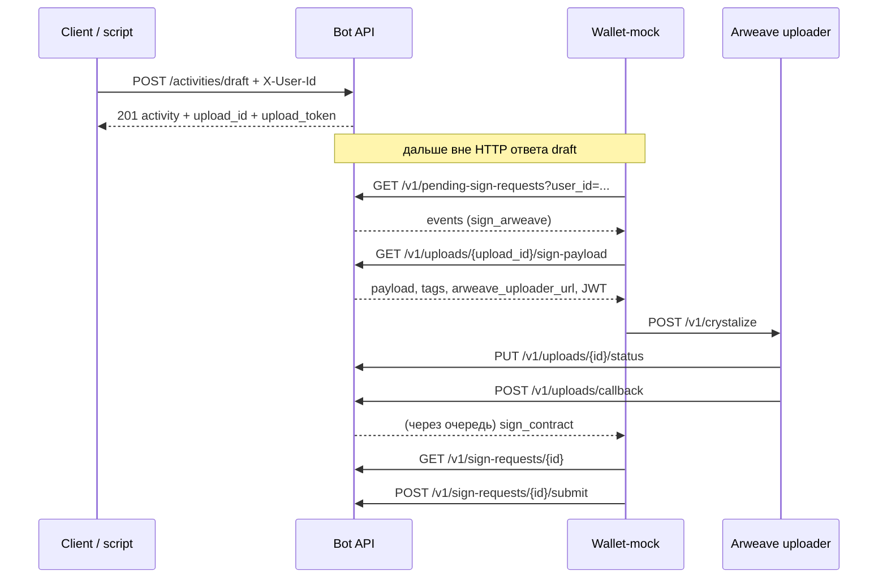

# Bullrun Floou — мануал

Скрипт: **`scripts/shell/run-bullrun-floou.sh`** (запуск из корня репозитория). Обёртка **`scripts/run-bullrun-floou.sh`** вызывает тот же файл.

Только **POST /activities/draft** без оркестратора: **`scripts/shell/post-floou-draft.sh`** (тело из `scripts/floou-draft-request.json`, см. `scripts/shell/README.md`).

---

## 1. Целевой сквозной процесс (весь цикл Floou)

Имеется в виду **сценарий A (wallet-driven)**: клиент кошелька (здесь — **wallet-mock runner**) опрашивает бота и дергает uploader. Это тот же контракт, что в **`bot/docs/tests/e2e-floou-orchestration-overview.md`** и **`bot/docs/tests/e2e-floou-manual.md`**.

### 1.1 Граница синхронная / асинхронная

- **Синхронно** заканчивается на ответе **`POST /activities/draft` (201)**: draft в хранилище, запись prepare/upload в Supabase (если включено), **`upload_id`**, **`upload_token`**, постановка события «нужна подпись Arweave» для `user_id`.
- **Асинхронно** (после выхода клиента из HTTP draft) идёт цепочка: кошелёк → sign-payload → crystalize → статус/callback → sign_contract → submit → (при успехе) запись в store и при необходимости RPC.

### 1.2 Участники

| Участник | Роль |
|----------|------|
| **Клиент** (curl, GPT, скрипт) | `POST /activities/draft` с **`X-User-Id`** (и при необходимости Bearer для GPT). |
| **Bot API** | Prepare, JWT, push события в очередь по `user_id`, эндпоинты `/v1/pending-sign-requests`, `/v1/uploads/...`, `/v1/sign-requests/...`. |
| **Wallet-mock** | Опрос pending, GET sign-payload, POST crystalize в uploader, GET sign-request, POST submit. |
| **Arweave uploader** | `POST /v1/crystalize`, затем **PUT** status и **POST** callback на бота (Bearer edge→backend). |
| **Блокчейн** | Отдельно; для полного смысла submit — реальная или мок-транзакция по политике окружения. |

### 1.3 Порядок шагов (целевой runtime)



Условия согласованности:

- **`USER_ID` в mock-runner** = **`X-User-Id`** при создании draft (один и тот же UUID/строка).
- **Uploader** знает **`BACKEND_URL`** бота и тот же **`EDGE_TO_BACKEND_SECRET`**, что и бот.
- JWT для upload: пара ключей согласована между ботом и uploader (см. e2e-manual).

### 1.4 Что делает оркестратор `run-bullrun-floou.sh` (без чтения кода)

| Фаза | Действие |
|------|----------|
| Подготовка | Читает **`scripts/.env`** (если есть); выставляет дефолты портов, **`BOT_URL`**, **`ARWEAVE_SERVICE_URL`**, **`USER_ID`**, опционально Bearer для draft из **`GPT_ACTIONS_BEARER_SECRET`**. |
| **local** | Стартует **uvicorn** бота (из `bot/` с `bot/.env`), **arweave-uploader** (`arweave-uploader/.env`), **wallet-mock** с env, переданным скриптом (в т.ч. **`FLOOU_DONE_MARKER_FILE`**, по умолчанию **`WALLET_MOCK_ARWEAVE_SIGN_MODE=local-valid`**). |
| **remote** | Не поднимает bot/uploader; стартует только **mock-runner**; **обязательны** реальные **`BOT_URL`** и **`ARWEAVE_SERVICE_URL`** в `.env`, иначе health будет крутиться на localhost. |
| Ожидание | Пока **`GET BOT_URL/health`** и **`GET ARWEAVE_SERVICE_URL/health`** не дадут 200 (таймаут **`FLOOU_SERVICE_READY_SEC`**). |
| Draft | **`POST BOT_URL/activities/draft`** с **`X-User-Id: USER_ID`** и телом из **`scripts/floou-draft-request.json`** (в remote файл обязателен). |
| Ожидание цикла | До **`FLOOU_SUBMIT_TIMEOUT_SEC`** ждёт строку JSON в временном файле-маркере: mock-runner пишет туда после успешного **submit** (поле **`ok`**, при расширенном логе — `crystalize_ok`, `callback_ok`, `tx_hash` и т.д.). |
| Финал | Опционально **GET** активити по `activity_id` из ответа draft; печать **`FLOOU_SUMMARY_JSON`** / plain; при **`FLOOU_STRICT`** — проверка полей сводки. |
| Остановка | SIGINT/SIGTERM: завершение дочерних PID (bot, uploader, wallet). |

Лог прогона: **`scripts/logs/<шесть-чисел>-<ddMMyyyyHHmm>.txt`** (отключить: **`FLOOU_LOG_DISABLE=true`**). Детали strict и сводки: **`scripts/docs/DEBUG_DEPLOY.md`**.

---

## 2. Кратко: что делает (как раньше)

В режиме **local** поднимает **bot**, **arweave-uploader** и **wallet/mock-runner**, ждёт `/health`, затем шлёт **POST `/activities/draft`**, дожидается цикла подписей в mock-runner и делает **GET** итоговой activity. В режиме **remote** локально стартует только **mock-runner**; bot и uploader должны уже быть доступны по URL из окружения.

Блокчейн-нода — отдельно. Расширенные инструкции по env и pytest: **`bot/docs/tests/e2e-floou-manual.md`**.

---

## 3. Два параметра, которые задаёт оператор

| Переменная | Значение |
|------------|----------|
| **`FLOOU_MODE`** | `local` (по умолчанию) или `remote` |
| **`USER_ID`** | UUID для заголовка `X-User-Id` (если не задан — дефолтный тестовый UUID в скрипте) |

Оркестратор читает только **`scripts/.env`** (если файл есть): **`FLOOU_MODE`**, **`USER_ID`**, **`BOT_URL`**, **`ARWEAVE_SERVICE_URL`** и т.д. задаются там или через `export` в shell до запуска. Кошелёк при этом поднимается как дочерний процесс и **не** получает env из своего `wallet/mock-runner/.env` через этот скрипт — при ручном `npm start` в mock-runner настройте его `.env` отдельно.

Для режима **local** при старте bot/uploader дополнительно читаются `.env` в **`bot/`** и **`arweave-uploader/`** (дочерние процессы).

**Матрица env mock-runner (poll, `POST /v1/crystalize`, submit):** полная таблица переменных, контракт тела crystalize и отличие «оркестратор задаёт env» vs «только `wallet/mock-runner/.env` при ручном `npm start`» — **`wallet/docs/mock-runner-launch-guide.md`**. Контракт HTTP uploader — **`arweave-uploader/docs/api.md`**. Постановка выравнивания: **`wallet/docs/analysis/tasks/task-align-mock-runner-bullrun-floou-crystalize-expectations/`** (ключ **WAL-FLOOU-1**, индекс **`wallet/docs/analysis/wallet-tasks-index.md`**).

---

## 4. Режим `remote` (удалённые bot + uploader)

Скрипт **не** запускает bot и arweave-uploader; поднимает **один** локальный процесс **mock-runner** и ждёт **`/health`** у **`BOT_URL`** и **`ARWEAVE_SERVICE_URL`**.

**Минимум в `scripts/.env` для remote (обязательно явные URL, иначе подставятся `http://127.0.0.1:8000` / `:3000` и скрипт будет ждать `/health` на пустом localhost):**

| Переменная | Зачем |
|------------|--------|
| `FLOOU_MODE=remote` | Включить ветку remote |
| `BOT_URL` | **HTTPS/HTTP база API бота** (Railway и т.д.), с `/health` — **не** опционально |
| `ARWEAVE_SERVICE_URL` | **База arweave-uploader**, с `/health` |
| `USER_ID` | Тот же идентификатор, что ожидает бэкенд для `X-User-Id` |
| Файл **`scripts/floou-draft-request.json`** | Обязателен, валидный JSON тела draft |

В **remote** скрипт **не** поднимает bot и uploader — он только стартует mock-runner и опрашивает **`BOT_URL`** / **`ARWEAVE_SERVICE_URL`**, которые вы задали. Если в логе всё ещё `127.0.0.1:8000`, значит **`BOT_URL` не попал из `scripts/.env`** (пустая строка, опечатка в имени, файл не сохранён).

Если mock-runner **уже** запущен отдельно (`npm start` в `wallet/mock-runner`), при запуске скрипта поднимется **второй** экземпляр mock-runner — обычно так не делают: либо только скрипт (он сам стартует runner), либо только ручной runner без оркестратора для того же прогона.

**Заметка:** строка `wallet auth refresh failed` / **401** в логе mock-runner — отдельная тема (аутентификация к боту / Bearer); на health и часть API это может не влиять — смотри `wallet/docs/mock-runner-launch-guide.md` и `bot/docs/tech/api/api.md`.

**Важно для mock-runner:** в **`BOT_URL` нельзя использовать `http://0.0.0.0:PORT` как адрес «куда ходить клиенту»** — для исходящих запросов из Node используйте **`http://127.0.0.1:PORT`** или **`http://localhost:PORT`**. Подробнее: **`wallet/docs/analysis/floou-mock-runner-poll-fetch-failed.md`**.

---

## 5. Тело POST `/activities/draft`

Фиксированный путь: **`scripts/floou-draft-request.json`**. Шаблон без своих данных: **`scripts/floou-draft-request.json.example`**. Файл с рабочим телом в git не коммитим (см. `.gitignore`).

- **`local`:** если файла нет или JSON невалиден — используется встроенное минимальное тело.
- **`remote`:** файл обязателен (непустой валидный JSON), иначе скрипт завершится с ошибкой до запуска mock-runner.

---

## 6. Примеры

```bash
./scripts/shell/run-bullrun-floou.sh

USER_ID='xxxxxxxx-xxxx-xxxx-xxxx-xxxxxxxxxxxx' ./scripts/shell/run-bullrun-floou.sh

FLOOU_MODE=remote ./scripts/shell/run-bullrun-floou.sh
# при необходимости всё в scripts/.env — см. §3

# Только POST /activities/draft (бот уже запущен; wallet/uploader — вручную):
# ./scripts/shell/post-floou-draft.sh
# POST_FLOOU_DRAFT_VERBOSE=1 ./scripts/shell/post-floou-draft.sh
```

Для remote **`BOT_URL`** и **`ARWEAVE_SERVICE_URL`** должны быть заданы (в **`scripts/.env`** или в shell).

Если на боте включён **`GPT_ACTIONS_BEARER_SECRET`**, задайте **тот же** секрет в **`scripts/.env`** — оркестратор и **`post-floou-draft.sh`** добавят `Authorization: Bearer …` к `POST /activities/draft` и к **GET** итоговой activity. Каноника: `bot/docs/tech/api/api.md`.

---

## 7. Дополнительно (не обязательно)

- **`FLOOU_STRICT=true`** или **`./scripts/shell/run-bullrun-floou.sh --strict`** — жёсткая проверка сводки в конце.
- **`FLOOU_LOG_DISABLE=true`** — не писать большой лог в `scripts/logs/`.
- **`FLOOU_SUBMIT_TIMEOUT_SEC`** — таймаут ожидания цикла подписей.

Сводка полей **`FLOOU_SUMMARY_*`**, strict, лог-файл: **`scripts/docs/DEBUG_DEPLOY.md`** (раздел Bullrun Floou).

---

## 8. Связанные документы

| Документ | Содержание |
|----------|------------|
| `bot/docs/tests/e2e-floou-orchestration-overview.md` | Диаграммы, сценарии A/B, различие pytest vs wallet-driven |
| `bot/docs/tests/e2e-floou-manual.md` | Env по компонентам, порты, маркеры pytest |
| `wallet/docs/mock-runner-launch-guide.md` | Запуск mock-runner вручную |
| `wallet/docs/analysis/floou-mock-runner-poll-fetch-failed.md` | Диагностика `poll error` / `fetch failed` |
| `scripts/docs/DEBUG_DEPLOY.md` | Лог-артефакт, strict, summary JSON |

**Версия:** 1.1 · **Дата:** 2026-04-04
