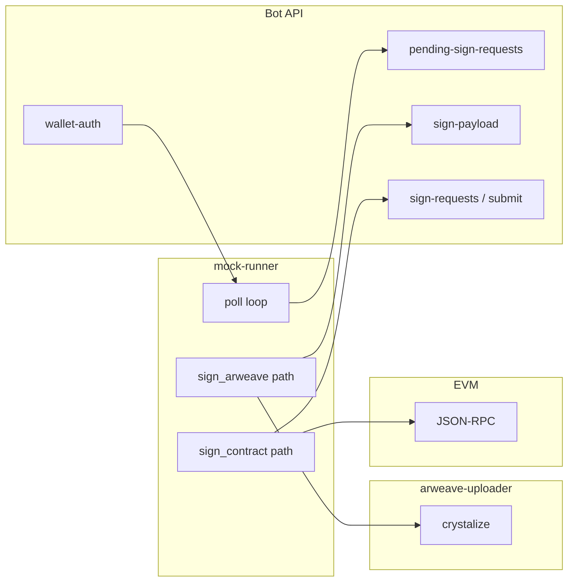

# Wallet-mock runner (W6) — обзор и архитектура

Эмулятор **клиента с кошельком** в репозитории `wallet/mock-runner`: один долгоживущий процесс опрашивает API бота и выполняет два независимых криптографических сценария (Arweave Data Item и EVM-транзакция). Веб-POC на Railway — отдельно (`wallet/webapp/`, см. `docs/railway-poc-webapp.md`).

**Практика:** [mock-runner-launch-guide.md](mock-runner-launch-guide.md) · **E2E playbook:** [poc-e2e-gpt-wallet-flow-playbook.md](poc-e2e-gpt-wallet-flow-playbook.md) · **Код:** [mock-runner/README.md](../mock-runner/README.md) · Локальный **`wallet/mock-runner/.env`** подхватывается при старте (**dotenv**), без ручного `source`.

---

## 1. Роль в системе

Runner **не** хранит состояние очереди: источник истины — **бот** (Supabase + очередь подписей). Runner только:

1. Авторизуется к боту (при `challenge_signature`) и далее шлёт запросы с `Authorization: Bearer` и при необходимости `X-User-Id` / `X-Wallet-Address`.
2. Читает работу: `GET /v1/pending-sign-requests?user_id=…`.
3. По каждому событию вызывает целевые эндпоинты бота и внешние сервисы (uploader, RPC), затем снова уходит в poll.

---

## 2. Два домена подписи (не смешивать)

| Домен | Ключ / материал | Библиотека / реализация | Куда уходит результат |
|--------|------------------|-------------------------|------------------------|
| **EVM** | `WALLET_MOCK_PRIVATE_KEY` (hex), опционально `WALLET_MOCK_ADDRESS` | `ethers` | Подпись raw tx `createActivity` → `POST …/sign-requests/{id}/submit` |
| **Arweave (ANS-104 Data Item)** | Зависит от `WALLET_MOCK_ARWEAVE_SIGN_MODE` | См. ниже | `signed_data_item` + `upload_token` + `upload_id` + `payload_size` → **`POST {uploader}/v1/crystalize`** ([`arweave-uploader/docs/api.md`](../../arweave-uploader/docs/api.md)) |

**Arweave-режимы:**

- **`local-valid`** (дефолт): Data Item собирается из фикстуры uploader + динамический `payload` с `sign-payload`; **JWK из env для этого режима не читается**.
- **`poc-jwk` / `env-jwk`**: подпись тем же JWK, что в `WALLET_MOCK_ARWEAVE_PRIVATE_KEY` или `WALLET_MOCK_ARWEAVE_PRIVATE_KEY_FILE` (RSA-2048, см. WAL-POC-7).
- **`dummy`**: намеренно невалидная подпись (отладка).

Скрипты деплоя (`scripts/lib/services/ArweaveManager.js`) используют пакет **`arweave`** для **L1-транзакций**; путь crystalize в runner — **Data Item**, не тот же API. Подробнее: `wallet/docs/analysis/tasks/task-poc-arweave-env-jwk-signing-runner/gap-analysis-arweave-lib-vs-manual-data-item.md`.

---

## 3. Поток событий (happy path)

1. **Старт:** при `WALLET_AUTH_MODE=challenge_signature` и заданном `WALLET_MOCK_PRIVATE_KEY` — обмен `challenge` → `verify` → кэш Bearer.
2. **Ожидание бота:** `GET /health` (снижение шума до готовности uvicorn).
3. **Poll:** `GET /v1/pending-sign-requests?user_id=USER_ID`.
4. **`sign_arweave`:** `GET …/uploads/{id}/sign-payload` → сборка Data Item → **`POST …/v1/crystalize`** на URL из `arweave_uploader_url` или **`ARWEAVE_SERVICE_URL`**; тело и коды ошибок — **[`arweave-uploader/docs/api.md`](../../arweave-uploader/docs/api.md)**. После публикации **uploader** уведомляет bot (PUT status / POST callback), не кошелёк.
5. После callback uploader→бот в очереди появляется **`sign_contract`**.
6. **`sign_contract`:** `GET …/sign-requests/{id}` → сборка и подпись tx → `POST …/submit`.

Опционально: `FLOOU_DONE_MARKER_FILE` — JSON-маркер для оркестратора `scripts/shell/run-bullrun-floou.sh`.

---

## 4. Идентичность и env (сжато)

- **`USER_ID`** — обязателен; должен совпасть с `X-User-Id` при создании draft (SSOT, см. launch-guide §3.1).
- **`BOT_URL`**, **`ARWEAVE_SERVICE_URL`:** полный URL со схемой; для локального клиента **не** `http://0.0.0.0:…` — **`127.0.0.1` / `localhost`** (см. launch-guide §2.3).
- **Логи:** `log-sanitize.mjs` (WAL-POC-5) — не логируйте ключи вручную в `console.log`.

---

## 5. Связанные артефакты

| Тема | Где |
|------|-----|
| Таблица всех переменных env | `wallet/mock-runner/README.md`, аудит `wallet/docs/analysis/wallet-mock-env-and-identity-audit-2026-04-02.md` |
| Режим JWK из файла | таск WAL-POC-7, `npm run test:poc-jwk` |
| Выравнивание с bullrun / crystalize | таск **WAL-FLOOU-1** [`analysis/tasks/task-align-mock-runner-bullrun-floou-crystalize-expectations/`](analysis/tasks/task-align-mock-runner-bullrun-floou-crystalize-expectations/) |
| Индекс wallet POC | `wallet/docs/analysis/poc-wallet-gpt-railway-masterlist.md` |

**Версия документа:** 2.2 · **Дата:** 2026-04-04
